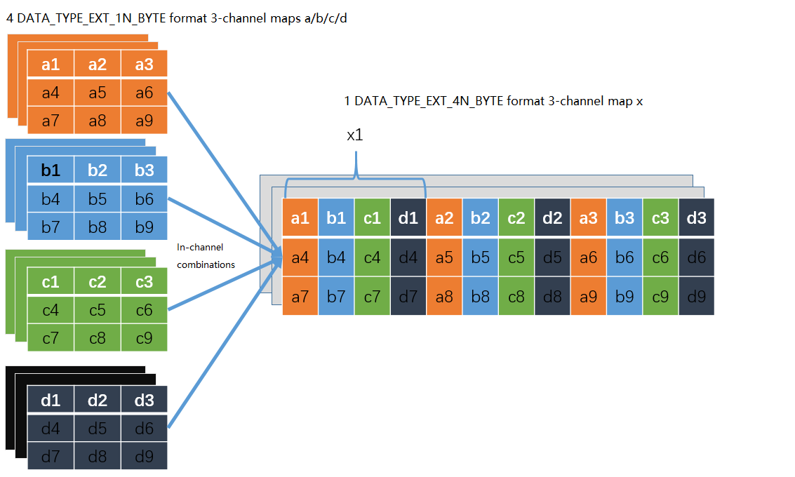

bm_image structure
==================

Bmcv api is operated around bm_image, with a bm_image object corresponding to a picture. Users can build bm_image objects through bm_image_create for the applications of each function of bmcv. Users need to destroy it through bm_image_destroy after usage.

bm_image
________

bm_image structure is defined as follows:

    .. code-block:: c

       struct bm_image {
           int width;
           int height;
           bm_image_format_ext image_format;
           bm_data_format_ext data_type;
           bm_image_private* image_private;
       };

bm_image structure covers the width and height of the image, the image format (image_format), image data format (data_type), and the private data of the structure.

bm_image_format_ext image_format
________________________________

image_format has the following enumeration types:

    .. code-block:: c

       typedef enum bm_image_format_ext_{
           FORMAT_YUV420P,
           FORMAT_YUV422P,
           FORMAT_YUV444P,
           FORMAT_NV12,
           FORMAT_NV21,
           FORMAT_NV16,
           FORMAT_NV61,
           FORMAT_NV24,
           FORMAT_RGB_PLANAR,
           FORMAT_BGR_PLANAR,
           FORMAT_RGB_PACKED,
           FORMAT_BGR_PACKED,
           FORMAT_RGBP_SEPARATE,
           FORMAT_BGRP_SEPARATE,
           FORMAT_GRAY,
           FORMAT_COMPRESSED,
           FORMAT_HSV_PLANAR,
           FORMAT_ARGB_PACKED,
           FORMAT_ABGR_PACKED,
           FORMAT_YUV444_PACKED,
           FORMAT_YVU444_PACKED,
           FORMAT_YUV422_YUYV,
           FORMAT_YUV422_YVYU,
           FORMAT_YUV422_UYVY,
           FORMAT_YUV422_VYUY,
           FORMAT_RGBYP_PLANAR,
           FORMAT_HSV180_PACKED,
           FORMAT_HSV256_PACKED
       } bm_image_format_ext;

**Description of each format:**

* FORMAT_YUV420P

  It means to pre-create a picture in YUV420 format with three planes

* FORMAT_YUV422P

  It means to pre-create a picture in YUV422 format with three planes

* FORMAT_YUV444P

  It means to pre-create a picture in YUV444 format with three planes

* FORMAT_NV12

  It means to pre-create a picture in NV12 format with two planes

* FORMAT_NV21

  It means to pre-create a picture in NV21 format with two planes

* FORMAT_NV16

  It means to pre-create a picture in NV16 format with two planes

* FORMAT_NV61

  It means to pre-create a picture in NV61 format with two planes

* FORMAT_RGB_PLANAR

  It means to pre-create a picture in RGB format with one plane and separately sequenced RGB

* FORMAT_BGR_PLANAR

  It means to pre-create a picture in BGR format with one plane and separately sequenced BGR

* FORMAT_RGB_PACKED

  It means to pre-create a picture in RGB format with one plane and staggered sequenced RGB

* FORMAT_BGR_PACKED

  It means to pre-create a picture in BGR format with one plane and staggered sequenced BGR

* FORMAT_RGBP_SEPARATE

  It means to pre-create a picture in RGB planar format. RGB is arranged separately and occupies one plane respectively. There are three planes in total.

* FORMAT_BGRP_SEPARATE

  It means to pre-create a picture in BGR planar format. BGR is arranged separately and occupies one plane respectively. There are three planes in total.

* FORMAT_GRAY

  It means to pre-create a gray image format picture with a plane

* FORMAT_COMPRESSED

  It means to pre-create a picture in VPU internally compressed format. There are four planes in total, and the contents are as follows:

  plane0: Y compressed table

  plane1: Y compressed data

  plane2: CbCr compressed table

  plane3: CbCr compressed data

* FORMAT_HSV_PLANAR

  It means to pre-create a picture in HSV planar format with three planes. The range of H is 0 to 180

* FORMAT_ARGB_PACKED

  It means to pre-create a picture in ARGB format with one plane and staggered sequenced ARGB

* FORMAT_ABGR_PACKED

  It means to pre-create a picture in ABGR format with one plane and staggered sequenced ABGR

* FORMAT_YUV444_PACKED

  It means to pre-create a picture in YUV444 format with one plane and staggered sequenced YUV

* FORMAT_YVU444_PACKED

  It means to pre-create a picture in YVU444 format with one plane and staggered sequenced YVU

* FORMAT_YUV422_YUYV

  It means to pre-create a picture in YUV422 format with one plane and staggered sequenced YUYV

* FORMAT_YUV422_YVYU

  It means to pre-create a picture in YUV422 format with one plane and staggered sequenced YVYU

* FORMAT_YUV422_UYVY

  It means to pre-create a picture in YUV422 format with one plane and staggered sequenced UYVY

* FORMAT_YUV422_VYUY

  It means to pre-create a picture in YUV422 format with one plane and staggered sequenced VYUY

* FORMAT_RGBYP_PLANAR

  It means to pre-create a picture in RGBY format with four planes and separately sequenced RGBY

* FORMAT_HSV180_PACKED

  It means to pre-create a picture in HSV planar format with one plane and staggered sequenced HSV.  The range of H is 0 to 180.

* FORMAT_HSV256_PACKED

  It means to pre-create a picture in HSV planar format with one plane and staggered sequenced HSV.  The range of H is 0 to 255.

bm_data_format_ext data_type
____________________________

data_type has the following enumeration types:

    .. code-block:: c

       typedef enum bm_image_data_format_ext_{
           DATA_TYPE_EXT_FLOAT32,
           DATA_TYPE_EXT_1N_BYTE,
           DATA_TYPE_EXT_4N_BYTE,
           DATA_TYPE_EXT_1N_BYTE_SIGNED,
           DATA_TYPE_EXT_4N_BYTE_SIGNED,
           DATA_TYPE_EXT_FP16,
           DATA_TYPE_EXT_BF16,
       }bm_image_data_format_ext;

**Description of incoming parameters:**

* DATA_TYPE_EXT_FLOAT32

  Indicating that the created image data format is single-precision floating-point number

* DATA_TYPE_EXT_1N_BYTE

  Indicating that the created image data format is ordinary unsigned 1N UINT8

* DATA_TYPE_EXT_4N_BYTE

  Indicating that the created image data format is 4N UINT8, that is, four unsigned INT8 image data are staggered. One bm_image object actually contains four pictures with the same attributes

* DATA_TYPE_EXT_1N_BYTE_SIGNED

  Indicating that the created image data format is ordinary signed 1N INT8

* DATA_TYPE_EXT_4N_BYTE_SIGNED

  Indicating that the created image data format is 4N INT8, that is, the four signed INT8 image data are staggered

* DATA_TYPE_EXT_FP16

  Indicating that the created image data format is a half-precision floating-point number. Use 5bit to represent the exponent and 10bit to represent the decimal

* DATA_TYPE_EXT_BF16

  Indicating that the created image data format is 16bit floating point number, which is actually truncated data for FLOAT32 single precision floating point number. Use 8bit to represent the exponent and 7bit to represent the decimal

- For 4N arrangement, please refer to the following figure:

As shown above, the 4Byte of the i-th position in the corresponding channel of the 4 1N format images are put together as a 32-bit DWORD as the value of the i-th position in the corresponding channel of the 4N format image.For example, a1/b1/c1/d1 in channel 1 synthesis x1; for cases with less than 4 maps, the placeholder in map x still needs to be preserved.

4N only supports RGB-related formats, not YUV-related formats and FORMAT_COMPRESSED.

