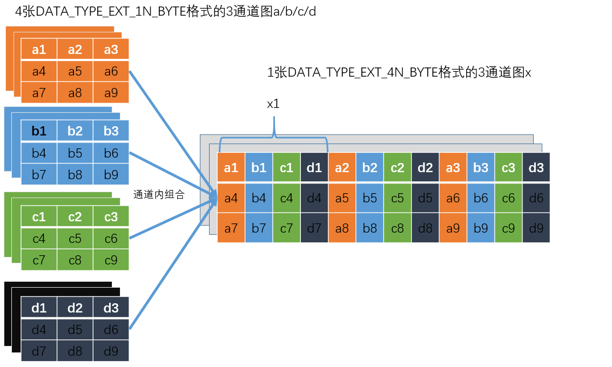

bm_image 结构体
===============

bmcv api 均是围绕 bm_image 来进行的，一个 bm_image 对象对应于一张图片。用户通过 bm_image_create 来构建 bm_image 对象，然后供各个 bmcv 的功能函数使用，使用完需要调用 bm_image_destroy 销毁。

bm_image
________

bm_image 结构体定义如下:

    .. code-block:: c

       struct bm_image {
           int width;
           int height;
           bm_image_format_ext image_format;
           bm_data_format_ext data_type;
           bm_image_private* image_private;
       };

bm_image 结构成员包括图片的宽高（width、height），图片格式 image_format，图片数据格式 data_type，以及该结构的私有数据。

bm_image_format_ext image_format
________________________________

其中 image_format 有以下枚举类型

    .. code-block:: c

       typedef enum bm_image_format_ext_{
           FORMAT_YUV420P,
           FORMAT_YUV422P,
           FORMAT_YUV444P,
           FORMAT_NV12,
           FORMAT_NV21,
           FORMAT_NV16,
           FORMAT_NV61,
           FORMAT_NV24,
           FORMAT_RGB_PLANAR,
           FORMAT_BGR_PLANAR,
           FORMAT_RGB_PACKED,
           FORMAT_BGR_PACKED,
           FORMAT_RGBP_SEPARATE,
           FORMAT_BGRP_SEPARATE,
           FORMAT_GRAY,
           FORMAT_COMPRESSED,
           FORMAT_HSV_PLANAR,
           FORMAT_ARGB_PACKED,
           FORMAT_ABGR_PACKED,
           FORMAT_YUV444_PACKED,
           FORMAT_YVU444_PACKED,
           FORMAT_YUV422_YUYV,
           FORMAT_YUV422_YVYU,
           FORMAT_YUV422_UYVY,
           FORMAT_YUV422_VYUY,
           FORMAT_RGBYP_PLANAR,
           FORMAT_HSV180_PACKED,
           FORMAT_HSV256_PACKED
       } bm_image_format_ext;

**各个格式说明:**

* FORMAT_YUV420P

  表示预创建一个 YUV420 格式的图片，有三个 plane

* FORMAT_YUV422P

  表示预创建一个 YUV422 格式的图片，有三个 plane

* FORMAT_YUV444P

  表示预创建一个 YUV444 格式的图片，有三个 plane

* FORMAT_NV12

  表示预创建一个 NV12 格式的图片，有两个 plane

* FORMAT_NV21

  表示预创建一个 NV21 格式的图片，有两个 plane

* FORMAT_NV16

  表示预创建一个 NV16 格式的图片，有两个 plane

* FORMAT_NV61

  表示预创建一个 NV61 格式的图片，有两个 plane

* FORMAT_RGB_PLANAR

  表示预创建一个 RGB 格式的图片，RGB 分开排列,有一个 plane

* FORMAT_BGR_PLANAR

  表示预创建一个 BGR 格式的图片，BGR 分开排列,有一个 plane

* FORMAT_RGB_PACKED

  表示预创建一个 RGB 格式的图片，RGB 交错排列,有一个 plane

* FORMAT_BGR_PACKED

  表示预创建一个 BGR 格式的图片，BGR 交错排列,有一个 plane

* FORMAT_RGBP_SEPARATE

  表示预创建一个 RGB planar 格式的图片，RGB 分开排列并各占一个 plane，共有 3 个 plane

* FORMAT_BGRP_SEPARATE

  表示预创建一个 BGR planar 格式的图片，BGR 分开排列并各占一个 plane，共有 3 个 plane

* FORMAT_GRAY

  表示预创建一个灰度图格式的图片，有一个 plane

* FORMAT_COMPRESSED

  表示预创建一个 VPU 内部压缩格式的图片，共有四个 plane，分别存放内容如下：

  plane0: Y 压缩表

  plane1: Y 压缩数据

  plane2: CbCr 压缩表

  plane3: CbCr 压缩数据

* FORMAT_HSV_PLANAR

  表示预创建一个HSV planar格式的图片，H 的范围为 0~180，有三个 plane

* FORMAT_ARGB_PACKED

  表示预创建一个ARGB 格式的图片，ARGB 交错排列，有一个 plane

* FORMAT_ABGR_PACKED

  表示预创建一个ABGR 格式的图片，BGRA 交错排列，有一个 plane

* FORMAT_YUV444_PACKED

  表示预创建一个YUV444 格式的图片，YUV 交错排列，有一个 plane

* FORMAT_YVU444_PACKED

  表示预创建一个YVU444 格式的图片，YVU 交错排列，有一个 plane

* FORMAT_YUV422_YUYV

  表示预创建一个YUV422 格式的图片，YUYV 交错排列，有一个 plane

* FORMAT_YUV422_YVYU

  表示预创建一个YUV422 格式的图片，YVYU 交错排列，有一个 plane

* FORMAT_YUV422_UYVY

  表示预创建一个YUV422 格式的图片，UYVY 交错排列，有一个 plane

* FORMAT_YUV422_VYUY

  表示预创建一个YUV422 格式的图片，VYUY 交错排列，有一个 plane

* FORMAT_RGBYP_PLANAR

  表示预创建一个RGBY planar格式的图片，有四个 plane

* FORMAT_HSV180_PACKED

  表示预创建一个HSV 格式的图片，H 的范围为 0~180，HSV 交错排列，有一个 plane

* FORMAT_HSV256_PACKED

  表示预创建一个HSV 格式的图片，H 的范围为 0~255，HSV 交错排列，有一个 plane

bm_data_format_ext data_type
____________________________

data_type 有以下枚举类型

    .. code-block:: c

       typedef enum bm_image_data_format_ext_{
           DATA_TYPE_EXT_FLOAT32,
           DATA_TYPE_EXT_1N_BYTE,
           DATA_TYPE_EXT_4N_BYTE,
           DATA_TYPE_EXT_1N_BYTE_SIGNED,
           DATA_TYPE_EXT_4N_BYTE_SIGNED,
           DATA_TYPE_EXT_FP16,
           DATA_TYPE_EXT_BF16,
       }bm_image_data_format_ext;

**各个格式说明:**

* DATA_TYPE_EXT_FLOAT32

  表示所创建的图片数据格式为单精度浮点数

* DATA_TYPE_EXT_1N_BYTE

  表示所创建图片数据格式为普通无符号 1N UINT8

* DATA_TYPE_EXT_4N_BYTE

  表示所创建图片数据格式为 4N UINT8，即四张无符号 INT8 图片数据交错排列，一个 bm_image 对象其实含有四张属性相同的图片

* DATA_TYPE_EXT_1N_BYTE_SIGNED

  表示所创建图片数据格式为普通有符号 1N INT8

* DATA_TYPE_EXT_4N_BYTE_SIGNED

  表示所创建图片数据格式为 4N INT8，即四张有符号 INT8 图片数据交错排列

* DATA_TYPE_EXT_FP16

  表示所创建的图片数据格式为半精度浮点数，5bit 表示指数，10bit 表示小数

* DATA_TYPE_EXT_BF16

  表示所创建的图片数据格式为16bit浮点数，实际是对FLOAT32单精度浮点数截断数据，即用8bit 表示指数，7bit 表示小数

- 其中，对于 4N 排列方式可参考下图：

如上图所示，将4张1N格式图像相应通道内第i个位置的4Byte拼接在一起作为1个32位的DWORD，作为4N格式图相应通道内第i个位置的值，比如说通道1内a1/b1/c1/d1合成x1；对于不足4张图的情形，在图x中仍需保留占位。

4N仅支持RGB相关格式，不支持YUV相关格式及FORMAT_COMPRESSED。

