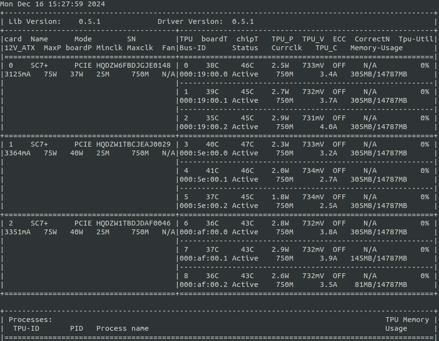
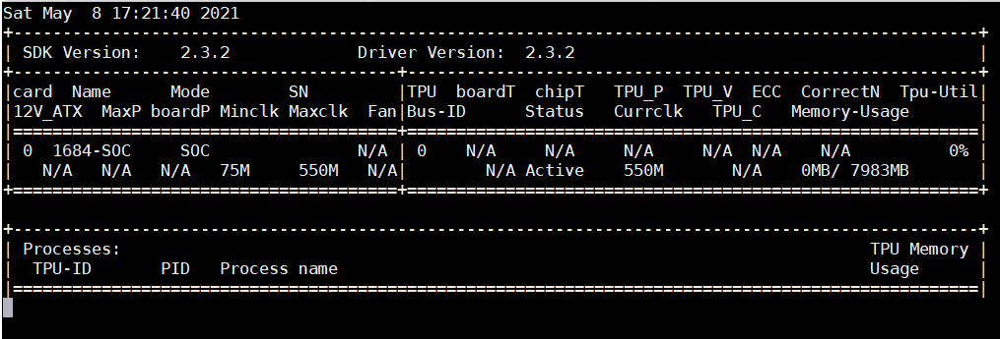

.. vim: syntax=rst

术语解释
--------

.. list-table::
   :widths: 30 70
   :header-rows: 0

   * - **术语**
     - **说明**

   * - BM1684
     - 算能面向深度学习领域推出的第三代张量处理器

   * - BM1684X
     - 算能面向深度学习领域推出的第四代张量处理器

   * - TPU
     - 芯片内部神经网络处理单元

   * - SOC模式
     - 一种产品形态，SDK运行于A53 AARCH64平台，TPU作为平台总线设备

   * - PCIe模式
     - 一种产品形态，SDK运行于X86平台，BM1684、BM1684X存在于PCIe接口的深度学习计算加速卡上

   * - Drivers
     - Drivers是API接口访问硬件的通道

   * - Gmem
     - 卡上用于TPU加速的DDR内存

   * - F
     - FAULT 故障状态

   * - N/A
     - 此项参数不支持

bm-smi介绍
--------

| bm-smi工具以界面或者文本的形式显示设备状态信息，如设备的温度、风扇转速等信息；也可使能、禁用或者设置设备的某些功能，如led、ecc等。
| bm-smi主要功能有：
1) 查看设备参数和运行时状态

   -  查看设备工作模式（PCIe/SOC）

   -  查看物理板卡ID

   -  查看设备芯片ID，所在PCIe总线ID

   -  查看设备温度和功耗

   -  查看设备ECC使能与否和纠正次数

   -  查看gmem总数和利率

   -  查看tpu利用率

   -  查看设备工作频率信息

   -  查看运行时，各进程所占gmem大小

   -  查看设备风扇状态

2) 修改板卡参数

   -  禁止、使能ECC

   -  打开、关闭板上led指示灯

3) 执行故障设备的recovery操作

   下表列举了bm-smi可以获取的设备信息以及在PCIe和SOC模式下的支持情况：

.. list-table::
   :widths: 40 20 20
   :header-rows: 0

   * - **设备信息**
     - **PCIe模式**
     - **SOC模式**

   * - 显示时间日期
     - 支持
     - 支持

   * - SDK Version
     - 支持
     - 支持

   * - Driver Version
     - 支持
     - 支持

   * - 物理板卡id号
     - 支持       
     - 支持

   * - tpu的设备号              
     - 支持
     - 支持

   * - 板卡名称
     - 支持
     - 支持

   * - 板卡状态
     - 支持
     - 支持

   * - 板级温度
     - 支持
     - 不支持

   * - 芯片温度
     - 支持
     - 不支持

   * - 板级功耗
     - 支持
     - 不支持

   * - 模块功耗
     - 支持
     - 不支持

   * - 模块电压
     - 支持
     - 不支持

   * - 供电电流
     - 支持
     - 不支持

   * - DDR ECC是否使能
     - 支持
     - 不支持

   * - DDR使能，纠正错误的次数
     - 支持
     - 不支持

   * - 板卡序列号
     - 支持
     - 不支持

   * - PCIe模式下domain:b:d.f
     - 支持
     - 不支持

   * - PCIe or SOC mode
     - 支持
     - 支持

   * - 最小工作频率
     - 支持
     - 支持

   * - 最大工作频率
     - 支持
     - 支持

   * - 当前工作频率
     - 支持
     - 支持

   * - 板卡最大功耗
     - 支持
     - 不支持

   * - 模块的工作电流
     - 支持
     - 不支持

   * - gmem总数和已使用数量
     - 支持
     - 支持

   * - tpu的瞬时利用率
     - 支持
     - 支持

   * - 风扇转速
     - 支持
     - 不支持

   * - 每个进程（或者线程）占用的gmem的数量
     - 支持
     - 不支持

   * - 文本模式
     - 支持
     - 不支持

   * - 参数
     - 支持
     - 仅支持file、lms、loop

图1为SC5+(三芯)/SC5H/SC5P(八芯)的显示状态，每张卡之间用=======隔开，最左边显示的板卡级别的属性，右边和中间显示的是单个芯片的状态。

bm-smi是一个可执行文件，不依赖其他动态库，位于/opt/sophon/libsophon-current/bin目录下，上图为一个执行bm-smi的示意图。

各项参数的含义
-------------

下面逐一介绍每个部分代表的含义。

-  Fri Aug 7 14:18:57 2020执行bm-smi时的时间日期，这里只是示例，实际执行时可能和这里显示的不同

-  SDK Version: 2.3.2：sdk的版本号，这里只是示例，实际执行时可能和这里显示的不同

-  Driver Version: 2.3.2：驱动的版本号，这里只是示例，实际执行时可能和这里显示的不同

-  Card : 物理板卡id号

-  Name：板卡名称

-  Mode: PCIe or SOC mode

-  SN : 板卡序列号（共17位）

-  TPU : tpu的设备号

-  BoardT:板级温度

-  chipT:芯片温度

-  TPU_P:TPU模块功耗

-  TPU_V:TPU模块电压

-  ECC: DDR ECC是否使能

-  CorrectNum:若DDR使能，纠正错误的次数

-  Tpu-Util:tpu的瞬时利用率

-  12V_ATX：板级12V供电电流

-  MaxP:板卡最大功耗

-  boardP:板级功耗

-  Minclk:tpu最小工作频率

-  Maxclk:tpu最大工作频率

-  Fan:风扇转速，显示N/A 表示本卡无风扇，显示F 表示有风扇故障

-  Bus-ID:PCIe模式下domain:b:d.f

-  Status:板卡状态，Active为活动状态， Fault为故障状态

-  Curclk:tpu当前工作频率，显示的值的颜色根据当前工作频率而不同，550M（bm1684）或1000M（bm1684x）显示白色，75M显示红色，其他频率显示黄色；红色和黄色用于提示用户当前工作频率不是最大工作频率。显示不同颜色只在2.1.0版本及以上版本才有。

-  TPU_C: tpu模块的工作电流

-  Memory-Usage:gmem总数和已使用数量；默认106M表示VPU的固件占用的内存大小。板卡上的memory有可能分布在不同的地址空间，我们分配的内存都是地址连续的内存，而且由于每次分配的大小不一样，会导致内存的碎片化，所以有可能出现利用率达不到100%的情况。

下面显示的是每个设备上每个进程（或者线程）占用的gmem的数量。

.. image:: ./images/bmsmid006.png

**注意事项：**

1、因为我们的板卡是支持多任务多用户同时使用的，理论上可以有无限个进程创建无限个handle申请global memory，可以使用上下方向键以及翻页键去查看所有的process占用gmem的信息，通过标记保存成文件，也是包含所有process信息的。

2、process占用的gmem信息，每一行显示的是这个process创建的一个handle对应的gmem，如果这个process创建了多个handle，那么每个handle占用的gmem信息是单独一行显示的。

具体使用方法和参数
-----------------------

bm-smi支持的参数有：

-  dev (which dev is selected to query, 0xff is for all.) type: int32，default: 255

..

   用于选择查询或者修改哪个设备的参数，默认所有设备。

   该功能SOC模式不支持。

-  ecc (ECC on DDR is on or off.)

  ::

   type: string default: ""

  用来配置DDR ECC的使能和关闭，示例如下

  ::

   bm-smi --dev=0x0 --ecc=on

   bm-smi --dev=0x0 --ecc=off

  执行这个命令时，不要让任何进程使用这个设备，设置完毕后， 重启主机生效。

  执行这个命令时，请不要和其他参数一起使用，例如：
  ::
   bm-smi --dev=0x0 --ecc=on --file=~/a.txt 这条命令中的--file=~/a.txt会被忽略，这条命
   令只会执行ecc相关的动作。

  如果不指定dev参数，默认对所有设备做操作。
   
  该功能SOC模式不支持。

-  file (target file to save smi log.)

  ::

   type: string default: ""

  可以将设备的状态重定向到文本文档中，使用方法如下：

  ::

   bm-smi --dev=0x0 --file=./bm-smi.log

  该功能SOC模式支持。

-  led (pcie card LED status: on/off/blink)

  ::

   type: string default: "on"

  用来配置板卡LED的亮和灭，示例如下

  ::

   bm-smi --dev=0x0 --led=on

   bm-smi --dev=0x0 --led=off

  注意：此功能在SC5+和SC5P上支持 on/off/blink，在SC5H上支持on/off，其它板卡类型不支持。SC5+板卡只有第一个芯片才能控制LED灯的状态，SC5P拥有8个led，每个设备都对应一个led，每个led都支持单独设置状态。

  该功能SOC模式不支持。

-  lms (sample interval in loop mode.) type: int32 default: 500

..

   用来设置运行bm-smi时查询设备状态的时间间隔，默认是500ms查询一次，这个参数的最小值是300ms。该功能SOC模式支持。

-  loop (true is for loop mode, false is for only once mode.) type: bool，default: true

   用来设置运行bm-smi时是单次模式还是周期模式，默认周期模式。单次模式下查询一次设备状态后bm-smi就退出了；周期模式下按照lms为周期反复查询设备状态。示例如下：

  ::

   bm-smi --loop

   bm-smi --noloop

  该功能SOC模式支持。

-  recovery，使用方式为：发现某个设备x功能出现故障,用户将所有业务从这个卡上移走，达到没有任何上层业务和应用使用这个板卡的状态，执行

  ::

    bm-smi --dev=0x(0/1/2/3…..) --recovery

  三芯卡SC5+ 和八芯卡SC5P只支持整卡recovery，recovery 卡上的任意设备，就会把整个卡recovery，所以recovery 的时候需要把整个卡上的任务停掉。

  注意：不要在板卡正常工作时执行这个操作，某些服务器不支持这个功能，执行这个功能会导致服务器重启。目前已知不支持的有dell R740、dell R940、浪潮5468和曙光X785-G30。

  该功能SOC模式不支持。

-  opmode和opval，使用方式为：选择bm-smi执行的模式以及模式值，兼容前面的标记，例如：

  ::

   bm-smi --opmode=display与bm-smi效果一样

   bm-smi --opmode=ecc --opval=on 与bm-smi --ecc=on效果一样。其他标记以此类推。

  目前opmode共有：display(显示)、ecc(使能)、led（指示灯）、recovery四种操作模式， 后续新功能都将以这种方式使用，为了照顾旧版本用户操作习惯，旧版本的使用方法在新版依旧可以使用。（注：目前只有opmode为ecc和led时要搭配使用opval去赋值）

  2.5.0 display mode添加了对heap和vpu内存监控显示，使用方法为
  ::
    bm-smi --opmode=display_memory_detail

  .. image:: ./images/bmsmid003.png
    :width: 5.34792in
    :height: 2.5125in

  同时还添加了对vpu和jpu的利用率显示，使用方法为
  ::
    bm-smi --opmode=display_util_detail

  .. image:: ./images/bmsmid004.png
    :width: 5.28194in
    :height: 2.14028in

文本模式介绍
-----------

bm-smi输出的是一个简单的图形界面，描述了板卡的状态，为了满足部分用户对文本信息的需求（便于用脚本parse部分参数），支持了文本模式（SOC模式不支持文本模式），使用方法如下：
::
   bm-smi --start_dev=0 --last_dev=2 --text_format

   1684-SC5+ PCIE chip0: 0 000:01:00.0 Active 56C 55C 2W 615mV OFF N/A 0% 75M 550M 550M
   3.3A 0MB 7086MB
   1684-SC5+ PCIE chip1: 1 000:01:00.1 Active 56C 55C 2W 613mV OFF N/A 0% 75M 550M 550M
   4.1A 0MB 7086MB
   1684-SC5+ PCIE chip2: 2 000:01:00.2 Active 54C 53C 1W 615mV OFF N/A 0% 75M 550M 550M
   2.6A 0MB 7086MB

上述命令的输出一行文本信息，分为三个区域：

第一个区域：
::
   1684-SC5+ PCIE chip0: 0 000:01:00.0 Active 56C 55C 2W 615mV OFF N/A 0% 75M 550M 550M
   3.3A 0MB 7086MB

| 三芯卡上的第0个chip的状态，1684-SC5+ PCIE chip0:
| 后面的信息依次对应bm-smi中的：TPU Bus-ID Status boardT chipT TPU_P TPU_V ECC CorrectN Tpu-Util Minclk Maxclk Curclk TPU_C Memory-Usage

第二个区域：
::
   1684-SC5+ PCIE chip1: 1 000:01:00.1 Active 56C 55C 2W 613mV OFF N/A 0% 75M 550M 550M
   4.2A 0MB 7086MB

| 三芯卡上的第1个chip的状态，1684-SC5+ PCIE chip1:
| 后面的信息依次对应bm-smi中的：TPU Bus-ID Status boardT chipT TPU_P TPU_V ECC CorrectN Tpu-Util Minclk Maxclk Curclk TPU_C Memory-Usage

第三个区域：
::
   1684-SC5+ PCIE chip2: 2 000:01:00.2 Active 54C 53C 1W 615mV OFF N/A 0% 75M 550M 550M
   2.6A 0MB 7086MB

| 三芯卡上的第2个chip的状态，1684-SC5+ PCIE chip2:
| 后面的信息依次对应bm-smi中的：TPU Bus-ID Status boardT chipT TPU_P TPU_V ECC CorrectN Tpu-Util Minclk Maxclk Curclk TPU_C Memory-Usage

.. parsed-literal::

  注意事项：

  1、--start_dev=0 --last_dev=2 表示bm-smi中显示的某张卡的第0个和最后1个chip对应的设备号；

  2、--start_dev --last_dev --text_format要一起使用。

bm-smi的help信息:
----------------

PCIe模式bm-smi的help信息
~~~~~~~~~~~~~~~~~~~~~~~~~~

::

   bm-smi --help

   bm-smi: command line brew

   usage: bm-smi [--ecc=on/off] [--file=/xx/yy.txt] [--dev=0/1...][--start_dev=x] [--last_dev=y]
   [--text_format] [--lms=500] [--recovery] [-loop] [--led=on/off/blink]

   ecc:

   set ecc status, default is off

   file:

   the target file to save smi log, default is empty.

   dev:

   which device to be selected to query, default is all.

   start_dev:

   the first device to be selected to query, must chip0 of one card, default is invalid.

   last_dev:

   the last device to be selected to query, default is invalid.

   lms:

   how many ms of the sample interval, default is 500.

   loop:

   if -loop (default): smi sample device every lms ms.

   if -noloop: smi sample device only once.

   recovery:

   recovery dev from fault to active status.

   text_format:

   if true only display attr value from start_dev to last_dev.

   led:

   pcie card LED status: on/off/blink.

   New usage: bm-smi [--opmode=display/ecc/led/recovery][--opval=on/off/...] [--file=/xx/yy.txt]
   [--dev=0/1...] [--start_dev=x] [--last_dev=y][--text_format][--lms=500] [-loop]

   opmode(default null):

   choose different mode,example:display, ecc, led, recovery

   display: means open bm-smi window and check info, use like ./bm-smi

   ecc: means enable or disable ecc, collocation opval=on/off

   led: means modify led status, collocation opval=on/blink/off

   recovery: means recovery dev from fault to active status.

   opval(default null):

   set mode value, use with opmode!

   off: for led/ecc

   on: for led/ecc

   blink: for led

   other flags have same usage, Both usage can be used!

      No modules matched: use -help

bm-smi在PCIe模式支持上面help列出的所有参数。

SOC模式bm-smi的help信息
~~~~~~~~~~~~~~~~~~~~~~~~~

::

   bm-smi --help

   bm-smi: command line brew

   usage: bm-smi [--opmode=display] [--file=/xx/yy.txt] [--lms=500] [-loop]

   opmode:

   SOC mode only use display for bm-smi.

   file:

   the target file to save smi log, default is empty.

   lms:

   how many ms of the sample interval, default is 500.

   loop:

   if -loop (default): smi sample device every lms ms.

   if -noloop: smi sample device only once.

      No modules matched: use -help

SOC模式只支持opmode=display、file、lms和loop参数，其他参数无效。

bm-smi用于SOC模式
----------------

PCIe 模式bm-smi支持上述所有功能，SOC 模式 bm-smi界面显示支持功能如图2所示，N/A表示该功能不支持；参数只支持opmode=display、file、lms和loop。

SOC模式bm-smi使用方法：登录soc后，直接运行bm-smi即可，

::

  bm-smi or bm-smi --opmode=display
  

