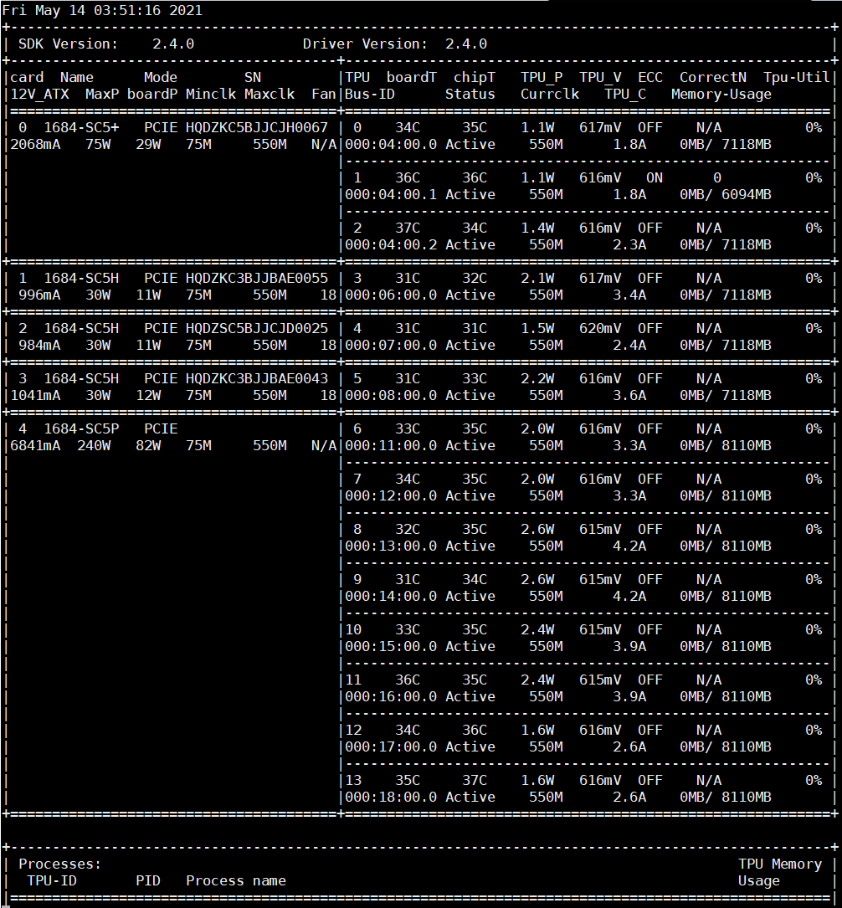
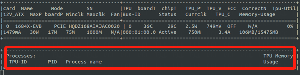

.. vim: syntax=rst

Interpretation of terms
-----------------------

.. list-table::
   :widths: 30 70
   :header-rows: 0

   * - **Term**
     - **Interpretation**

   * - BM1684
     - The third-generation tensor processor launched by SOPHGO for the field of deep learning.

   * - BM1684X
     - The fourth-generation tensor processor launched by SOPHGO for the field of deep learning.

   * - TPU
     - On-chip neural network processing unit.

   * - SOC mode
     - A working mode, the SDK runs on A53 AARCH64 platform, and TPU is used as the platform bus device.

   * - PCIe mode
     - A working mode, SDK runs on the X86 platform, BM1684 and BM1684X are at deep learning computing accelerator cards in PCIe interface.

   * - Drivers
     - Drivers are the channels through which the API interface accesses the hardware.

   * - Gmem
     - DDR memory on card for TPU acceleration.

   * - F
     - FAULT, fault status.

   * - N/A
     - This parameter is not supported.

Introduction of bm-smi
-------------------------

The bm-smi tool displays device status information in the form of interface or text, 
such as device temperature, fan speed; 
it can also enable, disable or set some device functions, such as led and ecc.

Bm-smi functions mainly include:

1) Viewing device parameters and runtime status.

   -  Viewing device working mode(PCIe/SOC).

   -  Viewing physical board ID.

   -  Viewing the device chip ID, and the PCIe bus ID where it is located.

   -  Viewing device temperature and power consumption.

   -  Viewing whether the device ECC is enabled and the number of corrections.

   -  Viewing the total number and usage of gmem.

   -  Viewing the usage of tpu.

   -  Viewing the work frequency information of the device.

   -  Viewing the size of gmem occupied by each process during running.

   -  Viewing device fan status.

2) Modifying board parameters.

   -  Disable or enable ECC.

   -  Turn on or turn off led indicator light on the board.

3) Performing the recovery operation on the fault device.

   The following table lists the device information that bm-smi can obtain and the support information in PCIe and SOC modes:

.. list-table::
   :widths: 40 20 20
   :header-rows: 0

   * - **Device Information**
     - **PCIe Mode**
     - **SOC Mode**

   * - Displaying time and date
     - Supported
     - Supported

   * - SDK Version
     - Supported
     - Supported

   * - Driver Version
     - Supported
     - Supported

   * - Physical board id number
     - Supported       
     - Supported

   * - Tpu device number              
     - Supported
     - Supported

   * - Board name
     - Supported
     - Supported

   * - Board status
     - Supported
     - Supported

   * - Board temperature
     - Supported
     - Not supported

   * - Chip temperature
     - Supported
     - Not supported

   * - Board power consumption
     - Supported
     - Not supported

   * - Module power consumption
     - Supported
     - Not supported

   * - Module voltage
     - Supported
     - Not supported

   * - Supply current
     - Supported
     - Not supported

   * - Whether DDR ECC is enabled
     - Supported
     - Not supported

   * - DDR enabled, number of correction times
     - Supported
     - Not supported

   * - Board serial number
     - Supported
     - Not supported

   * - domain:b:d.f in PCIe mode
     - Supported
     - Not supported

   * - PCIe or SOC mode
     - Supported
     - Supported

   * - Minimum work frequency
     - Supported
     - Supported

   * - Maximum work frequency
     - Supported
     - Supported

   * - Current work frequency
     - Supported
     - Supported

   * - Maximum power consumption of board
     - Supported
     - Not supported

   * - Working current of module
     - Supported
     - Not supported

   * - Byte numbers of gmem totals and used
     - Supported
     - Supported

   * - Instantaneous usage of tpu
     - Supported
     - Supported

   * - Fan speed
     - Supported
     - Not supported

   * - Byte numbers of gmem occupied by each process (or thread)
     - Supported
     - Not supported

   * - Text mode
     - Supported
     - Not supported

   * - Parameters
     - Supported
     - Only file, lms and loop are supported

Figure 1 shows the display status of SC5+ (three-core)/SC5H/SC5P (eight-core), each card is separated by =======, the board attributes are displayed on the left, and the state of a single chip is displayed on the right and middle.

bm-smi is an executable file that does not depend on other dynamic libraries, and it is located under /opt/sophon/libsophon-current/bin directory. The above figure is a schematic diagram about the execution of bm-smi.

Meanings of parameters
-----------------------

The meaning of each part is introduced one by one below:

-  Fri Aug 7 14:18:57 2020: time and date when bm-smi is executed. This is just an example, and the actual execution may be different from what is shown here.

-  SDK Version: 2.3.2: version number of sdk. This is just an example, and the actual execution may be different from what is shown here.

-  Driver Version: 2.3.2: version number of the driver. This is just an example, and the actual execution may be different from what is shown here.

-  Card: physical board id number.

-  Name: board name.

-  Mode: PCIe or SOC mode.

-  SN: board serial number (total of 17 bits).

-  TPU: device number of tpu.

-  BoardT: board temperature.

-  chipT: chip temperature.

-  TPU_P: power consumption of TPU module.

-  TPU_V: voltage of TPU module.

-  ECC: whether DDR ECC is enabled.

-  CorrectNum: the number of correction times if DDR is enabled.

-  Tpu-Util: instantaneous usage of tpu.

-  12V_ATX: 12V board supply current.

-  MaxP: maximum power consumption of board.

-  boardP: board power consumption.

-  Minclk: minimum work frequency of tpu.

-  Maxclk: maximum work frequency of tpu.

-  Fan: fan speed, N/A means the card has no fan, and F means  there is a failure in the fan.

-  Bus-ID: domain:b:d.f in PCIe mode.

-  Status: board status. Active means active status; and Fault means fault status.

-  Curclk: current work frequency of tpu. The color of the displayed value varies according to the current work frequency. 550M (bm1684) or 1000M (bm1684x) is displayed in white, 75M in red, and other frequencies in yellow; red and yellow are used to indicate to the user that the current work  frequency is not the maximum work frequency. Displaying different colors are only available in version 2.1.0 and above.

-  TPU_C: work current of tpu module.

-  Memory-Usage: byte numbers of gmem totals and used. The 106M indicates the memory size of the VPU firmware by default. The memory on the board may be distributed in different address spaces. All the memory we allocate is continuous address, and because of the different size of each allocation, it will lead to fragmentation of the memory, so the usage may not reach 100%.

The figure below shows the byte numbers of gmem occupied by each process (or thread) of each device:

**Notices:**

1. Because our board can be used by multiple users for multiple tasks at the same time, so theoretically, there can be unlimited processes creating unlimited handles to apply for global memory. You can use the up and down arrow keys and the page up and down keys to view the information of gmem occupied by all processes, save them as files through tag, which also contains all process information.

2. For the gmem information occupied by the process, each line displays the gmem corresponding to a handle created by the process. If the process creates multiple handles, the gmem information occupied by each handle is displayed on a separate line.

Specific operation methods and parameters
------------------------------------------

The parameters supported by bm-smi include:

-  dev (which dev is selected to query, 0xff is for all.) type: int32, default: 255

..

  Used to select the parameters of which device to query or modify, and all devices are selected by default. 

  This function is not supported in SOC mode.

-  ecc (ECC on DDR is on or off)

  ::

   type: string default: ""

  Used to configure Enable and Disable of DDR ECC, and the example is as follows:

  ::

   bm-smi --dev=0x0 --ecc=on

   bm-smi --dev=0x0 --ecc=off

  When executing this command, do not allow any process to use this device. After setting, restart the host to make it valid.

  When executing this command, please do not use it with other parameters, for example:

  ::

   bm-smi --dev=0x0 --ecc=on --file=~/a.txt
   # the --file=~/a.txt may be ignored. This command can only execute ecc-related actions.

  If the dev parameter is not specified, the operation will be performed on all devices by default.

  This function is not supported in SOC mode.

-  file (target file to save smi log)

  ::

   type: string default: ""

  The device status can be redirected to a text with the following method:

  ::

   bm-smi --dev=0x0 --file=./bm-smi.log

  This function is supported in SOC mode.

-  led (pcie card LED status: on/off/blink)

  ::

   type: string default: "on"

  Used to configure on and off of the board LED, and the examples are as below:

  ::

   bm-smi --dev=0x0 --led=on

   bm-smi --dev=0x0 --led=off

  Note: This function support on/off/blink on SC5+ and SC5P, on/off on SC5H, does not support other board types. For the SC5+ board, only the first chip can control the status of LED. SC5P has 8 LEDs, each device corresponds to one LED, and each LED supports setting status separately.

  This function is not supported in SOC mode.

-  lms (sample interval in loop mode.) type: int32 default: 500

..

  Used to set the time interval for querying the device status when running bm-smi, the default is 500ms, and the minimum value of this parameter is 300ms. This function is supported in SOC mode.

-  loop (true is for loop mode, false is for only once mode.) type: bool, default: true

   Used to set single mode or cycle mode when running bm-smi, and the cycle mode is set by default. In single mode, bm-smi exits after querying the device status once; in cycle mode, it queries the device status repeatedly according to lms. Examples are as follows:

  ::

   bm-smi --loop

   bm-smi --noloop

  This function is supported in SOC mode.

-  recovery, the use method is as follows: when x function of a certain device is found to be faulty, the user removes all services from this card, reaching to a state where no upper-layer services and applications use this card, and the following is executed:

  ::

    bm-smi --dev=0x(0/1/2/3…..) --recovery

  The three-core card SC5+ and the eight-core card SC5P only support the recovery of the entire card. Recoverying any device on the card can led to the entire card recoveried, so you need to stop the tasks on the entire card during recovery.

  Note: Do not perform this operation when the board card is working normally. Some servers do not support this function, and executing this function will cause the server to restart. Currently known servers that do not support this function are Dell R740, Dell R940, Inspur 5468 and Sugon X785-G30.

  This function is not supported in SOC mode.

-  opmode and opval, operation method is: select the mode and mode value of bm-smi execution, compatible with the previous tags, for example:

  ::

   bm-smi   --opmode=display
   #bm-smi have the same effects.

   bm-smi --opmode=ecc --opval=on
   #bm-smi --ecc=on have the same effects. And so on for other tags.

  At present, opmode has four operation modes: display, ecc (enable), led (indicator), and recovery. Subsequent new functions will be used in this way. In order to take care of users which have the operating habits of the old version , the operation method of the old version is still supported in the new version. (Note: At present, only when the opmode is ecc or led, you need to use it with opval to assign values).

  We added 2.5.0 display mode with the memory monitor display for heap and vpu, and the operation method is:

  ::

    bm-smi --opmode=display_memory_detail

  .. image:: ./images/bmsmid003.png
    :width: 5.34792in
    :height: 2.5125in

  Meanwhile, the usage display of vpu and jpu is also added, and the operation method is as follows:
  
  ::

    bm-smi --opmode=display_util_detail

  .. image:: ./images/bmsmid004.png
    :width: 5.28194in
    :height: 2.14028in

Introduction of text mode
--------------------------

The output of bm-smi is a simple graphical interface, which describes the status of the board. In order to meet the needs of some users for text information (easy to use scripts to parse some parameters), it supports text mode (SOC mode does not support text mode), and the operation method is as follows: 

::

   bm-smi --start_dev=0 --last_dev=2 --text_format

   1684-SC5+ PCIE chip0: 0 000:01:00.0 Active 56C 55C 2W 615mV OFF N/A 0% 75M 550M 550M 3.3A 0MB 7086MB
   1684-SC5+ PCIE chip1: 1 000:01:00.1 Active 56C 55C 2W 613mV OFF N/A 0% 75M 550M 550M 4.1A 0MB 7086MB
   1684-SC5+ PCIE chip2: 2 000:01:00.2 Active 54C 53C 1W 615mV OFF N/A 0% 75M 550M 550M 2.6A 0MB 7086MB

A line of text information output by the above command divided into three areas:

First area:

::

   1684-SC5+ PCIE chip0: 0 000:01:00.0 Active 56C 55C 2W 615mV OFF N/A 0% 75M 550M 550M 3.3A 0MB 7086MB

Status of the 0th chip on the three-core card, 1684-SC5+ PCIE chip0:

::
  
  TPU  Bus-ID  Status  boardT  chipT  TPU_P  TPU_V  ECC  CorrectN  Tpu-Util  Minclk  Maxclk  Curclk  TPU_C  Memory-Usage

Second area:

::

   1684-SC5+ PCIE chip1: 1 000:01:00.1 Active 56C 55C 2W 613mV OFF N/A 0% 75M 550M 550M 4.2A 0MB 7086MB

Status of the 1st chip on the three-chip card, 1684-SC5+ PCIE chip1: 

The following information corresponds in sequence to parameters in bm-smi: 

::
  
  TPU  Bus-ID  Status  boardT  chipT  TPU_P  TPU_V  ECC  CorrectN  Tpu-Util  Minclk  Maxclk  Curclk  TPU_C  Memory-Usage

Third area:

::

   1684-SC5+ PCIE chip2: 2 000:01:00.2 Active 54C 53C 1W 615mV OFF N/A 0% 75M 550M 550M 2.6A 0MB 7086MB

Status of the 2nd chip on the three-chip card, 1684-SC5+ PCIE chip2: 

The following information corresponds in sequence to parameters in bm-smi:

::
  
  TPU  Bus-ID  Status  boardT  chipT  TPU_P  TPU_V  ECC  CorrectN  Tpu-Util  Minclk  Maxclk  Curclk  TPU_C  Memory-Usage

::

  Notes:

  1. --start_dev=0 --last_dev=2 indicates the device numbers corresponding to the 0th chip and the last chip of a certain card displayed in bm-smi;

  2. --start_dev --last_dev --text_format should be used together.

help information of bm-smi :
-----------------------------

help information of bm-smi under PCIe mode
~~~~~~~~~~~~~~~~~~~~~~~~~~~~~~~~~~~~~~~~~~~

::

   bm-smi --help

   bm-smi: command line brew

   usage: bm-smi [--ecc=on/off] [--file=/xx/yy.txt] [--dev=0/1...][--start_dev=x] [--last_dev=y] [--text_format] [--lms=500] [--recovery] [-loop] [--led=on/off/blink]

   ecc:

   set ecc status, default is off

   file:

   the target file to save smi log, default is empty.

   dev:

   which device to be selected to query, default is all.

   start_dev:

   the first device to be selected to query, must chip0 of one card, default is invalid.

   last_dev:

   the last device to be selected to query, default is invalid.

   lms:

   how many ms of the sample interval, default is 500.

   loop:

   if -loop (default): smi sample device every lms ms.

   if -noloop: smi sample device only once.

   recovery:

   recovery dev from fault to active status.

   text_format:

   if true only display attr value from start_dev to last_dev.

   led:

   pcie card LED status: on/off/blink.

   New usage: bm-smi [--opmode=display/ecc/led/recovery][--opval=on/off/...] [--file=/xx/yy.txt][--dev=0/1...] [--start_dev=x] [--last_dev=y] [--text_format][--lms=500] [-loop]

   opmode(default null):

   choose different mode,example:display, ecc, led, recovery

   display: means open bm-smi window and check info, use like ./bm-smi

   ecc: means enable or disable ecc, collocation opval=on/off

   led: means modify led status, collocation opval=on/blink/off

   recovery: means recovery dev from fault to active status.

   opval(default null):

   set mode value, use with opmode!

   off: for led/ecc

   on: for led/ecc

   blink: for led

   other flags have same usage, Both usage can be used!

bm-smi supports all parameters listed above in help in PCIe mode.

help information of bm-smi in SOC mode
~~~~~~~~~~~~~~~~~~~~~~~~~~~~~~~~~~~~~~~

::

   bm-smi --help

   bm-smi: command line brew

   usage: bm-smi [--opmode=display] [--file=/xx/yy.txt] [--lms=500] [-loop]

   opmode:

   SOC mode only use display for bm-smi.

   file:

   the target file to save smi log, default is empty.

   lms:

   how many ms of the sample interval, default is 500.

   loop:

   if -loop (default): smi sample device every lms ms.

   if -noloop: smi sample device only once.

SOC mode only supports opmode=display, file, lms  and loop parameters, and other parameters are invalid. 

bm-smi used in SOC mode
--------------------------

In PCIe mode, bm-smi supports all the above functions; and in SOC mode, bm-smi interface supports the functions shown in Fig.2. N/A indicates this function is not supported; the supported parameters are only opmode=display, file, lms and loop.

In SOC mode, bm-smi operation method: run bm-smi directly after logging in soc.

::

  bm-smi or bm-smi --opmode=display
  
.. image:: ./images/bmsmid005.png
   :width: 5.76042in
   :height: 1.95764in
