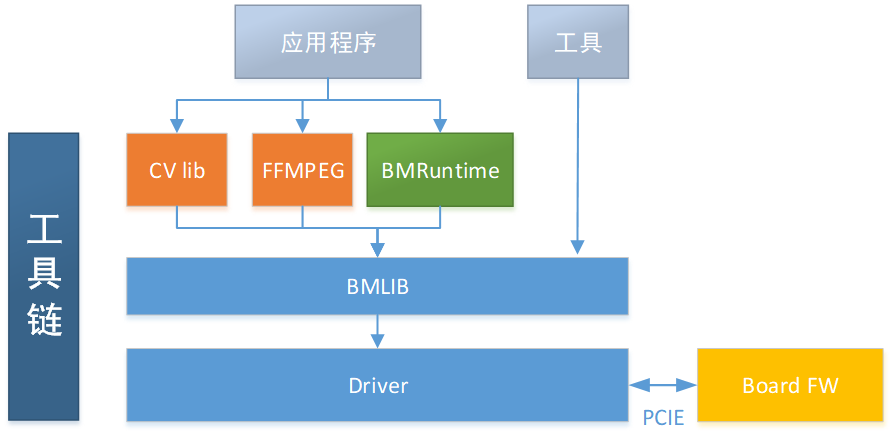
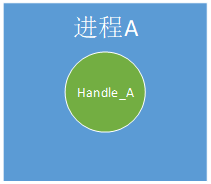
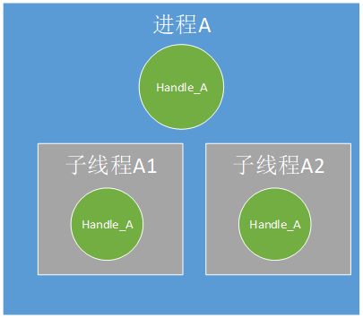
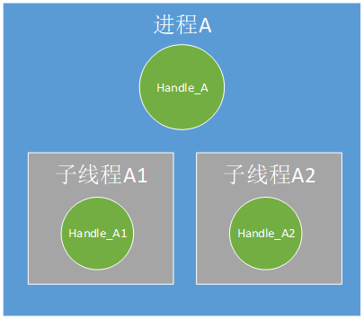
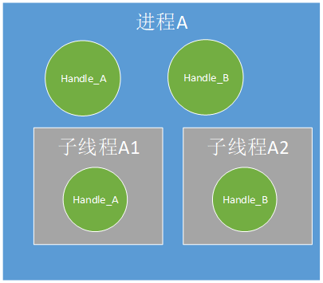
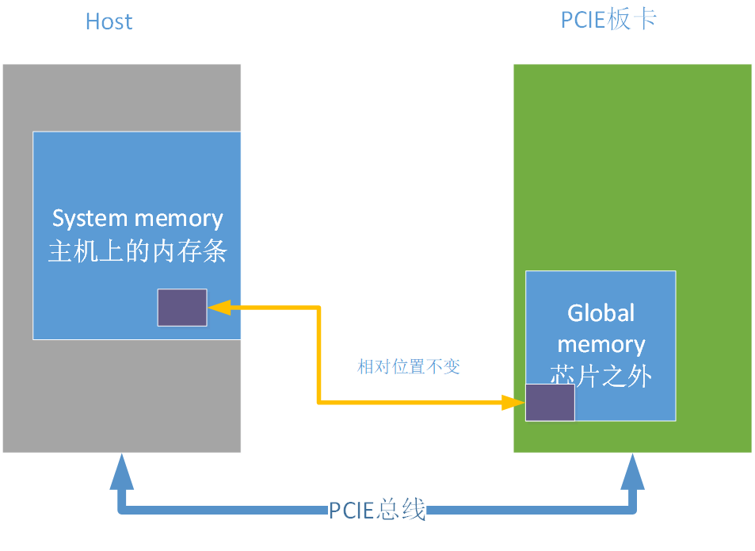
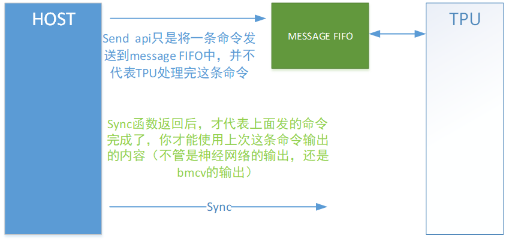

Bmlib的基本概念和功能
=====================

基于算能神经网络加速芯片设计的SDK的简单功能框图如下：

          
Bmlib是在内核驱动之上封装的一层底层软件库，完成的主要功能有：

-  设备handle的创建和销毁

-  Memory help函数接口

-  Global memory的申请和释放

-  数据在host和global memory之间的搬运

-  数据在global memory内部的搬运

-  API的发送和同步

-  Global memory在host端的映射和一致性管理

-  profile接口

-  A53的使能和使用

-  杂项管理接口

-  Power控制接口

Handle的概念
------------

我们的神经网络加速设备，无论是在PCIE模式，还是SOC模式，安装完tpu的驱动后，会成为一个标准的字符设备。上层用户进程如果要使用这个设备，需要在这个设备上创建一个handle句柄。

Handle是管理api，申请memory，释放memory的handle，如果一个进程创建了两个handle，名字为handle_A1，handle_A2，这是两个独立的handle。

如果线程B是进程A的子线程，进程A创建handle_A，
线程B创建handle_B，那么handle_A和handle_B也是两个独立的handle。

如果一个api是通过handle_A发送的，则必须通过handle_A sync；

如果一块memory是通过handle_A申请的，则必须通过handle_A 释放；

需要注意的是handle的创建者和使用者可以不一样，例如进程A创建了handle_A，A的子线程A1也可以使用handle_A，但是A1通过handle_A申请的memory在统计上算作A申请的。

我们推荐以下四种使用handle的方式：

进程A中创建Handle_A，Handle_A只在进程A中使用；

进程A中创建Handle_A，Handle_A在进程A的两个子线程（可以是多个，图中两个只是举例示意）中使用；

进程A及其子线程（可以是多个，图中两个只是举例示意）各自创建并使用自己创建的Handle；

进程A创建多个Handle，每个子线程分别使用这些Handle。

Memory的种类
------------

上图以PCIE模式介绍memory的种类，其中host可以是PC机/服务器，PCIE板卡就是SC5系列板卡。Host端的memory我们称之system
memory，PCIE板卡上的memory我们称之为global memory，或者device
memory。BM1684芯片中有专门的DMA硬件单元在system memory和global
memory之间搬运数据。

Api的概念和同步
---------------

Host这端的软件如果想让tpu完成一个任务，需要向tpu发送一个“api”，类似于一个命令。请注意发送api的函数和api的执行完成是异步的，所以host这端的软件还需要调用一个sync函数类等到api的真正完成。

目前发送api的动作，都已经封在bmcv/bmrt功能库中了，客户无法直接发送api，只能通过调用bmcv/bmrt的接口发送api。

调用完bmcv/bmrt的接口发送api后，是否需要调用sync函数等待api的完成，请参考bmcv/bmrt文档，bmcv/bmrt的接口可能已经将sync函数也封装在bmcv/bmrt的接口函数中了，这样bmcv/bmrt的接口函数返回后，api已经完成了。

Profile接口
-----------

Profile接口用于获取tpu处理api花费的时间，这个时间是从tpu开始工作后一直累加的（如果有不断的api得到处理），如果系统中只有一个进程使用tpu设备，我们可以通过计算调用api前后profile数据的差值来得到api的处理时间。

A53的使能
---------

在PCIE模式下，我们提供了一些接口用来启动BM1684中A53
core，并让他们完成一些加速任务。

Power控制
---------

我们提供了接口用于获取和设置tpu的工作频率，用户可以自己定义一些自己的功耗控制策略。

杂项信息接口
------------

用于获取板卡的信息和运行过程中的统计信息。目前包括memory总量和使用量，tpu的利用率
