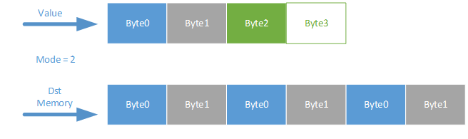
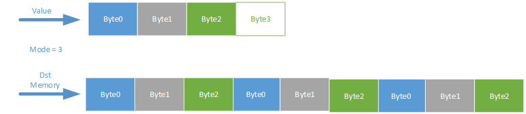

bmlib详细接口介绍
=================

设备handle的创建和销毁
----------------------

bm_dev_getcount
~~~~~~~~~~~~~~~

函数原型：bm_status_t bm_dev_getcount(int \*count)

函数作用：获取当前系统中，存在多少个sophon设备，如果获取的设备个数为N，则devid的合法取值为[0,N-1]。

参数介绍：

+--------------+--------------+---------------------------------------+
| 参数名       | 输入/输出    | 说明                                  |
+==============+==============+=======================================+
| count        | 输出         | 用于存放sophon设备个数的指针          |
+--------------+--------------+---------------------------------------+

返回值 ：BM_SUCCESS代表获得正确个数；其他错误码代表无法获取个数

bm_dev_query
~~~~~~~~~~~~

函数原型：bm_status_t bm_dev_query(int devid)

函数作用：根据设备索引值查询某个设备是否存在

参数介绍：

+--------------+--------------+---------------------------------------+
| 参数名       | 输入/输出    | 说明                                  |
+==============+==============+=======================================+
| devid        | 输入         | 被查询设备的索引值                    |
+--------------+--------------+---------------------------------------+

返回值 ：BM_SUCCESS代表存在这个设备；其他错误码代表不存在这个设备

bm_dev_request
~~~~~~~~~~~~~~

函数原型：bm_status_t bm_dev_request(bm_handle_t \*handle, int devid)

函数作用：在指定的设备上创建handle

参数介绍：

+--------------+--------------+---------------------------------------+
| 参数名       | 输入/输出    | 说明                                  |
+==============+==============+=======================================+
| handle       | 输出         | 保存创建的handle的指针                |
+--------------+--------------+---------------------------------------+
| devid        | 输入         | 指定具体设备                          |
+--------------+--------------+---------------------------------------+

返回值 ：BM_SUCCESS代表创建成功；其他错误码代表创建失败

bm_get_devid
~~~~~~~~~~~~

函数原型：int bm_get_devid(bm_handle_t \*handle)

函数作用：根据给定handle获取设备索引

参数介绍：

+--------------+--------------+---------------------------------------+
| 参数名       | 输入/输出    | 说明                                  |
+==============+==============+=======================================+
| handle       | 输入         | 设备句柄                              |
+--------------+--------------+---------------------------------------+

返回值 ：handle指向的int型设备索引

bm_dev_free
~~~~~~~~~~~

函数原型：void bm_dev_free(bm_handle_t handle)

函数作用：释放创建的handle

参数介绍：

+--------------+--------------+---------------------------------------+
| 参数名       | 输入/输出    | 说明                                  |
+==============+==============+=======================================+
| handle       | 输入         | 将要被释放的handle                    |
+--------------+--------------+---------------------------------------+

返回值 ：无

memory help函数接口
-------------------

bm_mem_get_type
~~~~~~~~~~~~~~~

函数原型：bm_mem_type_t bm_mem_get_type(struct bm_mem_desc mem);

函数作用：获取一块memory的种类

参数介绍：

+--------------+--------------+---------------------------------------+
| 参数名       | 输入/输出    | 说明                                  |
+==============+==============+=======================================+
| mem          | 输入         | 被查询的memory                        |
+--------------+--------------+---------------------------------------+

返回值 ：BM_MEM_TYPE_DEVICE，代表global
memory；BM_MEM_TYPE_SYSTEM，代表linux系统user层memory。

bm_mem_get_device_addr
~~~~~~~~~~~~~~~~~~~~~~

函数原型：unsigned long long bm_mem_get_device_addr(struct bm_mem_desc
mem);

函数作用：获取device类型的memory的地址

参数介绍：

+--------------+--------------+---------------------------------------+
| 参数名       | 输入/输出    | 说明                                  |
+==============+==============+=======================================+
| mem          | 输入         | 被查询的memory                        |
+--------------+--------------+---------------------------------------+

返回值 ：返回device memory的地址，64bit的一个无符号数字

bm_mem_set_device_addr
~~~~~~~~~~~~~~~~~~~~~~

函数原型：void bm_mem_set_device_addr(struct bm_mem_desc \*pmem,
unsigned long long addr);

函数作用：设置一个device类型 memory的地址

参数介绍：

+--------------+--------------+---------------------------------------+
| 参数名       | 输入/输出    | 说明                                  |
+==============+==============+=======================================+
| pmem         | 输入/输出    | 被设置的memory的指针                  |
+--------------+--------------+---------------------------------------+
| addr         | 输入         | memory被设置的地址                    |
+--------------+--------------+---------------------------------------+

返回值 ：无

bm_mem_get_device_size
~~~~~~~~~~~~~~~~~~~~~~

函数原型：unsigned int bm_mem_get_device_size(struct bm_mem_desc mem);

函数作用：获取一块device类型的memory的大小

参数介绍：

+--------------+--------------+---------------------------------------+
| 参数名       | 输入/输出    | 说明                                  |
+==============+==============+=======================================+
| mem          | 输入         | 被查询的memory                        |
+--------------+--------------+---------------------------------------+

返回值 ：返回memory大小，32位的无符号数

bm_mem_set_device_size
~~~~~~~~~~~~~~~~~~~~~~

函数原型：void bm_mem_set_device_size(struct bm_mem_desc \*pmem,
unsigned int size);

函数作用：设置一块device类型的memory的大小

参数介绍：

+--------------+--------------+---------------------------------------+
| 参数名       | 输入/输出    | 说明                                  |
+==============+==============+=======================================+
| pmem         | 输入/输出    | 被设置的memory的指针                  |
+--------------+--------------+---------------------------------------+
| size         | 输入         | memory的大小，单位是byte              |
+--------------+--------------+---------------------------------------+

返回值 ：无

bm_set_device_mem
~~~~~~~~~~~~~~~~~

函数原型：void bm_set_device_mem(bm_device_mem_t \*pmem, unsigned int
size,

unsigned long long addr);

函数作用：填充一个device类型的memory的大小和地址

参数介绍：

+--------------+--------------+---------------------------------------+
| 参数名       | 输入/输出    | 说明                                  |
+==============+==============+=======================================+
| pmem         | 输入/输出    | 被设置的memory的指针                  |
+--------------+--------------+---------------------------------------+
| size         | 输入         | memory的大小，单位是byte              |
+--------------+--------------+---------------------------------------+
| addr         | 输入         | memory的地址                          |
+--------------+--------------+---------------------------------------+

返回值 ：无

bm_mem_from_device
~~~~~~~~~~~~~~~~~~

函数原型：bm_device_mem_t bm_mem_from_device(unsigned long long
device_addr, unsigned int len);

函数作用：根据地址和大小构建一个bm_device_mem_t类型的结构体

参数介绍：

+--------------+--------------+---------------------------------------+
| 参数名       | 输入/输出    | 说明                                  |
+==============+==============+=======================================+
| device_addr  | 输入         | memory的地址                          |
+--------------+--------------+---------------------------------------+
| len          | 输入         | memory的大小，单位是byte              |
+--------------+--------------+---------------------------------------+

返回值 ：一个bm_device_mem_t类型的结构体

bm_mem_get_system_addr
~~~~~~~~~~~~~~~~~~~~~~

函数原型：void \*bm_mem_get_system_addr(struct bm_mem_desc mem);

函数作用：获取system类型memory的地址

参数介绍：mem，被查询的memory

+--------------+--------------+---------------------------------------+
| 参数名       | 输入/输出    | 说明                                  |
+==============+==============+=======================================+
| mem          | 输入         | 被查询的memory                        |
+--------------+--------------+---------------------------------------+

返回值 ：返回一个memory的地址

bm_mem_set_system_addr
~~~~~~~~~~~~~~~~~~~~~~

函数原型：void bm_mem_set_system_addr(struct bm_mem_desc \*pmem, void
\*addr);

函数作用：设置一个system类型memory的地址

参数介绍：

+--------------+--------------+---------------------------------------+
| 参数名       | 输入/输出    | 说明                                  |
+==============+==============+=======================================+
| pmem         | 输入/输出    | 被设置的memory的指针                  |
+--------------+--------------+---------------------------------------+
| addr         | 输入         | system 地址指针                       |
+--------------+--------------+---------------------------------------+

返回值 ：无

bm_mem_from_system
~~~~~~~~~~~~~~~~~~

函数原型：bm_system_mem_t bm_mem_from_system(void \*system_addr);

函数作用：根据一个system指针构建一个bm_system_mem_t类型的结构体

参数介绍：

+--------------+--------------+---------------------------------------+
| 参数名       | 输入/输出    | 说明                                  |
+==============+==============+=======================================+
| system_addr  | 输入         | system 地址指针                       |
+--------------+--------------+---------------------------------------+

返回值 ：一个bm_system_mem_t类型的结构体

Global memory的申请和释放
-------------------------

bm_mem_null
~~~~~~~~~~~

函数原型：bm_device_mem_t bm_mem_null(void);

函数作用：返回一个类型非法的bm memory结构体

参数介绍：无

返回值 ：一个bm_device_mem_t类型的结构体

bm_malloc_neuron_device
~~~~~~~~~~~~~~~~~~~~~~~

函数原型：bm_status_t bm_malloc_neuron_device(bm_handle_t handle,
bm_device_mem_t \*pmem, int n, int c, int h, int w);

函数作用：根据batch的形状信息申请一块device类型的memory，每个神经元的大小为一个FP32(4
bytes)

参数介绍：

+--------------+--------------+---------------------------------------+
| 参数名       | 输入/输出    | 说明                                  |
+==============+==============+=======================================+
| handle       | 输入         | 设备句柄                              |
+--------------+--------------+---------------------------------------+
| pmem         | 输出         | 分配出device memory的指针             |
+--------------+--------------+---------------------------------------+
| n/c/h/w      | 输入         | batch 的形状                          |
+--------------+--------------+---------------------------------------+

返回值 ：BM_SUCCESS代表分配成功；其他错误码代表分配失败

bm_malloc_device_dword
~~~~~~~~~~~~~~~~~~~~~~

函数原型：bm_status_t bm_malloc_device_dword(bm_handle_t handle,
bm_device_mem_t \*pmem, int count);

函数作用：分配count个DWORD（4 bytes）大小的device类型的memory

参数介绍：

+--------------+--------------+---------------------------------------+
| 参数名       | 输入/输出    | 说明                                  |
+==============+==============+=======================================+
| handle       | 输入         | 设备句柄                              |
+--------------+--------------+---------------------------------------+
| pmem         | 输出         | 分配出device memory的指针             |
+--------------+--------------+---------------------------------------+
| count        | 输入         | 需要分配的dword的个数                 |
+--------------+--------------+---------------------------------------+

返回值 ：BM_SUCCESS代表分配成功；其他错误码代表分配失败

bm_malloc_device_byte
~~~~~~~~~~~~~~~~~~~~~

函数原型：bm_status_t bm_malloc_device_byte(bm_handle_t handle,
bm_device_mem_t \*pmem, unsigned int size);

函数作用：分配指定字节个数大小的device类型的memory

参数介绍：

+--------------+--------------+---------------------------------------+
| 参数名       | 输入/输出    | 说明                                  |
+==============+==============+=======================================+
| handle       | 输入         | 设备句柄                              |
+--------------+--------------+---------------------------------------+
| pmem         | 输出         | 分配出device memory的指针             |
+--------------+--------------+---------------------------------------+
| size         | 输入         | 需要分配的byte的个数                  |
+--------------+--------------+---------------------------------------+

返回值 ：BM_SUCCESS代表分配成功；其他错误码代表分配失败

bm_malloc_device_byte_heap
~~~~~~~~~~~~~~~~~~~~~~~~~~

函数原型：bm_status_t bm_malloc_device_byte_heap(bm_handle_t handle,
bm_device_mem_t \*pmem, int heap_id, unsigned int size);

函数作用：在指定的HEAP上分配指定字节个数大小的device类型的memory

参数介绍：

+--------------+--------------+---------------------------------------+
| 参数名       | 输入/输出    | 说明                                  |
+==============+==============+=======================================+
| handle       | 输入         | 设备句柄                              |
+--------------+--------------+---------------------------------------+
| pmem         | 输出         | 分配出device memory的指针             |
+--------------+--------------+---------------------------------------+
| heap_id      | 输入         | 所指定分配GMEM的HEAP（0/1/2）         |
+--------------+--------------+---------------------------------------+
| size         | 输入         | 需要分配的byte的个数                  |
+--------------+--------------+---------------------------------------+

返回值 ：BM_SUCCESS代表分配成功；其他错误码代表分配失败

bm_malloc_device_byte_heap_mask
~~~~~~~~~~~~~~~~~~~~~~~~~~~~~~~

函数原型：bm_status_t bm_malloc_device_byte_heap_mask(bm_handle_t
handle, bm_device_mem_t \*pmem, int heap_id_mask, unsigned int size);

函数作用：在指定的一个或多个HEAP上分配指定字节个数大小的device类型的memory

参数介绍：

.. list-table::
   :widths: 25 25 50
   :header-rows: 0

   * - **参数名**
     - **输入/输出**
     - **说明**

   * - handle
     - 输入
     - 设备句柄

   * - pmem
     - 输出
     - 分配出device memory的指针

   * - heap_id_mask
     - 输入
     - 指定分配GMEM的HEAP id 的mask，每个bit代表一个HEAP，设置为1代表可以从这个HEAP分配，为0代表不能从这个HEAP分配，最低位bit0代表heap0，依次增加

   * - size
     - 输入
     - 需要分配的byte的个数

返回值 ：BM_SUCCESS代表分配成功；其他错误码代表分配失败

bm_free_device
~~~~~~~~~~~~~~

函数原型：void bm_free_device(bm_handle_t handle, bm_device_mem_t mem);

函数作用：释放一块device类型的memory

参数介绍：

+--------------+--------------+---------------------------------------+
| 参数名       | 输入/输出    | 说明                                  |
+==============+==============+=======================================+
| handle       | 输入         | 设备句柄                              |
+--------------+--------------+---------------------------------------+
| mem          | 输入         | 要释放的device memory                 |
+--------------+--------------+---------------------------------------+

返回值 ：无

bm_gmem_arm_reserved_request
~~~~~~~~~~~~~~~~~~~~~~~~~~~~

函数原型：unsigned long long bm_gmem_arm_reserved_request(bm_handle_t
handle);

函数作用：获取为arm926保留的gmem的起始地址

参数介绍：

+--------------+--------------+---------------------------------------+
| 参数名       | 输入/输出    | 说明                                  |
+==============+==============+=======================================+
| handle       | 输入         | 设备句柄                              |
+--------------+--------------+---------------------------------------+

返回值 ：为arm926保留的gmem的起始地址（一个绝对地址）

bm_gmem_arm_reserved_release
~~~~~~~~~~~~~~~~~~~~~~~~~~~~

函数原型：void bm_gmem_arm_reserved_release(bm_handle_t handle);

函数作用：释放为arm926保留的gmem

参数介绍：

+--------------+--------------+---------------------------------------+
| 参数名       | 输入/输出    | 说明                                  |
+==============+==============+=======================================+
| handle       | 输入         | 设备句柄                              |
+--------------+--------------+---------------------------------------+

返回值 ： 无

数据在host和global memory之间的搬运
-----------------------------------

bm_memcpy_s2d
~~~~~~~~~~~~~

函数原型：bm_status_t bm_memcpy_s2d(bm_handle_t handle, bm_device_mem_t
dst, void \*src);

函数作用：拷贝system内存到device类型的内存中

参数介绍：

+--------------+--------------+---------------------------------------+
| 参数名       | 输入/输出    | 说明                                  |
+==============+==============+=======================================+
| handle       | 输入         | 设备句柄                              |
+--------------+--------------+---------------------------------------+
| dst          | 输入         | 目标device memory的结构体             |
+--------------+--------------+---------------------------------------+
| src          | 输入         | 指向system内存的指针                  |
+--------------+--------------+---------------------------------------+

返回值 ：BM_SUCCESS代表传输成功；其他错误码代表传输失败

bm_memcpy_s2d_partial_offset
~~~~~~~~~~~~~~~~~~~~~~~~~~~~

函数原型：bm_status_t bm_memcpy_s2d_partial_offset(bm_handle_t handle,

bm_device_mem_t dst, void \*src,

unsigned int size,

unsigned int offset);

函数作用：拷贝system内存到device类型内存，指定长度和device内存的起始地址offset，效果是从src拷贝size长度的数据到(dst起始地址+offset)这个位置上。

参数介绍：

+--------------+--------------+---------------------------------------+
| 参数名       | 输入/输出    | 说明                                  |
+==============+==============+=======================================+
| handle       | 输入         | 设备句柄                              |
+--------------+--------------+---------------------------------------+
| dst          | 输入         | 目标device memory的结构体             |
+--------------+--------------+---------------------------------------+
| src          | 输入         | 指向system内存的指针                  |
+--------------+--------------+---------------------------------------+
| size         | 输入         | 拷贝的长度                            |
+--------------+--------------+---------------------------------------+
| offset       | 输入         | 本次拷贝在device                      |
|              |              | memory端相对于这块device              |
|              |              | memory起始地址的offset                |
+--------------+--------------+---------------------------------------+

返回值 ：BM_SUCCESS代表传输成功；其他错误码代表传输失败

bm_memcpy_s2d_partial
~~~~~~~~~~~~~~~~~~~~~

函数原型：bm_status_t bm_memcpy_s2d_partial(bm_handle_t handle,
bm_device_mem_t dst, void \*src, unsigned int size);

函数作用：拷贝system内存到device类型内存，指定长度；效果是从src拷贝size长度的数据到dst起始地址这个位置上。

参数介绍：

+--------------+--------------+---------------------------------------+
| 参数名       | 输入/输出    | 说明                                  |
+==============+==============+=======================================+
| handle       | 输入         | 设备句柄                              |
+--------------+--------------+---------------------------------------+
| dst          | 输入         | 目标device memory的结构体             |
+--------------+--------------+---------------------------------------+
| src          | 输入         | 指向system内存的指针                  |
+--------------+--------------+---------------------------------------+
| size         | 输入         | 拷贝的长度                            |
+--------------+--------------+---------------------------------------+

返回值 ：BM_SUCCESS代表传输成功；其他错误码代表传输失败

bm_memcpy_d2s
~~~~~~~~~~~~~

函数原型：bm_status_t bm_memcpy_d2s(bm_handle_t handle, void \*dst,
bm_device_mem_t src);

函数作用：拷贝device类型内存到system内存

参数介绍：handle, 设备句柄；dst，指向system内存的指针结构体；src，
device memory；

+--------------+--------------+---------------------------------------+
| 参数名       | 输入/输出    | 说明                                  |
+==============+==============+=======================================+
| handle       | 输入         | 设备句柄                              |
+--------------+--------------+---------------------------------------+
| dst          | 输入         | 指向system内存的指针                  |
+--------------+--------------+---------------------------------------+
| src          | 输入         | 源device memory的结构体               |
+--------------+--------------+---------------------------------------+

返回值 ：BM_SUCCESS代表传输成功；其他错误码代表传输失败

bm_memcpy_d2s_partial_offset
~~~~~~~~~~~~~~~~~~~~~~~~~~~~

函数原型：bm_status_t bm_memcpy_d2s_partial_offset(bm_handle_t handle,
void \*dst, bm_device_mem_t src, unsigned int size, unsigned int
offset);

函数作用：拷贝device类型内存到system内存，指定大小，和device
memory端的offset，效果是从device
memory起始地址+offset拷贝size字节数据到dst上。

参数介绍：

+--------------+--------------+---------------------------------------+
| 参数名       | 输入/输出    | 说明                                  |
+==============+==============+=======================================+
| handle       | 输入         | 设备句柄                              |
+--------------+--------------+---------------------------------------+
| dst          | 输入         | 指向system内存的指针                  |
+--------------+--------------+---------------------------------------+
| src          | 输入         | 源device memory的结构体               |
+--------------+--------------+---------------------------------------+
| size         | 输入         | 拷贝的长度（单位为byte）              |
+--------------+--------------+---------------------------------------+
| offset       | 输入         | 本次拷贝在device                      |
|              |              | memory端相对于这块device              |
|              |              | memory起始地址的offset                |
+--------------+--------------+---------------------------------------+

返回值 ：BM_SUCCESS代表传输成功；其他错误码代表传输失败

bm_memcpy_d2s_partial
~~~~~~~~~~~~~~~~~~~~~

函数原型：bm_status_t bm_memcpy_d2s_partial(bm_handle_t handle, void
\*dst, bm_device_mem_t src, unsigned int size);

函数作用：拷贝device类型内存到system内存，指定大小；效果是从device
memory起始地址拷贝size字节数据到dst上。

参数介绍：

+--------------+--------------+---------------------------------------+
| 参数名       | 输入/输出    | 说明                                  |
+==============+==============+=======================================+
| handle       | 输入         | 设备句柄                              |
+--------------+--------------+---------------------------------------+
| dst          | 输入         | 指向system内存的指针                  |
+--------------+--------------+---------------------------------------+
| src          | 输入         | 源device memory的结构体               |
+--------------+--------------+---------------------------------------+
| size         | 输入         | 拷贝的长度（单位为byte）              |
+--------------+--------------+---------------------------------------+

返回值 ：BM_SUCCESS代表传输成功；其他错误码代表传输失败

bm_mem_convert_system_to_device_neuron
~~~~~~~~~~~~~~~~~~~~~~~~~~~~~~~~~~~~~~

函数原型：bm_status_t bm_mem_convert_system_to_device_neuron(bm_handle_t
handle, struct bm_mem_desc \*dev_mem, struct bm_mem_desc sys_mem, bool
need_copy, int n, int c, int h, int w);

函数作用：按照batch形状申请一块device类型的memory（一个神经元大小为FP32(4
bytes)）,按需将一段system memory内存copy到这块device memory上。

参数介绍：

+--------------+--------------+---------------------------------------+
| 参数名       | 输入/输出    | 说明                                  |
+==============+==============+=======================================+
| handle       | 输入         | 设备句柄                              |
+--------------+--------------+---------------------------------------+
| dev_mem      | 输出         | 指向分配出的device memory的指针       |
+--------------+--------------+---------------------------------------+
| sys_mem      | 输入         | system类型的memory结构体              |
+--------------+--------------+---------------------------------------+
| need_copy    | 输入         | 是否需要                              |
|              |              | 将system内存copy到新分配的这块device  |
|              |              | memory上                              |
+--------------+--------------+---------------------------------------+
| n/c/h/w      | 输入         | batch的形状                           |
+--------------+--------------+---------------------------------------+

返回值 ：BM_SUCCESS代表成功；其他错误码代表失败

bm_mem_convert_system_to_device_neuron_byte
~~~~~~~~~~~~~~~~~~~~~~~~~~~~~~~~~~~~~~~~~~~

函数原型：bm_status_t bm_mem_convert_system_to_device_neuron_byte(

bm_handle_t handle, struct bm_mem_desc \*dev_mem, struct bm_mem_desc
sys_mem, bool need_copy, int n, int c, int h, int w);

函数作用：按照batch形状申请一块device类型的memory（一个神经元大小为1
bytes）,按需将一段system memory内存copy到这块device memory上。

参数介绍：

+--------------+--------------+---------------------------------------+
| 参数名       | 输入/输出    | 说明                                  |
+==============+==============+=======================================+
| handle       | 输入         | 设备句柄                              |
+--------------+--------------+---------------------------------------+
| dev_mem      | 输出         | 指向分配出的device memory的指针       |
+--------------+--------------+---------------------------------------+
| sys_mem      | 输入         | system类型的memory结构体              |
+--------------+--------------+---------------------------------------+
| need_copy    | 输入         | 是否需要                              |
|              |              | 将system内存copy到新分配的这块device  |
|              |              | memory上                              |
+--------------+--------------+---------------------------------------+
| n/c/h/w      | 输入         | batch的形状                           |
+--------------+--------------+---------------------------------------+

返回值 ：BM_SUCCESS代表成功；其他错误码代表失败

bm_mem_convert_system_to_device_coeff
~~~~~~~~~~~~~~~~~~~~~~~~~~~~~~~~~~~~~

函数原型：bm_status_t bm_mem_convert_system_to_device_coeff(bm_handle_t
handle, struct bm_mem_desc \*dev_mem, struct bm_mem_desc sys_mem, bool
need_copy, int coeff_count);

函数作用：按照系数元素个数申请一块device类型的memory（一个系数元素大小为4个bytes）,按需将一段system
memory内存copy到这块device memory上。

参数介绍：

+--------------+--------------+---------------------------------------+
| 参数名       | 输入/输出    | 说明                                  |
+==============+==============+=======================================+
| handle       | 输入         | 设备句柄                              |
+--------------+--------------+---------------------------------------+
| dev_mem      | 输出         | 指向分配出的device memory的指针       |
+--------------+--------------+---------------------------------------+
| sys_mem      | 输入         | system类型的memory结构体              |
+--------------+--------------+---------------------------------------+
| need_copy    | 输入         | 是否需要                              |
|              |              | 将system内存copy到新分配的这块device  |
|              |              | memory上                              |
+--------------+--------------+---------------------------------------+
| coeff_count  | 输入         | 系数元素的个数                        |
+--------------+--------------+---------------------------------------+

返回值 ：BM_SUCCESS代表成功；其他错误码代表失败

bm_mem_convert_system_to_device_coeff_byte
~~~~~~~~~~~~~~~~~~~~~~~~~~~~~~~~~~~~~~~~~~

函数原型：bm_status_t bm_mem_convert_system_to_device_coeff_byte(

bm_handle_t handle, struct bm_mem_desc \*dev_mem, struct bm_mem_desc
sys_mem, bool need_copy, int coeff_count);

函数作用：按照系数元素个数申请一块device类型的memory（一个系数元素大小为1个byte）,按需将一段system
memory内存copy到这块device memory上。

参数介绍：

+--------------+--------------+---------------------------------------+
| 参数名       | 输入/输出    | 说明                                  |
+==============+==============+=======================================+
| handle       | 输入         | 设备句柄                              |
+--------------+--------------+---------------------------------------+
| dev_mem      | 输出         | 指向分配出的device memory的指针       |
+--------------+--------------+---------------------------------------+
| sys_mem      | 输入         | system类型的memory结构体              |
+--------------+--------------+---------------------------------------+
| need_copy    | 输入         | 是否需要                              |
|              |              | 将system内存copy到新分配的这块device  |
|              |              | memory上                              |
+--------------+--------------+---------------------------------------+
| coeff_count  | 输入         | 系数元素的个数，单位byte              |
+--------------+--------------+---------------------------------------+

返回值 ：BM_SUCCESS代表成功；其他错误码代表失败

数据在global memory内部的搬运
-----------------------------

bm_memcpy_d2d
~~~~~~~~~~~~~

函数原型：bm_status_t bm_memcpy_d2d(bm_handle_t handle, bm_device_mem_t
dst, int dst_offset, bm_device_mem_t src, int src_offset, int len);

函数作用：将一块device类型的memory拷贝到另外一块device类型的memory，指定大小和目的、源数据的offset；效果是从(src起始地址+
src_offset)拷贝len个DWORD（4字节）的数据到(dst起始地址+ dst_offset)

参数介绍：

+--------------+--------------+---------------------------------------+
| 参数名       | 输入/输出    | 说明                                  |
+==============+==============+=======================================+
| handle       | 输入         | 设备句柄                              |
+--------------+--------------+---------------------------------------+
| dst          | 输入         | 目标device memory结构体               |
+--------------+--------------+---------------------------------------+
| dst_offset   | 输入         | 用于计算数据拷贝的起始位置的offset    |
+--------------+--------------+---------------------------------------+
| src          | 输入         | 源device memory结构体                 |
+--------------+--------------+---------------------------------------+
| src_offset   | 输入         | 用于计算数据拷贝的起始位置的offset    |
+--------------+--------------+---------------------------------------+
| len          | 输入         | 数据copy长度，单位是DWORD（4字节）    |
+--------------+--------------+---------------------------------------+

返回值 ：BM_SUCCESS代表传输成功；其他错误码代表传输失败

bm_memcpy_d2d_byte
~~~~~~~~~~~~~~~~~~

函数原型：bm_status_t bm_memcpy_d2d_byte(bm_handle_t handle,
bm_device_mem_t dst, size_t dst_offset, bm_device_mem_t src, size_t
src_offset, size_t size);

函数作用：将一块device类型的memory拷贝到另外一块device类型的memory，指定大小和目的、源数据的offset；效果是从(src起始地址+
src_offset)拷贝len个字节的数据到(dst起始地址+ dst_offset)

参数介绍：

+--------------+--------------+---------------------------------------+
| 参数名       | 输入/输出    | 说明                                  |
+==============+==============+=======================================+
| handle       | 输入         | 设备句柄                              |
+--------------+--------------+---------------------------------------+
| dst          | 输入         | 目标device memory结构体               |
+--------------+--------------+---------------------------------------+
| dst_offset   | 输入         | 用于计算数据拷贝的起始位置的offset    |
+--------------+--------------+---------------------------------------+
| src          | 输入         | 源device memory结构体                 |
+--------------+--------------+---------------------------------------+
| src_offset   | 输入         | 用于计算数据拷贝的起始位置的offset    |
+--------------+--------------+---------------------------------------+
| size         | 输入         | 数据copy长度，单位是字节              |
+--------------+--------------+---------------------------------------+

返回值 ：BM_SUCCESS代表传输成功；其他错误码代表传输失败

bm_memcpy_d2d_stride
~~~~~~~~~~~~~~~~~~~~

函数原型：bm_status_t bm_memcpy_d2d_stride(bm_handle_t handle,
bm_device_mem_t dst, int dst_stride, bm_device_mem_t src,

int src_stride, int count, int format_size);

函数作用：将一块device类型的memory拷贝到另外一块device类型的memory，指定目的、源数据的stride，数据的个数，以及数据的类型字节大小；效果是从src起始地址按src_stride为间隔大小拷贝count个元素大小为format_size字节的数据到dst起始地址，以dst_stride为间隔大小存储。

参数介绍：

.. list-table::
   :widths: 25 20 55
   :header-rows: 0

   * - **参数名**
     - **输入/输出**
     - **说明**

   * - handle
     - 输入
     - 设备句柄

   * - dst
     - 输入
     - 目标device memory结构体

   * - dst_stride
     - 输入
     - 目标每个元素的间隔

   * - src
     - 输入
     - 源device memory结构体

   * - src_stride
     - 输入
     - 源数据的每个元素的间隔

   * - count
     - 输入
     - 需要拷贝的元素的个数

   * - format_size
     - 输入
     - 每个元素的字节大小，比如float类型字节大小是4，uint8_t类型字节大小是1；拷贝个数、stride都是以format_size为单位

限制条件：dst_stride通常为1；只有一种情况可以不为1：dst_stride = 4 且
src_stride = 1 且 format_size = 1。

返回值 ：BM_SUCCESS代表传输成功；其他错误码代表传输失败

bm_memset_device
~~~~~~~~~~~~~~~~

函数原型：bm_status_t bm_memset_device(bm_handle_t handle, const int
value, bm_device_mem_t mem);

函数作用：用value填充一块device memory

参数介绍：

+--------------+--------------+---------------------------------------+
| 参数名       | 输入/输出    | 说明                                  |
+==============+==============+=======================================+
| handle       | 输入         | 设备句柄                              |
+--------------+--------------+---------------------------------------+
| value        | 输入         | 需要填充的值                          |
+--------------+--------------+---------------------------------------+
| mem          | 输入         | 目标device                            |
|              |              | memory结构体，此                      |
|              |              | 函数只能填充大小为4字节整数倍的global |
|              |              | memory空间                            |
+--------------+--------------+---------------------------------------+

返回值 ：BM_SUCCESS代表填充成功；其他错误码代表填充失败

本函数的作用和bm_memset_device_ext函数mode为4时的作用一样。

bm_memset_device_ext
~~~~~~~~~~~~~~~~~~~~

函数原型：bm_status_t bm_memset_device_ext(bm_handle_t handle, void\*
value, int mode, bm_device_mem_t mem);

函数作用：用value指向的内容和指定的模式填充一块device memory

参数介绍：

+--------------+--------------+---------------------------------------+
| 参数名       | 输入/输出    | 说明                                  |
+==============+==============+=======================================+
| handle       | 输入         | 设备句柄                              |
+--------------+--------------+---------------------------------------+
| value        | 输入         | 指向需要填充的值                      |
+--------------+--------------+---------------------------------------+
| mode         | 输入         | 填充模式，详见下图                    |
+--------------+--------------+---------------------------------------+
| mem          | 输入         | 目标device memory结构体               |
+--------------+--------------+---------------------------------------+

返回值 ：BM_SUCCESS代表填充成功；其他错误码代表填充失败

此函数的功能示意图如下：

.. image:: ./images/image8.png

Mode为2时，dst memory的size必须是2字节的整数倍

Mode为3时，dst memory的size必须是3字节的整数倍

.. image:: ./images/image11.png

Mode为4时，dst memory的size必须是4字节的整数倍

Global memory 在不同设备间搬运
------------------------------

bm_memcpy_c2c
~~~~~~~~~~~~~

函数原型：bm_status_t bm_memcpy_c2c(bm_handle_t src_handle, bm_handle_t
dst_handle, bm_device_mem_t src, bm_device_mem_t dst, bool
force_dst_cdma);

函数作用：将global memory
从一块设备搬运到另一个设备（目前仅支持同一张卡上的设备）

参数介绍：

+--------------+--------------+---------------------------------------+
| 参数名       | 输入/输出    | 说明                                  |
+==============+==============+=======================================+
| src_handle   | 输入         | 源地址的设备句柄                      |
+--------------+--------------+---------------------------------------+
| dst_handle   | 输入         | 目的地址的设备句柄                    |
+--------------+--------------+---------------------------------------+
| src          | 输入         | 源目标device memory 结构体            |
+--------------+--------------+---------------------------------------+
| dst          | 输入         | 目的目标device memory 结构体          |
+--------------+--------------+---------------------------------------+
| fo           | 输入         | 强制使用目的device的cdma              |
| rce_dst_cdma |              | 进行搬运，默认使用源device的cdma搬运  |
+--------------+--------------+---------------------------------------+

返回值 ：BM_SUCCESS代表成功；其他错误码代表失败

Global memory在host端的映射和一致性管理
---------------------------------------

bm_mem_mmap_device_mem
~~~~~~~~~~~~~~~~~~~~~~

函数原型：bm_status_t bm_mem_mmap_device_mem(bm_handle_t handle,
bm_device_mem_t \*dmem, unsigned long long \*vmem);

函数作用：将一块global
memory映射到host的user空间，并开启cache（只在soc模式下面有效，pcie模式下不支持）

参数介绍：

+--------------+--------------+---------------------------------------+
| 参数名       | 输入/输出    | 说明                                  |
+==============+==============+=======================================+
| handle       | 输入         | 设备句柄                              |
+--------------+--------------+---------------------------------------+
| dmem         | 输入         | 执行被映射的global memory的结构体     |
+--------------+--------------+---------------------------------------+
| vmem         | 输出         | 存储映射出来的虚拟地址的指针          |
+--------------+--------------+---------------------------------------+

返回值 ：BM_SUCCESS代表成功；其他错误码代表失败

bm_mem_mmap_device_mem_no_cache
~~~~~~~~~~~~~~~~~~~~~~

函数原型：bm_status_t bm_mem_mmap_device_mem_no_cache(bm_handle_t handle,
bm_device_mem_t \*dmem, unsigned long long \*vmem);

函数作用：将一块global
memory映射到host的user空间，并关闭cache（只在soc模式下面有效，pcie模式下不支持）

参数介绍：

+--------------+--------------+---------------------------------------+
| 参数名       | 输入/输出    | 说明                                  |
+==============+==============+=======================================+
| handle       | 输入         | 设备句柄                              |
+--------------+--------------+---------------------------------------+
| dmem         | 输入         | 执行被映射的global memory的结构体     |
+--------------+--------------+---------------------------------------+
| vmem         | 输出         | 存储映射出来的虚拟地址的指针          |
+--------------+--------------+---------------------------------------+

返回值 ：BM_SUCCESS代表成功；其他错误码代表失败

bm_mem_invalidate_device_mem
~~~~~~~~~~~~~~~~~~~~~~~~~~~~

函数原型：bm_status_t bm_mem_invalidate_device_mem(bm_handle_t handle,
bm_device_mem_t \*dmem);

函数作用：invalidate一段被映射过的device
memory（只在soc模式下面有效，pcie模式下不支持）

参数介绍：

+--------------+--------------+---------------------------------------+
| 参数名       | 输入/输出    | 说明                                  |
+==============+==============+=======================================+
| handle       | 输入         | 设备句柄                              |
+--------------+--------------+---------------------------------------+
| dmem         | 输入         | 执行被使无效的global                  |
|              |              | memory的结构体指针                    |
+--------------+--------------+---------------------------------------+

返回值 ：BM_SUCCESS代表成功；其他错误码代表失败

bm_mem_invalidate_partial_device_mem
~~~~~~~~~~~~~~~~~~~~~~~~~~~~~~~~~~~~

函数原型：bm_status_t bm_mem_invalidate_partial_device_mem(bm_handle_t
handle, bm_device_mem_t \*dmem, u32 offset, u32 len)

函数作用：invalidate一段被映射过的device
memory的一部分（只在soc模式下面有效，pcie模式下不支持）

参数介绍：

+--------------+--------------+---------------------------------------+
| 参数名       | 输入/输出    | 说明                                  |
+==============+==============+=======================================+
| handle       | 输入         | 设备句柄                              |
+--------------+--------------+---------------------------------------+
| dmem         | 输入         | 执行被使无效的global                  |
|              |              | memory的结构体指针                    |
+--------------+--------------+---------------------------------------+
| offset       | 输入         | 地址偏移量                            |
+--------------+--------------+---------------------------------------+
| len          | 输入         | invalidate的长度                      |
+--------------+--------------+---------------------------------------+

返回值 ：BM_SUCCESS代表成功；其他错误码代表失败

bm_mem_flush_device_mem
~~~~~~~~~~~~~~~~~~~~~~~

函数原型：bm_status_t bm_mem_flush_device_mem(bm_handle_t handle,
bm_device_mem_t \*dmem);

函数作用：flush一段被映射过的device global
memory（只在soc模式下面有效，pcie模式下不支持）

参数介绍：

+--------------+--------------+---------------------------------------+
| 参数名       | 输入/输出    | 说明                                  |
+==============+==============+=======================================+
| handle       | 输入         | 设备句柄                              |
+--------------+--------------+---------------------------------------+
| dmem         | 输入         | 执行被flush的global memory的结构体    |
+--------------+--------------+---------------------------------------+

返回值 ：BM_SUCCESS代表成功；其他错误码代表失败

bm_mem_flush_partial_device_mem
~~~~~~~~~~~~~~~~~~~~~~~~~~~~~~~

函数原型：bm_status_t bm_mem_flush_partial_device_mem(bm_handle_t
handle,

bm_device_mem_t \*dmem, u32 offset, u32 len)

函数作用：flush一段被映射过的device global
memory的一部分（只在soc模式下面有效，pcie模式下不支持）

参数介绍：

+--------------+--------------+---------------------------------------+
| 参数名       | 输入/输出    | 说明                                  |
+==============+==============+=======================================+
| handle       | 输入         | 设备句柄                              |
+--------------+--------------+---------------------------------------+
| dmem         | 输入         | 执行被flush的global memory的结构体    |
+--------------+--------------+---------------------------------------+
| offset       | 输入         | 地址偏移量                            |
+--------------+--------------+---------------------------------------+
| len          | 输入         | flush的长度                           |
+--------------+--------------+---------------------------------------+

返回值 ：BM_SUCCESS代表成功；其他错误码代表失败

bm_mem_unmap_device_mem
~~~~~~~~~~~~~~~~~~~~~~~

函数原型：bm_status_t bm_mem_unmap_device_mem(bm_handle_t handle, void
\*vmem, int size);

函数作用：SOC 模式下，解除device
内存的映射。（只在soc模式下面有效，pcie模式下不支持）

+--------------+--------------+---------------------------------------+
| 参数名       | 输入/输出    | 说明                                  |
+==============+==============+=======================================+
| handle       | 输入         | 设备句柄                              |
+--------------+--------------+---------------------------------------+
| vmem         | 输入         | unmap的虚拟地址                       |
+--------------+--------------+---------------------------------------+
| size         | 输入         | unmap的大小                           |
+--------------+--------------+---------------------------------------+

返回值 ：BM_SUCCESS代表成功；其他错误码代表失败

bm_mem_vir_to_phy
~~~~~~~~~~~~~~~~~

函数原型：bm_status_t bm_mem_vir_to_phy(bm_handle_t handle, unsigned
long long vmem，unsigned long long \*device_mem);

函数作用：SOC 模式下，可以将bm_mem_mmap_device_mem
函数得到的虚拟地址转换成device
内存的物理地址。（只在soc模式下面有效，pcie模式下不支持）

+--------------+--------------+---------------------------------------+
| 参数名       | 输入/输出    | 说明                                  |
+==============+==============+=======================================+
| handle       | 输入         | 设备句柄                              |
+--------------+--------------+---------------------------------------+
| vmem         | 输入         | 虚拟地址                              |
+--------------+--------------+---------------------------------------+
| device_mem   | 输出         | 设备上的物理地址                      |
+--------------+--------------+---------------------------------------+

返回值 ：BM_SUCCESS代表成功；其他错误码代表失败

API的同步 
---------

bm_flush
~~~~~~~~

函数原型：void bm_flush(bm_handle_t handle);

函数作用：此函数的功能等同于bm_handle_sync，此函数是为了保持对老的代码兼容存在的，不建议再继续使用。

参数介绍：

+--------------+--------------+---------------------------------------+
| 参数名       | 输入/输出    | 说明                                  |
+==============+==============+=======================================+
| handle       | 输入         | 设备句柄                              |
+--------------+--------------+---------------------------------------+

返回值 ：无返回值

bm_device_sync
~~~~~~~~~~~~~~

函数原型：bm_status_t bm_device_sync(bm_handle_t handle);

函数作用：
这个函数的含义是：创建handle的进程调A用这个函数时，在handle指向的设备上已经有了N个api在处理，函数返回后，这N个api都完成了。

参数介绍

+--------------+--------------+---------------------------------------+
| 参数名       | 输入/输出    | 说明                                  |
+==============+==============+=======================================+
| handle       | 输入         | 设备句柄                              |
+--------------+--------------+---------------------------------------+

返回值 ：BM_SUCCESS代表同步成功；其他错误码代表同步失败

bm_thread_sync
~~~~~~~~~~~~~~

函数原型：bm_status_t bm_thread_sync(bm_handle_t handle);

函数作用：这个函数的确切含义是：等待本caller
thread在handle上之前提交过的所有api完成，如果本caller
thread没有在此handle上提交过api，则直接返回成功；本函数返回不能保证本caller
thread在其他handle上提交过的api已经完成。

参数介绍：

+--------------+--------------+---------------------------------------+
| 参数名       | 输入/输出    | 说明                                  |
+==============+==============+=======================================+
| handle       | 输入         | 设备句柄                              |
+--------------+--------------+---------------------------------------+

返回值 ：BM_SUCCESS代表同步成功；其他错误码代表同步失败

bm_handle_sync
~~~~~~~~~~~~~~

函数原型：bm_status_t bm_handle_sync(bm_handle_t handle);

函数作用：同步提交到当前handle上所有的API操作，这个函数的含义是：调用这个函数时，通过此handle发送的API有N个，函数返回后，这N个api都完成了。

参数介绍：

+--------------+--------------+---------------------------------------+
| 参数名       | 输入/输出    | 说明                                  |
+==============+==============+=======================================+
| handle       | 输入         | 设备句柄                              |
+--------------+--------------+---------------------------------------+

返回值 ：BM_SUCCESS代表同步成功；其他错误码代表同步失败

profile接口
-----------

bm_get_profile
~~~~~~~~~~~~~~

函数原型：bm_status_t bm_get_profile(bm_handle_t handle, bm_profile_t
\*profile);

函数作用：获取当前时间点的proflile数据

参数介绍：

+--------------+--------------+---------------------------------------+
| 参数名       | 输入/输出    | 说明                                  |
+==============+==============+=======================================+
| handle       | 输入         | 设备句柄                              |
+--------------+--------------+---------------------------------------+
| profile      | 输出         | 指向一个存放profling数据的结构体      |
+--------------+--------------+---------------------------------------+

返回值 ：BM_SUCCESS代表成功；其他错误码代表失败

bm_get_last_api_process_time_us
~~~~~~~~~~~~~~~~~~~~~~~~~~~~~~~

函数原型：bm_status_t bm_get_last_api_process_time_us(bm_handle_t
handle, unsigned long \*time_us);

函数作用：此函数已经废弃

参数介绍：无

返回值 ：BM_SUCCESS代表成功；其他错误码代表失败

power管理接口
-------------

bm_set_clk_tpu_freq
~~~~~~~~~~~~~~~~~~~

函数原型：bm_status_t bm_set_clk_tpu_freq(bm_handle_t handle, int freq);

函数作用：设置当前tpu的工作频率，只在PCIE模式有效

参数介绍：

+--------------+--------------+---------------------------------------+
| 参数名       | 输入/输出    | 说明                                  |
+==============+==============+=======================================+
| handle       | 输入         | 设备句柄                              |
+--------------+--------------+---------------------------------------+
| freq         | 输入         | tpu的目标工作频率                     |
+--------------+--------------+---------------------------------------+

返回值 ：BM_SUCCESS代表成功；其他错误码代表失败

bm_get_clk_tpu_freq
~~~~~~~~~~~~~~~~~~~

函数原型：bm_status_t bm_get_clk_tpu_freq(bm_handle_t handle, int
\*freq);

函数作用：获取当前tpu的工作频率

参数介绍：

+--------------+--------------+---------------------------------------+
| 参数名       | 输入/输出    | 说明                                  |
+==============+==============+=======================================+
| handle       | 输入         | 设备句柄                              |
+--------------+--------------+---------------------------------------+
| freq         | 输出         | 保存tpu当前工作频率的指针             |
+--------------+--------------+---------------------------------------+

返回值 ：BM_SUCCESS代表成功；其他错误码代表失败

设备管理接口
------------

bm_get_misc_info
~~~~~~~~~~~~~~~~

函数原型：bm_status_t bm_get_misc_info(bm_handle_t handle, struct
bm_misc_info \*pmisc_info);

函数作用：获取设备相关的misc信息

参数介绍：

+--------------+--------------+---------------------------------------+
| 参数名       | 输入/输出    | 说明                                  |
+==============+==============+=======================================+
| Handle       | 输入         | 设备句柄                              |
+--------------+--------------+---------------------------------------+
| pmisc_info   | 输出         | 存放misc数据的指针                    |
+--------------+--------------+---------------------------------------+

返回值 ：BM_SUCCESS代表成功；其他错误码代表失败

bm_get_card_num
~~~~~~~~~~~~~~~~

函数原型：bm_status_t bm_status_t bm_get_card_num(unsigned int
\*card_num);

函数作用：获取设备上卡的数量

参数介绍：

+--------------+--------------+---------------------------------------+
| 参数名       | 输入/输出    | 说明                                  |
+==============+==============+=======================================+
| card_num     | 输出         | 存放卡数量的指针                      |
+--------------+--------------+---------------------------------------+

返回值 ：BM_SUCCESS代表成功；其他错误码代表失败

bm_get_card_id
~~~~~~~~~~~~~~~

函数原型：bm_status_t bm_get_card_id(bm_handle_t handle, unsigned int
\*card_id);

函数作用：获取设备对应卡的编号

参数介绍：

+---------+-----------+----------------+
| 参数名  | 输入/输出 | 说明           |
+=========+===========+================+
| Handle  | 输入      | 设备句柄       |
+---------+-----------+----------------+
| card_id | 输出      | 存放卡id的指针 |
+---------+-----------+----------------+

返回值 ：BM_SUCCESS代表成功；其他错误码代表失败

bm_get_chip_num_from_card
~~~~~~~~~~~~~~~~~~~~~~~~~~

函数原型：bm_get_chip_num_from_card(unsigned int card_id, unsigned int
\*chip_num, unsigned int
\*dev_start_index);

函数作用：获取卡上的设备编号

参数介绍：

+-----------------+-----------+------------------+
| 参数名          | 输入/输出 | 说明             |
+=================+===========+==================+
| card_id         | 输入      | 卡编号           |
+-----------------+-----------+------------------+
| chip_num        | 输出      | 卡上设备数量     |
+-----------------+-----------+------------------+
| dev_start_index | 输出      | 卡上设备起始编号 |
+-----------------+-----------+------------------+

返回值 ：BM_SUCCESS代表成功；其他错误码代表失败

bm_get_chipid
~~~~~~~~~~~~~

函数原型：bm_status_t bm_get_chipid(bm_handle_t handle, unsigned int
\*p_chipid);

函数作用：获取设备对应的芯片ID(0x1684和0x1686)

参数介绍：

+--------------+--------------+---------------------------------------+
| 参数名       | 输入/输出    | 说明                                  |
+==============+==============+=======================================+
| Handle       | 输入         | 设备句柄                              |
+--------------+--------------+---------------------------------------+
| p_chipid     | 输出         | 存放芯片ID的指针                      |
+--------------+--------------+---------------------------------------+

返回值 ：BM_SUCCESS代表成功；其他错误码代表失败

bm_get_vpu_instant_usage
~~~~~~~~~~~~~~~~~~~~~~~~~

函数原型：bm_status_t bm_get_vpu_instant_usage(bm_handle_t handle, int
\*vpu_usage);

函数作用：获取设备对应的vpu使用率

参数介绍：

+-----------+-----------+---------------------------+
| 参数名    | 输入/输出 | 说明                      |
+===========+===========+===========================+
| Handle    | 输入      | 设备句柄                  |
+-----------+-----------+---------------------------+
| vpu_usage | 输出      | 存放vpu多核的使用率的数组 |
+-----------+-----------+---------------------------+

bm1684板卡为5核vpu，vpu_usage应为5位数组，bm1684x板卡为3核vpu，
vpu_usage应为3位数组

返回值 ：BM_SUCCESS代表成功；其他错误码代表失败

bm_get_jpu_core_usage
~~~~~~~~~~~~~~~~~~~~~~~~~

函数原型：bm_status_t bm_get_jpu_core_usage(bm_handle_t handle, int
\*jpu_usage);

函数作用：获取设备对应的jpu使用率

参数介绍：

+-----------+-----------+---------------------------+
| 参数名    | 输入/输出 | 说明                      |
+===========+===========+===========================+
| Handle    | 输入      | 设备句柄                  |
+-----------+-----------+---------------------------+
| jpu_usage | 输出      | 存放jpu多核的使用率的数组 |
+-----------+-----------+---------------------------+

bm1684板卡为4核jpu，jpu_usage应为4位数组，bm1684x板卡为2核jpu，
jpu_usage应为2位数组

返回值 ：BM_SUCCESS代表成功；其他错误码代表失败

bm_get_vpp_instant_usage
~~~~~~~~~~~~~~~~~~~~~~~~~

函数原型：bm_status_t bm_get_vpp_instant_usage(bm_handle_t handle, int
\*vpp_usage);

函数作用：获取设备对应的vpp使用率

参数介绍：

+-----------+-----------+---------------------------+
| 参数名    | 输入/输出 | 说明                      |
+===========+===========+===========================+
| Handle    | 输入      | 设备句柄                  |
+-----------+-----------+---------------------------+
| vpp_usage | 输出      | 存放vpp多核的使用率的数组 |
+-----------+-----------+---------------------------+

bm1684板卡与bm1684x板卡均为2核vpp，vpp_usage应为2位数组

返回值 ：BM_SUCCESS代表成功；其他错误码代表失败

bm_get_stat
~~~~~~~~~~~

函数原型：bm_status_t bm_get_stat(bm_handle_t handle, bm_dev_stat_t
\*stat);

函数作用：获取handle对应的设备的运行时统计信息

参数介绍：

+--------------+--------------+---------------------------------------+
| 参数名       | 输入/输出    | 说明                                  |
+==============+==============+=======================================+
| Handle       | 输入         | 设备句柄                              |
+--------------+--------------+---------------------------------------+
| Stat         | 输出         | 存放统计信息的指针                    |
+--------------+--------------+---------------------------------------+

返回值 ：BM_SUCCESS代表成功；其他错误码代表失败

bm_get_gmem_heap_id
~~~~~~~~~~~~~~~~~~~

函数原型: bm_get_gmem_heap_id(bm_handle_t handle,

bm_device_mem_t \*pmem,

unsigned int \*heapid);

函数作用：获取pmem指向的设备内存的heap id

参数介绍：

+--------------+--------------+---------------------------------------+
| 参数名       | 输入/输出    | 说明                                  |
+==============+==============+=======================================+
| Handle       | 输入         | 设备句柄                              |
+--------------+--------------+---------------------------------------+
| Pmem         | 输入         | 设备内存指针                          |
+--------------+--------------+---------------------------------------+
| Heaped       | 输出         | 存放设备内存所在heap id 的指针        |
+--------------+--------------+---------------------------------------+

返回值 ：BM_SUCCESS代表成功；其他错误码代表失败

bmlib_log_get_level
~~~~~~~~~~~~~~~~~~~

函数原型：int bmlib_log_get_level(void);

函数作用：获取bmlib log等级

参数介绍：void

返回值 ：bmlib log 等级

bmlib_log_set_level
~~~~~~~~~~~~~~~~~~~

函数原型：void bmlib_log_set_level(int level);

函数作用：设置bmlib log等级

参数介绍：

+--------------+--------------+---------------------------------------+
| 参数名       | 输入/输出    | 说明                                  |
+==============+==============+=======================================+
| Level        | 输入         | 要设置的bmlib log的等级               |
+--------------+--------------+---------------------------------------+

返回值 ：void

bmlib_log_set_callback
~~~~~~~~~~~~~~~~~~~~~~

函数原型：void bmlib_log_set_callback((*callback)(const char\* , int ,
const char*, va_list));

函数作用：设置callback获取bmlib log

参数介绍：

+--------------+--------------+---------------------------------------+
| 参数名       | 输入/输出    | 说明                                  |
+==============+==============+=======================================+
| Callback     | 输入         | 设置获取bmlib log的回调函数的函数指针 |
+--------------+--------------+---------------------------------------+

返回值 ：void

bm_set_debug_mode
~~~~~~~~~~~~~~~~~

函数原型：void bm_set_debug_mode(bm_handle_t handle, int mode);

函数作用：为tpu fw log设置debug模式 备注：此函数SC3在使用

参数介绍：

+--------------+--------------+---------------------------------------+
| 参数名       | 输入/输出    | 说明                                  |
+==============+==============+=======================================+
| Handle       | 输入         | 设备句柄                              |
+--------------+--------------+---------------------------------------+
| Mode         | 输入         | fw log                                |
|              |              | debug模式，0/1表示disable/enable      |
+--------------+--------------+---------------------------------------+

返回值 ：void

bmlib_set_api_dbg_callback
~~~~~~~~~~~~~~~~~~~~~~~~~~

函数原型：void bmlib_set_api_dbg_callback(bmlib_api_dbg_callback
callback);

函数作用：设置debug callback获取fw log 备注：此函数SC3在使用

参数介绍：

+--------------+--------------+---------------------------------------+
| 参数名       | 输入/输出    | 说明                                  |
+==============+==============+=======================================+
| Handle       | 输入         | 设备句柄                              |
+--------------+--------------+---------------------------------------+
| Callback     | 输入         | 要设置的获取fw log 回调函数的函数指针 |
+--------------+--------------+---------------------------------------+

返回值 ：void

bm_get_tpu_current
~~~~~~~~~~~~~~~~~~

函数原型：bm_status_t bm_get_tpu_current(bm_handle_t handle, int
\*tpuc);

函数作用：获取句柄对应设备的电流值，默认单位毫安（mA）。

参数介绍：

+--------------+--------------+---------------------------------------+
| 参数名       | 输入/输出    | 说明                                  |
+==============+==============+=======================================+
| handle       | 输入         | 设备句柄                              |
+--------------+--------------+---------------------------------------+
| tpuc         | 输出         | 要获取tpuc的函数指针                  |
+--------------+--------------+---------------------------------------+

返回值 ：BM_SUCCESS代表成功；其他错误码代表失败

bm_get_board_max_power
~~~~~~~~~~~~~~~~~~~~~~

函数原型：bm_status_t bm_get_board_max_power(bm_handle_t handle, int
\*maxp);

函数作用：获取设备所在板卡支持的最大功耗值，默认单位瓦（W）。

参数介绍：

+--------------+--------------+---------------------------------------+
| 参数名       | 输入/输出    | 说明                                  |
+==============+==============+=======================================+
| handle       | 输入         | 设备句柄                              |
+--------------+--------------+---------------------------------------+
| maxp         | 输出         | 要获取maxp的函数指针                  |
+--------------+--------------+---------------------------------------+

返回值 ：BM_SUCCESS代表成功；其他错误码代表失败

bm_get_board_power
~~~~~~~~~~~~~~~~~~

函数原型：bm_status_t bm_get_board_power(bm_handle_t handle, int
\*boardp);

函数作用：获取设备所在板卡的当前功耗值，默认单位瓦（W）。

参数介绍：

+--------------+--------------+---------------------------------------+
| 参数名       | 输入/输出    | 说明                                  |
+==============+==============+=======================================+
| handle       | 输入         | 设备句柄                              |
+--------------+--------------+---------------------------------------+
| boardp       | 输出         | 要获取boardp的函数指针                |
+--------------+--------------+---------------------------------------+

返回值 ：BM_SUCCESS代表成功；其他错误码代表失败

bm_get_fan_speed
~~~~~~~~~~~~~~~~

函数原型：bm_status_t bm_get_fan_speed(bm_handle_t handle, int \*fan);

函数作用：获取设备所在板卡的风扇占空比。

参数介绍：

+--------------+--------------+---------------------------------------+
| 参数名       | 输入/输出    | 说明                                  |
+==============+==============+=======================================+
| handle       | 输入         | 设备句柄                              |
+--------------+--------------+---------------------------------------+
| fan          | 输出         | 要获取fan的函数指针                   |
+--------------+--------------+---------------------------------------+

返回值 ：BM_SUCCESS代表成功；其他错误码代表失败

bm_get_ecc_correct_num
~~~~~~~~~~~~~~~~~~~~~~

函数原型：bm_status_t bm_get_ecc_correct_num(bm_handle_t handle,
unsigned long \*ecc_correct_num);

函数作用：获取设备在DDR使能时，纠正错误的次数。

参数介绍：

+---------------+--------------+--------------------------------------+
| 参数名        | 输入/输出    | 说明                                 |
+===============+==============+======================================+
| handle        | 输入         | 设备句柄                             |
+---------------+--------------+--------------------------------------+
| ec            | 输出         | 要获取ecc_correct_num的函数指针      |
| c_correct_num |              |                                      |
+---------------+--------------+--------------------------------------+

返回值 ：BM_SUCCESS代表成功；其他错误码代表失败

bm_get_12v_atx
~~~~~~~~~~~~~~

函数原型：bm_status_t bm_get_12v_atx(bm_handle_t handle, int \*atx_12v);

函数作用：获取设备板级12V供电电流，默认单位毫安（mA）。

参数介绍：

+--------------+--------------+---------------------------------------+
| 参数名       | 输入/输出    | 说明                                  |
+==============+==============+=======================================+
| Handle       | 输入         | 设备句柄                              |
+--------------+--------------+---------------------------------------+
| atx_12v      | 输出         | 要获取atx_12v的函数指针               |
+--------------+--------------+---------------------------------------+

返回值 ：BM_SUCCESS代表成功；其他错误码代表失败

bm_get_sn
~~~~~~~~~

函数原型：bm_status_t bm_get_sn(bm_handle_t handle, char \*sn);

函数作用：获取板卡序列号（共17位）。

参数介绍：

+--------------+--------------+---------------------------------------+
| 参数名       | 输入/输出    | 说明                                  |
+==============+==============+=======================================+
| handle       | 输入         | 设备句柄                              |
+--------------+--------------+---------------------------------------+
| sn           | 输出         | 要获取sn的函数指针                    |
+--------------+--------------+---------------------------------------+

返回值 ：BM_SUCCESS代表成功；其他错误码代表失败

bm_get_status
~~~~~~~~~~~~~

函数原型：bm_status_t bm_get_status(bm_handle_t handle, int \*status);

函数作用：获取句柄对应的设备状态，0为活动状态， 1为故障状态。

参数介绍：

+--------------+--------------+---------------------------------------+
| 参数名       | 输入/输出    | 说明                                  |
+==============+==============+=======================================+
| handle       | 输入         | 设备句柄                              |
+--------------+--------------+---------------------------------------+
| status       | 输出         | 要获取status的函数指针                |
+--------------+--------------+---------------------------------------+

返回值 ：BM_SUCCESS代表成功；其他错误码代表失败

bm_get_tpu_minclk
~~~~~~~~~~~~~~~~~

函数原型：bm_status_t bm_get_tpu_minclk(bm_handle_t handle, unsigned int
\*tpu_minclk);

函数作用：获取句柄对应设备的最小工作频率，默认单位兆赫兹（MHz）。

参数介绍：

+--------------+--------------+---------------------------------------+
| 参数名       | 输入/输出    | 说明                                  |
+==============+==============+=======================================+
| handle       | 输入         | 设备句柄                              |
+--------------+--------------+---------------------------------------+
| tpu_minclk   | 输出         | 要获取tpu_minclk的函数指针            |
+--------------+--------------+---------------------------------------+

返回值 ：BM_SUCCESS代表成功；其他错误码代表失败

bm_get_tpu_maxclk
~~~~~~~~~~~~~~~~~

函数原型：bm_status_t bm_get_tpu_maxclk(bm_handle_t handle, unsigned int
\*tpu_maxclk);

函数作用：获取句柄对应设备的最大工作频率，默认单位兆赫兹（MHz）。

参数介绍：

+--------------+--------------+---------------------------------------+
| 参数名       | 输入/输出    | 说明                                  |
+==============+==============+=======================================+
| handle       | 输入         | 设备句柄                              |
+--------------+--------------+---------------------------------------+
| tpu_maxclk   | 输出         | 要获取tpu_maxclk的函数指针            |
+--------------+--------------+---------------------------------------+

返回值 ：BM_SUCCESS代表成功；其他错误码代表失败

bm_get_driver_version
~~~~~~~~~~~~~~~~~~~~~

函数原型：bm_status_t bm_get_driver_version(bm_handle_t handle, int
\*driver_version);

函数作用：获取板卡安装的驱动版本。

参数介绍：

+--------------+--------------+---------------------------------------+
| 参数名       | 输入/输出    | 说明                                  |
+==============+==============+=======================================+
| handle       | 输入         | 设备句柄                              |
+--------------+--------------+---------------------------------------+
| dr           | 输出         | 要获取driver_version的函数指针        |
| iver_version |              |                                       |
+--------------+--------------+---------------------------------------+

返回值 ：BM_SUCCESS代表成功；其他错误码代表失败

bm_get_board_name
~~~~~~~~~~~~~~~~~

函数原型：bm_status_t bm_get_board_name(bm_handle_t handle, char
\*name);

函数作用：获取当前板卡的名称，名称:芯片id-板卡类型（如：1684-SC5+）。

参数介绍：

+--------------+--------------+---------------------------------------+
| 参数名       | 输入/输出    | 说明                                  |
+==============+==============+=======================================+
| handle       | 输入         | 设备句柄                              |
+--------------+--------------+---------------------------------------+
| name         | 输出         | 要获取name的函数指针                  |
+--------------+--------------+---------------------------------------+

返回值 ：BM_SUCCESS代表成功；其他错误码代表失败

bm_get_board_temp
~~~~~~~~~~~~~~~~~

函数原型：bm_status_t bm_get_board_temp(bm_handle_t handle, unsigned int
\*board_temp);

函数作用：获取句柄对应设备所在板卡的板级温度，默认单位摄氏度（℃）。

参数介绍：

+--------------+--------------+---------------------------------------+
| 参数名       | 输入/输出    | 说明                                  |
+==============+==============+=======================================+
| handle       | 输入         | 设备句柄                              |
+--------------+--------------+---------------------------------------+
| board_temp   | 输出         | 要获取board_temp的函数指针            |
+--------------+--------------+---------------------------------------+

返回值 ：BM_SUCCESS代表成功；其他错误码代表失败

bm_get_chip_temp
~~~~~~~~~~~~~~~~

函数原型：bm_status_t bm_get_chip_temp(bm_handle_t handle, unsigned int
\*chip_temp);

函数作用：获取句柄对应设备的温度，默认单位摄氏度（℃）。

参数介绍：

+--------------+--------------+---------------------------------------+
| 参数名       | 输入/输出    | 说明                                  |
+==============+==============+=======================================+
| handle       | 输入         | 设备句柄                              |
+--------------+--------------+---------------------------------------+
| chip_temp    | 输出         | 要获取chip_temp的函数指针             |
+--------------+--------------+---------------------------------------+

返回值 ：BM_SUCCESS代表成功；其他错误码代表失败

bm_get_tpu_power
~~~~~~~~~~~~~~~~

函数原型：bm_status_t bm_get_tpu_power(bm_handle_t handle, float
\*tpu_power);

函数作用：获取句柄对应设备的功耗，默认单位瓦（W）。

参数介绍：

+--------------+--------------+---------------------------------------+
| 参数名       | 输入/输出    | 说明                                  |
+==============+==============+=======================================+
| handle       | 输入         | 设备句柄                              |
+--------------+--------------+---------------------------------------+
| tpu_power    | 输出         | 要获取tpu_power的函数指针             |
+--------------+--------------+---------------------------------------+

返回值 ：BM_SUCCESS代表成功；其他错误码代表失败

bm_get_tpu_volt
~~~~~~~~~~~~~~~

函数原型：bm_status_t bm_get_tpu_volt(bm_handle_t handle, float
\*tpu_volt);

函数作用：获取句柄对应设备的电压，默认单位毫伏（mV）。

参数介绍：

+--------------+--------------+---------------------------------------+
| 参数名       | 输入/输出    | 说明                                  |
+==============+==============+=======================================+
| handle       | 输入         | 设备句柄                              |
+--------------+--------------+---------------------------------------+
| tpu_volt     | 输出         | 要获取tpu_volt的函数指针              |
+--------------+--------------+---------------------------------------+

返回值 ：BM_SUCCESS代表成功；其他错误码代表失败

A53使能
------------

bmcpu_start_cpu
~~~~~~~~~~~~~~~

函数原型：bm_status_t bmcpu_start_cpu(bm_handle_t handle, char
\*boot_file, char *core_file);

函数作用：启动设备上的ARM处理器A53。

参数介绍：

+--------------+--------------+---------------------------------------+
| 参数名       | 输入/输出    | 说明                                  |
+==============+==============+=======================================+
| handle       | 输入         | 设备句柄                              |
+--------------+--------------+---------------------------------------+
| boot_file    | 输入         | ARM处理器启动的boot文件               |
+--------------+--------------+---------------------------------------+
| core_file    | 输入         | ARM处理器启动的kernel文件             |
+--------------+--------------+---------------------------------------+

返回值 ：BM_SUCCESS代表成功；其他错误码代表失败

bmcpu_open_process
~~~~~~~~~~~~~~~~~~

函数原型：int bmcpu_open_process(bm_handle_t handle, unsigned
\int flags, int timeout);

函数作用：创建运行在A53上的进程。

参数介绍：

+--------------+--------------+---------------------------------------+
| 参数名       | 输入/输出    | 说明                                  |
+==============+==============+=======================================+
| handle       | 输入         | 设备句柄                              |
+--------------+--------------+---------------------------------------+
| flags        | 输入         | 创建a53进程的标志位                   |
+--------------+--------------+---------------------------------------+
| timeout      | 输入         | 创建a53进程的超时时间                 |
+--------------+--------------+---------------------------------------+

返回值 ：A53上进程句柄

bmcpu_load_library
~~~~~~~~~~~~~~~~~~~

函数原型：bm_status_t bmcpu_load_library(bm_handle_t handle, int
\process_handle, char *library_file, int timeout);

函数作用：加载A53上进程所需要的动态库。

参数介绍：

+----------------+--------------+---------------------------------------+
| 参数名         | 输入/输出    | 说明                                  |
+================+==============+=======================================+
| handle         | 输入         | 设备句柄                              |
+----------------+--------------+---------------------------------------+
| process_handle | 输入         | A53上进程句柄                         |
+----------------+--------------+---------------------------------------+
| library_file   | 输入         | 需要加载的动态库文件                  |
+----------------+--------------+---------------------------------------+
| timeout        | 输入         | 加载动态库的超时时间                  |
+----------------+--------------+---------------------------------------+

返回值 ：BM_SUCCESS代表成功；其他错误码代表失败

bmcpu_exec_function
~~~~~~~~~~~~~~~~~~~~

函数原型：int bmcpu_exec_function(bm_handle_t handle,
\int process_handle, char *function_name, void *function_param,
\unsigned int param_size, int timeout);

函数作用：在A53进程执行指定函数。

参数介绍：

+----------------+--------------+---------------------------------------+
| 参数名         | 输入/输出    | 说明                                  |
+================+==============+=======================================+
| handle         | 输入         | 设备句柄                              |
+----------------+--------------+---------------------------------------+
| process_handle | 输入         | A53上进程句柄                         |
+----------------+--------------+---------------------------------------+
| function_name  | 输入         | 需要执行的函数名称                    |
+----------------+--------------+---------------------------------------+
| function_param | 输入         | 需要执行的函数入参地址                |
+----------------+--------------+---------------------------------------+
| param_size     | 输入         | 需要执行的函数入参大小                |
+----------------+--------------+---------------------------------------+
| timeout        | 输入         | A53执行函数的超时时间                 |
+----------------+--------------+---------------------------------------+

返回值 ：0代表成功；大于0代表bmlib失败，小于0代表function执行失败

bmcpu_exec_function_ext
~~~~~~~~~~~~~~~~~~~~~~~

函数原型：int bmcpu_exec_function_ext(bm_handle_t handle,
\int process_handle, char *function_name, void *function_param,
\unsigned int param_size, unsigned int opt, int timeout);

函数作用：在A53进程执行指定函数，设置是否刷新cache。

参数介绍：

+----------------+--------------+---------------------------------------+
| 参数名         | 输入/输出    | 说明                                  |
+================+==============+=======================================+
| handle         | 输入         | 设备句柄                              |
+----------------+--------------+---------------------------------------+
| process_handle | 输入         | A53上进程句柄                         |
+----------------+--------------+---------------------------------------+
| function_name  | 输入         | 需要执行的函数名称                    |
+----------------+--------------+---------------------------------------+
| function_param | 输入         | 需要执行的函数入参地址                |
+----------------+--------------+---------------------------------------+
| param_size     | 输入         | 需要执行的函数入参大小                |
+----------------+--------------+---------------------------------------+
| opt            | 输入         | 是否需要刷新cache                     |
+----------------+--------------+---------------------------------------+
| timeout        | 输入         | A53执行函数的超时时间                 |
+----------------+--------------+---------------------------------------+

返回值 ：0代表成功；大于0代表bmlib失敗，小于0代表function执行失败

bmcpu_map_phys_addr
~~~~~~~~~~~~~~~~~~~~

函数原型：void *bmcpu_map_phys_addr(bm_handle_t handle, int
\process_handle, void *phys_addr, unsigned int size, int timeout);

函数作用：将设备物理地址映射成A53能访问的虚拟地址。

参数介绍：

+----------------+--------------+---------------------------------------+
| 参数名         | 输入/输出    | 说明                                  |
+================+==============+=======================================+
| handle         | 输入         | 设备句柄                              |
+----------------+--------------+---------------------------------------+
| process_handle | 输入         | A53上进程句柄                         |
+----------------+--------------+---------------------------------------+
| phys_addr      | 输入         | host侧申请的设备内存对应的虚拟地址    |
+----------------+--------------+---------------------------------------+
| size           | 输入         | 申请的内存大小                        |
+----------------+--------------+---------------------------------------+
| timeout        | 输入         | A53映射地址的超时时间                 |
+----------------+--------------+---------------------------------------+

返回值 ：设备物理地址映射成的A53能访问的虚拟地址

bmcpu_unmap_phys_addr
~~~~~~~~~~~~~~~~~~~~~

函数原型：bm_status_t bmcpu_unmap_phys_addr(bm_handle_t handle, int
\process_handle, void *phys_addr, int timeout);

函数作用：释放被A53映射的物理地址。

参数介绍：

+----------------+--------------+---------------------------------------+
| 参数名         | 输入/输出    | 说明                                  |
+================+==============+=======================================+
| handle         | 输入         | 设备句柄                              |
+----------------+--------------+---------------------------------------+
| process_handle | 输入         | A53上进程句柄                         |
+----------------+--------------+---------------------------------------+
| phys_addr      | 输入         | host侧申请的设备内存对应的A53虚拟地址 |
+----------------+--------------+---------------------------------------+
| timeout        | 输入         | A53映射地址的超时时间                 |
+----------------+--------------+---------------------------------------+

返回值 ：BM_SUCCESS代表成功；其他错误码代表失败

bmcpu_close_process
~~~~~~~~~~~~~~~~~~~

函数原型：int bmcpu_close_process(bm_handle_t handle, int
\process_handle, int timeout);

函数作用：关闭运行在A53上的进程。

参数介绍：

+----------------+--------------+---------------------------------------+
| 参数名         | 输入/输出    | 说明                                  |
+================+==============+=======================================+
| handle         | 输入         | 设备句柄                              |
+----------------+--------------+---------------------------------------+
| process_handle | 输入         | A53上进程句柄                         |
+----------------+--------------+---------------------------------------+
| timeout        | 输入         | 关闭a53进程的超时时间                 |
+----------------+--------------+---------------------------------------+

返回值 ：BM_SUCCESS代表成功；其他错误码代表失败

bmcpu_reset_cpu
~~~~~~~~~~~~~~~~~~~

函数原型：bm_status_t bmcpu_reset_cpu(bm_handle_t handle);

函数作用：使A53进入关机状态。

参数介绍：

+----------------+--------------+---------------------------------------+
| 参数名         | 输入/输出    | 说明                                  |
+================+==============+=======================================+
| handle         | 输入         | 设备句柄                              |
+----------------+--------------+---------------------------------------+

返回值 ：BM_SUCCESS代表成功；其他错误码代表失败