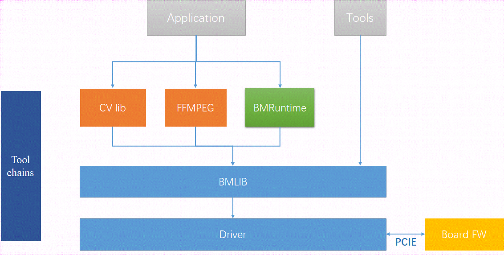
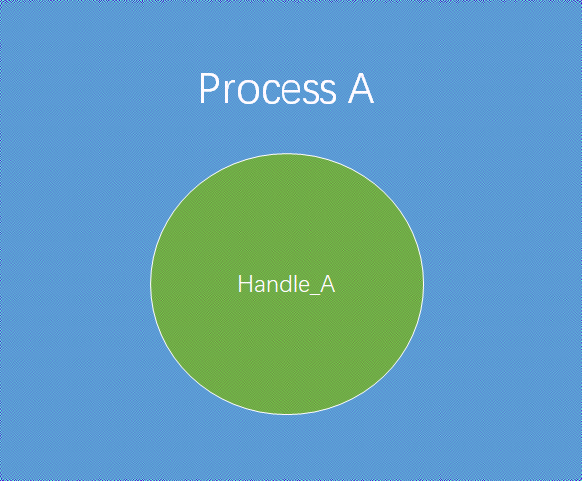
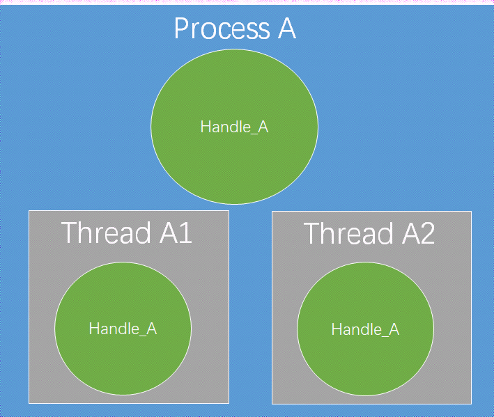
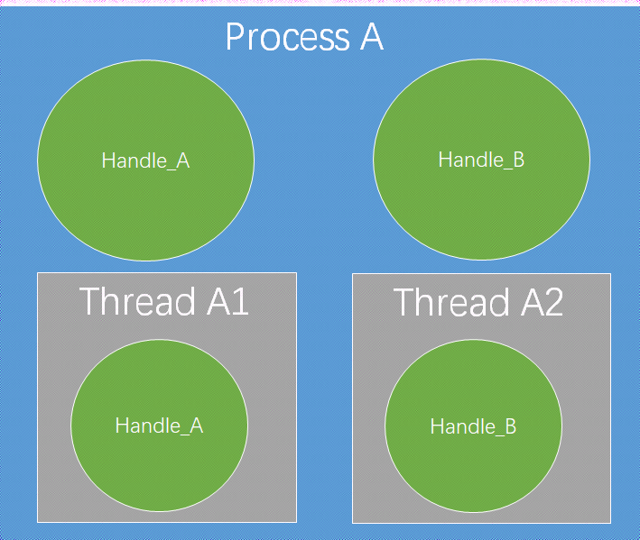
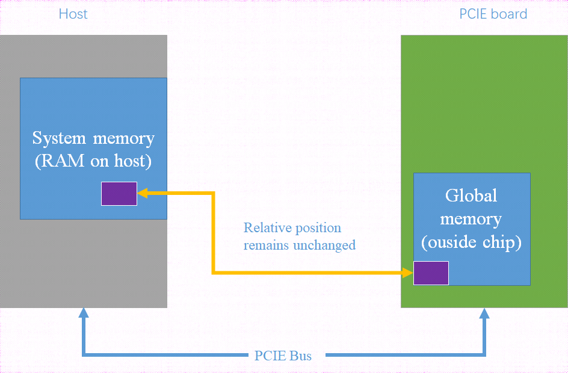
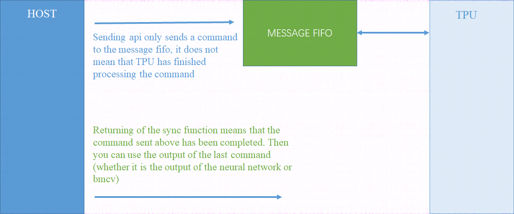

Basic Concepts and Functions of Bmlib
=====================

The simple functional diagram of SDK based on SOPHGO neural network accelerator chip is as follows:

          
Bmlib is a underlying software library encapsulated on the kernel driver. Its main functions include:

-  Creation and destruction of the device handle

-  Memory help function interface

-  Allocation and release of global memory

-  Data handling between host and global memory

-  Data handling in global memory

-  API sending and synchronization

-  Mapping and consistency management of global memory on the host side

-  Profile interface

-  Enabling and use of A53

-  Miscellaneous management interface

-  Power control interface

Concept of Handle
------------

Our neural network acceleration device, whether in PCIe mode or SOC mode, 
will become a standard character device after the installation of the TPU driver. 
A handle needs to be created when the upper user process try to run on this device.

Handle is used in managing api, applying for memory and releasing memory. 
If a process creates two handles, which name is handle_A1 and handle_A2, 
then they are independent.

If there are two handles, Process_A and Thread_B,and Thread_B is a sub-thread of Process_A. 
Thread_A and Thread_B are created in Process_A and Thread_B respectively. 
Handle_A and Handle_B are also surely independent.

If an api is sent through handle_A, it must be passed through handle_A sync；

If a piece of memory is applied through handle_A, it must be released through handle_A;

It should be noted that the creator and user of the handle can be different. For example, process A creates handle_A, and the sub-thread A1 of A can also use handle_A, but the memory applied by A1 through the handle_A is statistically counted as that applied by A.

We recommend the following four ways to use handle:

Create Handle_A in process A. Handle_A is only used in process A;

.. image:: ./images/image3.png
   :scale: 50%
   :align: center

Create handle_A in process A. Handle_A is used in the two sub-threads of process A (it can be multiple, and the two in the figure are only illustrative);

Process A and its sub-threads (can be multiple, and the two in the figure are just examples) create and use their own created handles;

Process A creates multiple handles, which are used by each sub-thread.

Memory Type
------------

The above figure introduces the types of memory in PCIe mode, 
in which host can be PC/server, and PCIe board is SC5 series board. 
The memory on the host side is called system memory, 
and the memory on the PCIe board is called global memory or device memory. 
There is a DMA hardware in BM1684 chip special for carrying data between system memory and global memory.

Concept and Synchronization of Api
---------------

If the software on the host side wants the TPU to complete a task, 
it needs to send an “API” to the TPU, which is like a command. 
Please note that the sending API function and the execution completion of the API are asynchronous, 
so the software on the host side needs to call a sync function class until the API is really completed.

At present, the action of sending API has been encapsulated in bmcv / bmrt function library. 
Users cannot send API directly, but can send API by calling the interface of bmcv / bmrt.

After calling the interface of bmcv / bmrt to send the API, 
please refer to the bmcv / bmrt document to check whether you need to call the sync function to wait for the completion of the API. 
The interface of bmcv / bmrt may have encapsulated the sync function in the interface function of bmcv / bmrt. 
In this way, the API has been completed when the interface function of bmcv / bmrt returns.

Interface of Profile
-----------

Profile interface is used to obtain the time spent by the TPU processing API, 
which has been accumulated since TPU began to work (if there are continuous APIs to be processed). 
If only one process in the system uses TPU device, we can calculate the processing time of the API by calculating the difference between the profile data before and after calling the API.

Enable of A53
---------

In PCIe mode, we provide some interfaces to start A53 core in BM1684 
and let them complete some acceleration tasks.

Power Control
---------

We provide interfaces to obtain and set the working frequency of TPU. 
Users can define their own power consumption control strategies.

Interface of Miscellaneous Information
------------

It is used to obtain the information of the board and the statistical information during operation. 
At present, it includes the total amount and usage of memory and the utilization rate of TPU
