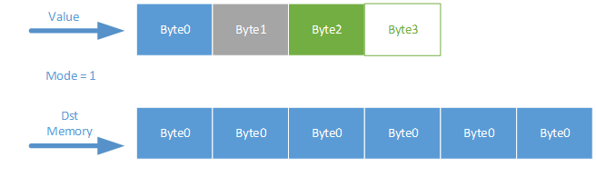
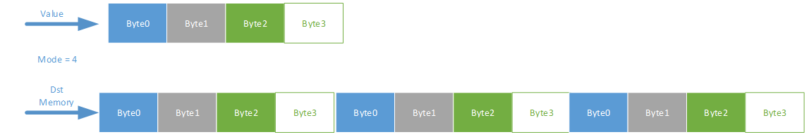

Detailed Interface Introductions to bmlib
=============================================

Creation and Destruction of Device Handle
-------------------------------------------

bm_dev_getcount
~~~~~~~~~~~~~~~

Function prototype: bm_status_t bm_dev_getcount(int *count)

Function: obtain the number of sophon devices in the current system. If the number of devices obtained is N, the legal value of devid is [0, N-1].

Parameter introduction:

+--------------+---------------+-------------------------------------------------+
| Parameter    | Input / output| Description                                     |
+==============+===============+=================================================+
| count        | Output        | Pointer for storing the number of sophon devices|
+--------------+---------------+-------------------------------------------------+

Return value: BM_SUCCESS indicates getting the correct number; 
Other error codes indicate that the number cannot be obtained

bm_dev_query
~~~~~~~~~~~~

Function prototype: bm_status_t bm_dev_query(int devid)

Function: query whether a device exists according to the device index value

Parameter introduction:

+--------------+---------------+-------------------------------------------------+
| Parameter    | Input / output| Description                                     |
+==============+===============+=================================================+
| devid        | Input         | Index value of the queried device               |
+--------------+---------------+-------------------------------------------------+

Return value: BM_SUCCESS indicates the existence of this device; 
Other error codes indicate that the device does not exist

bm_dev_request
~~~~~~~~~~~~~~

Function prototype: bm_status_t bm_dev_request(bm_handle_t *handle, int devid)

Function: create a handle on a specific device

Parameter introduction:

+--------------+---------------+-------------------------------------------------+
| Parameter    | Input / output| Description                                     |
+==============+===============+=================================================+
| handle       | Output        | Save the pointer of the created handle          |
+--------------+---------------+-------------------------------------------------+
| devid        | Input         | Specific device                                 |
+--------------+---------------+-------------------------------------------------+

Return value: BM_SUCCESS indicates the creation is successful; 
Other error codes represent creation error.

bm_get_devid
~~~~~~~~~~~~

Prototype function: bm_get_devid(bm_handle_t *handle)

Function: get the device index according to the given handle

Parameter introduction:

+--------------+---------------+-------------------------------------------------+
| Parameter    | Input / output| Description                                     |
+==============+===============+=================================================+
| handle       | input         | device handle                                   |
+--------------+---------------+-------------------------------------------------+

Return value: int type device index pointed to by handle

bm_dev_free
~~~~~~~~~~~

Function prototype: void bm_dev_free(bm_handle_t handle)

Function: release the created handle

Parameter introduction:

+--------------+---------------+-------------------------------------------------+
| Parameter    | Input / output| Description                                     |
+==============+===============+=================================================+
| handle       | input         | Handle to be released                           |
+--------------+---------------+-------------------------------------------------+

Return value: None

Interfaces of memory help functions
-------------------

bm_mem_get_type
~~~~~~~~~~~~~~~

Function prototype: bm_mem_type_t bm_mem_get_type(struct bm_mem_desc mem);

Function: get the type of a piece of memory

Parameter introduction:

+--------------+---------------+-------------------------------------------------+
| Parameter    | Input / output| Description                                     |
+==============+===============+=================================================+
| mem          | input         | Queried memory                                  |
+--------------+---------------+-------------------------------------------------+

Return value: BM_MEM_TYPE_DEVICE represents global memory; 

BM_MEM_TYPE_SYSTEM represents the user layer memory of Linux system.

bm_mem_get_device_addr
~~~~~~~~~~~~~~~~~~~~~~

Function prototype: unsigned long long bm_mem_get_device_addr(struct bm_mem_desc mem);

Function: get the address of memory of device type

Parameter introduction:

+--------------+---------------+-------------------------------------------------+
| Parameter    | Input / output| Description                                     |
+==============+===============+=================================================+
| mem          | input         | Queried memory                                  |
+--------------+---------------+-------------------------------------------------+

Return value: returns the address of device memory, 
an unsigned number of 64 bits

bm_mem_set_device_addr
~~~~~~~~~~~~~~~~~~~~~~

Function prototype: void bm_mem_set_device_addr(struct bm_mem_desc *pmem, unsigned long long addr);

Function: Set the address of a device type memory

Parameter introduction:

+--------------+---------------+-------------------------------------------------+
| Parameter    | Input / output| Description                                     |
+==============+===============+=================================================+
| pmem         | Input / output| Pointer to the set memory                       |
+--------------+---------------+-------------------------------------------------+
| addr         | input         | Memory address set                              |
+--------------+---------------+-------------------------------------------------+

Return value: None

bm_mem_get_device_size
~~~~~~~~~~~~~~~~~~~~~~

Function prototype: unsigned int bm_mem_get_device_size(struct bm_mem_desc mem);

Function: get the size of a piece of memory of device type

Parameter introduction:

+--------------+---------------+-------------------------------------------------+
| Parameter    | Input / output| Description                                     |
+==============+===============+=================================================+
| mem          | input         | Queried memory                                  |
+--------------+---------------+-------------------------------------------------+

Return value: return the memory size, 
32-bit unsigned number

bm_mem_set_device_size
~~~~~~~~~~~~~~~~~~~~~~

Function prototype: void bm_mem_set_device_size(struct bm_mem_desc *pmem, unsigned int size);

Function: set the size of a piece of memory of device type

Parameter introduction:

+--------------+---------------+-------------------------------------------------+
| Parameter    | Input / output| Description                                     |
+==============+===============+=================================================+
| pmem         | Input/output  | Pointer to the set memory                       |
+--------------+---------------+-------------------------------------------------+
| size         | input         | The size of memory, in bytes                    |
+--------------+---------------+-------------------------------------------------+

Return value: None

bm_set_device_mem
~~~~~~~~~~~~~~~~~

Function prototype: void bm_set_device_mem(bm_device_mem_t *pmem, unsigned int size, unsigned long long addr);

Function: fill in the size and address of a device type memory

Parameter introduction:

+--------------+---------------+-------------------------------------------------+
| Parameter    | Input / output| Description                                     |
+==============+===============+=================================================+
| pmem         |Input / output | Pointer to the set memory                       |
+--------------+---------------+-------------------------------------------------+
| size         | input         | The size of memory, in bytes                    |
+--------------+---------------+-------------------------------------------------+
| addr         | input         | Address of memory                               |
+--------------+---------------+-------------------------------------------------+

Return value: None

bm_mem_from_device
~~~~~~~~~~~~~~~~~~

Function prototype: bm_device_mem_t bm_mem_from_device(unsigned long long device_addr, unsigned int len);

Function: build a bm_device_mem_t type structure according to the address and size

Parameter introduction:

+--------------+---------------+-------------------------------------------------+
| Parameter    | Input / output| Description                                     |
+==============+===============+=================================================+
| device_addr  | input         | Address of memory                               |
+--------------+---------------+-------------------------------------------------+
| len          | input         | The size of memory, in bytes                    |
+--------------+---------------+-------------------------------------------------+

Return value: a bm_device_mem_t structure

bm_mem_get_system_addr
~~~~~~~~~~~~~~~~~~~~~~

Function prototype: void *bm_mem_get_system_addr(struct bm_mem_desc mem);

Function: get the address of system type memory

Parameter Description: mem, the queried memory

+--------------+---------------+-------------------------------------------------+
| Parameter    | Input / output| Description                                     |
+==============+===============+=================================================+
| mem          | input         | Queried memory                                  |
+--------------+---------------+-------------------------------------------------+

Return value: return the address of the queried memory

bm_mem_set_system_addr
~~~~~~~~~~~~~~~~~~~~~~

Function prototype: void bm_mem_set_system_addr(struct bm_mem_desc *pmem, void *addr);

Function: set the address of a system type memory

Parameter introduction:

+--------------+---------------+-------------------------------------------------+
| Parameter    | Input / output| Description                                     |
+==============+===============+=================================================+
| pmem         | Input/output  | Pointer to the set memory                       |
+--------------+---------------+-------------------------------------------------+
| addr         | input         | System address pointer                          |
+--------------+---------------+-------------------------------------------------+

Return value: None

bm_mem_from_system
~~~~~~~~~~~~~~~~~~

Function prototype: bm_system_mem_t bm_mem_from_system(void *system_addr);

Function: build a bm_system_mem_t according to the system pointer

Parameter introduction:

+--------------+---------------+-------------------------------------------------+
| Parameter    | Input / output| Description                                     |
+==============+===============+=================================================+
| system_addr  | input         | System address pointer                          |
+--------------+---------------+-------------------------------------------------+

Return value: a bm_system_mem_t structure

Application and Release of Global Memory
-------------------------

bm_mem_null
~~~~~~~~~~~

Function prototype: bm_device_mem_t bm_mem_null(void);

Function: Return a bm memory structure which type is illegal

Parameter: None

Return value: a bm_device_mem_t structure

bm_malloc_neuron_device
~~~~~~~~~~~~~~~~~~~~~~~

Function prototype: bm_status_t bm_malloc_neuron_device(bm_handle_t handle, bm_device_mem_t *pmem, int n, int c, int h, int w);

Function: apply for a device type memory according to the shape information of batch, and the size of each neuron is an FP32 (4 bytes)

Parameter introduction:

+--------------+---------------+-------------------------------------------------+
| Parameter    | Input / output| Description                                     |
+==============+===============+=================================================+
| handle       | input         | Device handle                                   |
+--------------+---------------+-------------------------------------------------+
| pmem         | output        |  Allocate the pointer of device memory          |
+--------------+---------------+-------------------------------------------------+
| n/c/h/w      | input         | Shape of batch                                  |
+--------------+---------------+-------------------------------------------------+

Return value: BM_SUCCESS means successful assignment; 
Other error codes represent allocation error

bm_malloc_device_dword
~~~~~~~~~~~~~~~~~~~~~~

Function prototype: bm_status_t bm_malloc_device_dword(bm_handle_t handle, bm_device_mem_t *pmem, int count);

Function: allocate memory of device type with the size of count DWORD (4 bytes)

Parameter introduction:

+--------------+---------------+-------------------------------------------------+
| Parameter    | Input / output| Description                                     |
+==============+===============+=================================================+
| handle       | input         | Device handle                                   |
+--------------+---------------+-------------------------------------------------+
| pmem         | output        | Allocate the pointer of device memory           |
+--------------+---------------+-------------------------------------------------+
| count        | input         | Number of dword to be allocated                 |
+--------------+---------------+-------------------------------------------------+

Return value: BM_SUCCESS indicates successful assignment; 
Other error codes represent allocation failure

bm_malloc_device_byte
~~~~~~~~~~~~~~~~~~~~~

Function prototype: bm_status_t bm_malloc_device_byte(bm_handle_t handle, bm_device_mem_t *pmem, unsigned int size);

Function: allocate memory of device type with specified number of bytes

Parameter introduction:

+--------------+---------------+-------------------------------------------------+
| Parameter    | Input / output| Description                                     |
+==============+===============+=================================================+
| handle       | input         | Device handle                                   |
+--------------+---------------+-------------------------------------------------+
| pmem         | output        |  Allocate the pointer of the device memory      |
+--------------+---------------+-------------------------------------------------+
| size         | input         | Number of bytes to be allocated                 |
+--------------+---------------+-------------------------------------------------+

Return value: BM_SUCCESS indicates successful assignment; 
Other error codes represent allocation failure

bm_malloc_device_byte_heap
~~~~~~~~~~~~~~~~~~~~~~~~~~

Function prototype: bm_status_t bm_malloc_device_byte_heap(bm_handle_t handle, bm_device_mem_t *pmem, int heap_id, unsigned int size);

Function: allocate the memory of the device type with the specific number and size of bytes on the specific HEAP

Parameter introduction:

+--------------+---------------+-------------------------------------------------+
| Parameter    | Input / output| Description                                     |
+==============+===============+=================================================+
| handle       | input         | Device handle                                   |
+--------------+---------------+-------------------------------------------------+
| pmem         | output        | Allocate the pointer of device memory           |
+--------------+---------------+-------------------------------------------------+
| heap_id      | input         | HEAP assigned to GMEM (0/1/2)                   |
+--------------+---------------+-------------------------------------------------+
| size         | input         | Number of bytes to be allocated                 |
+--------------+---------------+-------------------------------------------------+

Return value: BM_SUCCESS indicates successful assignment; 
Other error codes represent allocation failure

bm_malloc_device_byte_heap_mask
~~~~~~~~~~~~~~~~~~~~~~~~~~~~~~~

Function prototype: bm_status_t bm_malloc_device_byte_heap_mask(bm_handle_t handle, bm_device_mem_t *pmem, int heap_id_mask, unsigned int size);

Function: allocate device type memory with size of specified bytes on one or more specified HEAP

Parameter introduction:

.. list-table::
   :widths: 25 25 50
   :header-rows: 0

   * - **Parameter**
     - **Input/output**
     - **Description**

   * - handle
     - input
     - Device handle 

   * - pmem
     - output
     - Allocate the pointer of the device memory

   * - heap_id_mask
     - input
     - Specify the mask for allocating the HEAP ID of GMEM. Each bit represents a HEAP. If it is set to 1, it means it can be allocated from this HEAP. If it is 0, it means it cannot be allocated from this HEAP. The lowest bit bit0 represents heap0, increasing in sequence

   * - size
     - input
     - Number of bytes to be allocated

Return value: BM_SUCCESS indicates successful assignment; Other error codes represent allocation failure

bm_free_device
~~~~~~~~~~~~~~

Function prototype: void bm_free_device(bm_handle_t handle, bm_device_mem_t mem);

Function: release a piece of memory of device type

Parameter introduction:

+--------------+---------------+-------------------------------------------------+
| Parameter    | Input / output| Description                                     |
+==============+===============+=================================================+
| handle       | input         | Device handle                                   |
+--------------+---------------+-------------------------------------------------+
| mem          | input         | Device memory to release                        |
+--------------+---------------+-------------------------------------------------+

Return value: None

bm_gmem_arm_reserved_request
~~~~~~~~~~~~~~~~~~~~~~~~~~~~

Function prototype: unsigned long long bm_gmem_arm_reserved_request(bm_handle_t handle);

Function: obtain the starting address of GMEM reserved for arm926

Parameter introduction:

+--------------+---------------+-------------------------------------------------+
| Parameter    | Input / output| Description                                     |
+==============+===============+=================================================+
| handle       | input         | Device handle                                   |
+--------------+---------------+-------------------------------------------------+

Return value: the starting address of GMEM reserved for arm926 (an absolute address)

bm_gmem_arm_reserved_release
~~~~~~~~~~~~~~~~~~~~~~~~~~~~

Function prototype: void bm_gmem_arm_reserved_release(bm_handle_t handle);

Function: release GMEM reserved for arm926

Parameter introduction:

+--------------+---------------+-------------------------------------------------+
| Parameter    | Input / output| Description                                     |
+==============+===============+=================================================+
| handle       | input         | Device handle                                   |
+--------------+---------------+-------------------------------------------------+

Return value: None

Data Transportation between Host and Global Memory
-----------------------------------

bm_memcpy_s2d
~~~~~~~~~~~~~

Function prototype: bm_status_t bm_memcpy_s2d(bm_handle_t handle, bm_device_mem_t dst, void *src);

Function: copy system memory to device memory

Parameter introduction:

+--------------+---------------+-------------------------------------------------+
| Parameter    | Input / output| Description                                     |
+==============+===============+=================================================+
| handle       | input         | Device handle                                   |
+--------------+---------------+-------------------------------------------------+
| dst          | input         |  Structure of target device memory              |
+--------------+---------------+-------------------------------------------------+
| src          | input         | Pointer to system memory                        |
+--------------+---------------+-------------------------------------------------+

Return value: BM_SUCCESS indicates successful transmission; 
Other error codes represent transmission failure

bm_memcpy_s2d_partial_offset
~~~~~~~~~~~~~~~~~~~~~~~~~~~~

Function prototype: bm_status_t bm_memcpy_s2d_partial_offset(bm_handle_t handle,
bm_device_mem_t dst, void *src,
unsigned int size,
unsigned int offset);

Function: copy system memory to device type memory, 
specify the length and the starting address offset of device memory. 
The effect is to copy size length data from src to (dst starting address + offset).

Parameter introduction:

.. list-table::
   :widths: 15 20 65
   :header-rows: 0

   * - **Parameter**
     - **Input/Output**
     - **Description**

   * - handle
     - input
     - Device handle

   * - dst
     - input
     - Target device memory structure

   * - src
     - input
     - Pointer to system memory

   * - size
     - input
     - Length of copy

   * - offset
     - input
     - This copy is made on the device memory side relative to the offset of the starting address of the device memory.

Return value: BM_SUCCESS indicates successful transmission; 
Other error codes represent transmission failure

bm_memcpy_s2d_partial
~~~~~~~~~~~~~~~~~~~~~

Function prototype: bm_status_t bm_memcpy_s2d_partial(bm_handle_t handle, bm_device_mem_t dst, void *src, unsigned int size);

Function: copy system memory to device type memory and specify the length; The effect is to copy the data of size length from src to the starting address of dst.

Parameter introduction:

+--------------+---------------+-------------------------------------------------+
| Parameter    | Input / output| Description                                     |
+==============+===============+=================================================+
| handle       | input         | Device handle                                   |
+--------------+---------------+-------------------------------------------------+
| dst          | input         | Structure of target device memory               |
+--------------+---------------+-------------------------------------------------+
| src          | input         | Pointer to system memory                        |
+--------------+---------------+-------------------------------------------------+
| size         | input         | Length of copy                                  |
+--------------+---------------+-------------------------------------------------+

Return value: BM_SUCCESS indicates successful transmission; 
Other error codes represent transmission failure

bm_memcpy_d2s
~~~~~~~~~~~~~

Function prototype: bm_status_t bm_memcpy_d2s(bm_handle_t handle, void *dst, bm_device_mem_t src);

Function: copy device type memory to system memory

Parameter introduction:
handle, device handle; dst, pointer structure to system memory; src, device memory;

+--------------+---------------+-------------------------------------------------+
| Parameter    | Input / output| Description                                     |
+==============+===============+=================================================+
| handle       | input         | Device handle                                   |
+--------------+---------------+-------------------------------------------------+
| dst          | input         | Pointer to system memory                        |
+--------------+---------------+-------------------------------------------------+
| src          | input         | Structure of source device memory               |
+--------------+---------------+-------------------------------------------------+

Return value: BM_SUCCESS indicates successful transmission; Other error codes represent transmission failure.

bm_memcpy_d2s_partial_offset
~~~~~~~~~~~~~~~~~~~~~~~~~~~~

Function prototype: bm_status_t bm_memcpy_d2s_partial_offset(bm_handle_t handle, void *dst, bm_device_mem_t src, unsigned int size, unsigned int offset);

Function: copy device type memory to system memory, specifing the size, and offset of device memory. The effect is to copy size byte data from device memory start address + offset to dst.

Parameter introduction:

+--------------+---------------+----------------------------------------------------------------------------------------------+
| Parameter    | Input / output| Description                                                                                  |
+==============+===============+==============================================================================================+
| handle       | input         | Device handle                                                                                |
+--------------+---------------+----------------------------------------------------------------------------------------------+
| dst          | input         | Pointer to system memory                                                                     |
+--------------+---------------+----------------------------------------------------------------------------------------------+
| src          | input         | Structure of source device memory                                                            |
+--------------+---------------+----------------------------------------------------------------------------------------------+
| size         | input         | Length of copy (in bytes)                                                                    |
+--------------+---------------+----------------------------------------------------------------------------------------------+
| offset       | input         |The offset of this copy at the device memory end to the starting address of this device memory|
+--------------+---------------+----------------------------------------------------------------------------------------------+

Return value: BM_SUCCESS indicates successful transmission; Other error codes represent transmission failure.

bm_memcpy_d2s_partial
~~~~~~~~~~~~~~~~~~~~~

Function prototype: bm_status_t bm_memcpy_d2s_partial(bm_handle_t handle, void *dst, bm_device_mem_t src, unsigned int size);

Function: copy device type memory to system memory and specify the size; The effect is to copy size byte data from the starting address of device memory to dst.

Parameter introduction:

+--------------+---------------+-------------------------------------------------+
| Parameter    | Input / output| Description                                     |
+==============+===============+=================================================+
| handle       | input         | Device handle                                   |
+--------------+---------------+-------------------------------------------------+
| dst          | input         | Pointer to system memory                        |
+--------------+---------------+-------------------------------------------------+
| src          | input         | Structure of source device memory               |
+--------------+---------------+-------------------------------------------------+
| size         | input         | Length of copy (in bytes)                       |
+--------------+---------------+-------------------------------------------------+

Return value: BM_SUCCESS indicates successful transmission; Other error codes represent transmission failure.

bm_mem_convert_system_to_device_neuron
~~~~~~~~~~~~~~~~~~~~~~~~~~~~~~~~~~~~~~

Function prototype: bm_status_t bm_mem_convert_system_to_device_neuron(bm_handle_t handle, struct bm_mem_desc *dev_mem, struct bm_mem_desc sys_mem, bool need_copy, int n, int c, int h, int w);

Function: apply for a device type memory according to the batch shape (the size of a neuron is fp32 (4 bytes)), and copy a section of system memory to this device memory as needed.

Parameter introduction:

+--------------+---------------+------------------------------------------------------------------------+
| Parameter    | Input / output| Description                                                            |
+==============+===============+========================================================================+
| handle       | input         | Device handle                                                          |
+--------------+---------------+------------------------------------------------------------------------+
| dev_mem      | output        | Pointer to the allocated device memory                                 |
+--------------+---------------+------------------------------------------------------------------------+
| sys_mem      | input         | Memory structure of system type                                        |
+--------------+---------------+------------------------------------------------------------------------+
| need_copy    | input         | Whether to copy the system memory to the newly allocated device memory |
+--------------+---------------+------------------------------------------------------------------------+
| n/c/h/w      | input         | Shape of batch                                                         |
+--------------+---------------+------------------------------------------------------------------------+

Return value: BM_SUCCESS indicates success; 
Other error codes represent failure

bm_mem_convert_system_to_device_neuron_byte
~~~~~~~~~~~~~~~~~~~~~~~~~~~~~~~~~~~~~~~~~~~

Function prototype: 
bm_status_t bm_mem_convert_system_to_device_neuron_byte(
bm_handle_t handle, struct bm_mem_desc *dev_mem, struct bm_mem_desc sys_mem, bool need_copy, int n, int c, int h, int w);

Function: apply for a device type memory according to the batch shape (the size of a neuron is 1 byte), and copy a section of system memory to this device memory as needed.

Parameter introduction:

+--------------+---------------+------------------------------------------------------------------------+
| Parameter    | Input / output| Description                                                            |
+==============+===============+========================================================================+
| handle       | input         | Device handle                                                          |
+--------------+---------------+------------------------------------------------------------------------+
| dev_mem      | output        | Pointer to the allocated device memory                                 |
+--------------+---------------+------------------------------------------------------------------------+
| sys_mem      | input         | Memory structure of system type                                        |
+--------------+---------------+------------------------------------------------------------------------+
| need_copy    | input         | Whether to copy the system memory to the newly allocated device memory |
+--------------+---------------+------------------------------------------------------------------------+
| n/c/h/w      | input         | Shape of batch                                                         |
+--------------+---------------+------------------------------------------------------------------------+

Return value: BM_SUCCESS indicates success; Other error codes represent failure

bm_mem_convert_system_to_device_coeff
~~~~~~~~~~~~~~~~~~~~~~~~~~~~~~~~~~~~~

Function prototype: bm_status_t bm_mem_convert_system_to_device_coeff(bm_handle_t handle, struct bm_mem_desc *dev_mem, struct bm_mem_desc sys_mem, bool need_copy, int coeff_count);

Function: apply for a device type memory according to the number of coefficient elements (the size of a coefficient element is 4 bytes), and copy a section of system memory to this device memory as needed.

Parameter introduction:

+--------------+---------------+------------------------------------------------------------------------+
| Parameter    | Input / output| Description                                                            |
+==============+===============+========================================================================+
| handle       | input         | Device handle                                                          |
+--------------+---------------+------------------------------------------------------------------------+
| dev_mem      | output        | Pointer to the allocated device memory                                 |
+--------------+---------------+------------------------------------------------------------------------+
| sys_mem      | input         | Memory structure of system type                                        |
+--------------+---------------+------------------------------------------------------------------------+
| need_copy    | input         | Whether to copy the system memory to the newly allocated device memory |
+--------------+---------------+------------------------------------------------------------------------+
| coeff_count  | input         | Number of coefficient elements                                         |
+--------------+---------------+------------------------------------------------------------------------+

Return value: BM_SUCCESS indicates success; 
Other error codes represent failure

bm_mem_convert_system_to_device_coeff_byte
~~~~~~~~~~~~~~~~~~~~~~~~~~~~~~~~~~~~~~~~~~

Function prototype: bm_status_t bm_mem_convert_system_to_device_coeff_byte(
bm_handle_t handle, struct bm_mem_desc *dev_mem, struct bm_mem_desc sys_mem, bool need_copy, int coeff_count);

Function: apply for a device type memory according to the number of coefficient elements (the size of a coefficient element is 1 byte), and copy a section of system memory to this device memory as needed.

Parameter introduction:

+--------------+---------------+------------------------------------------------------------------------+
| Parameter    | Input / output| Description                                                            |
+==============+===============+========================================================================+
| handle       | input         | Device handle                                                          |
+--------------+---------------+------------------------------------------------------------------------+
| dev_mem      | output        | Pointer to the allocated device memory                                 |
+--------------+---------------+------------------------------------------------------------------------+
| sys_mem      | input         | Memory structure of type system                                        |
+--------------+---------------+------------------------------------------------------------------------+
| need_copy    | input         | Whether to copy the system memory to the newly allocated device memory |
+--------------+---------------+------------------------------------------------------------------------+
| coeff_count  | input         | Number of coefficient elements, in byte                                |
+--------------+---------------+------------------------------------------------------------------------+

Return value: BM_SUCCESS indicates success; Other error codes represent failure

Data Transportation in Global Memory
-----------------------------

bm_memcpy_d2d
~~~~~~~~~~~~~

Function prototype: bm_status_t bm_memcpy_d2d(bm_handle_t handle, bm_device_mem_t dst, int dst_offset, bm_device_mem_t src, int src_offset, int len);

Function: copy a piece of device type memory to another piece of device type memory, and specify the size, purpose and offset of source data; The effect is to copy len DWORD (4 bytes) data from (src start address + src_offset) to (dst start address + dst_offset)

Parameter introduction:

+--------------+---------------+--------------------------------------------------------------------+
| Parameter    | Input / output| Description                                                        |
+==============+===============+====================================================================+
| handle       | input         | Device handle                                                      |
+--------------+---------------+--------------------------------------------------------------------+
| dst          | input         | Target device memory structure                                     |
+--------------+---------------+--------------------------------------------------------------------+
| dst_offset   | input         | Offset used to calculate the starting position of the data copy    |
+--------------+---------------+--------------------------------------------------------------------+
| src          | input         | Source device memory structure                                     |
+--------------+---------------+--------------------------------------------------------------------+
| src_offset   | input         | Offset used to calculate the starting position of the data copy    |
+--------------+---------------+--------------------------------------------------------------------+
| len          | input         | Data copy length, in DWORD (4 bytes)                               |
+--------------+---------------+--------------------------------------------------------------------+

Return value: BM_SUCCESS means successful transmission; Other error codes represent transmission failure.

bm_memcpy_d2d_byte
~~~~~~~~~~~~~~~~~~

Function prototype: bm_status_t bm_memcpy_d2d_byte(bm_handle_t handle, bm_device_mem_t dst, size_t dst_offset, bm_device_mem_t src, size_t src_offset, size_t size);

Function: copy a piece of device type memory to another piece of device type memory, and specify the size, purpose and offset of source data; The effect is to copy len bytes of data from (src start address + src_offset) to (dst start address + dst_offset)

Parameter introduction:

+--------------+---------------+--------------------------------------------------------------------+
| Parameter    | Input / output| Description                                                        |
+==============+===============+====================================================================+
| handle       | input         | Device handle                                                      |
+--------------+---------------+--------------------------------------------------------------------+
| dst          | input         | Target device memory structure                                     |
+--------------+---------------+--------------------------------------------------------------------+
| dst_offset   | input         | Offset used to calculate the starting position of the data copy    |
+--------------+---------------+--------------------------------------------------------------------+
| src          | input         | Source device memory structure                                     |
+--------------+---------------+--------------------------------------------------------------------+
| src_offset   | input         | Offset used to calculate the starting position of the data copy    |
+--------------+---------------+--------------------------------------------------------------------+
| size         | input         | Data copy length, in bytes                                         |
+--------------+---------------+--------------------------------------------------------------------+

Return value: BM_SUCCESS means successful transmission; Other error codes represent transmission failure.

bm_memcpy_d2d_stride
~~~~~~~~~~~~~~~~~~~~

Function prototype: 
bm_status_t bm_memcpy_d2d_stride(bm_handle_t handle, bm_device_mem_t dst, int dst_stride, bm_device_mem_t src,
int src_stride, int count, int format_size);

Function: copy a piece of device type memory to another piece of device type memory, specify the purpose and stride of source data, the number of data, and the type and byte size of data; The effect is to copy count data with element size of format_size bytes from the src start address to the dst start address with src_stride as the interval size, and store the data with dst_stride as the interval size.

Parameter introduction:

.. list-table::
   :widths: 25 20 55
   :header-rows: 0

   * - **Parameter**
     - **Input/Output**
     - **Description**

   * - handle
     - input
     - Device handle

   * - dst
     - input
     - Target device memory structure

   * - dst_stride
     - input
     - Interval of each element of the target

   * - src
     - input
     - Source device memory structure

   * - src_stride
     - input
     - Interval for each element of the source data

   * - count
     - input
     - Number of elements to be copied

   * - format_size
     - input
     - The byte size of each element. For example, the byte size of float type is 4 and uint8_t type byte size is 1; The number of copies and stride are in format_size

Restrictions: dst_stride is usually 1; There is only one case that cannot be 1: dst_stride = 4 and src_stride = 1 and format_size = 1.

Return value: BM_SUCCESS means successful transmission; Other error codes represent transmission failure.

bm_memset_device
~~~~~~~~~~~~~~~~

Function prototype: 
bm_status_t bm_memset_device(bm_handle_t handle, const int value, bm_device_mem_t mem);

Function: fill a piece of device memory with value

Parameter introduction:

+--------------+---------------+-----------------------------------------------------------------------------------------------------------------------------+
| Parameter    | Input / output| Description                                                                                                                 |
+==============+===============+=============================================================================================================================+
| handle       | input         | Device handle                                                                                                               |
+--------------+---------------+-----------------------------------------------------------------------------------------------------------------------------+
| value        | input         | Values to be populated                                                                                                      |
+--------------+---------------+-----------------------------------------------------------------------------------------------------------------------------+
| mem          | input         | The target device memory structure. This function can only fill the global memory space with an integer multiple of 4 bytes |
+--------------+---------------+-----------------------------------------------------------------------------------------------------------------------------+

Return value: BM_SUCCESS: Successful filling; Other error codes represent filling failure

The role of this function and bm_memset_device_ext function has the same effect when mode is 4.

bm_memset_device_ext
~~~~~~~~~~~~~~~~~~~~

Function prototype: bm_status_t bm_memset_device_ext(bm_handle_t handle, void* value, int mode, bm_device_mem_t mem);

Function: fill a piece of device memory with the content pointed to by value and the specified mode

Parameter introduction:

+--------------+---------------+-------------------------------------------------------------------+
| Parameter    | Input / output| Description                                                       |
+==============+===============+===================================================================+
| handle       | input         | Device handle                                                     |
+--------------+---------------+-------------------------------------------------------------------+
| value        | input         | Points to the value to be populated                               |
+--------------+---------------+-------------------------------------------------------------------+
| mode         | input         | The filling mode is shown in the figure below                     |
+--------------+---------------+-------------------------------------------------------------------+
| mem          | input         | Target device memory structure                                    |
+--------------+---------------+-------------------------------------------------------------------+

Return value: BM_SUCCESS indicates Successful filling; Other error codes represent filling failure

The function diagram of this function is as follows:

.. image:: ./images/image9.png

When mode is 2, the size of DST memory must be an integer multiple of 2 bytes

.. image:: ./images/image10.png

When mode is 3, the size of DST memory must be an integer multiple of 3 bytes

When the mode is 4, the size of dst memory must be an integer multiple of 4 bytes

Global memory transportation between different devices
------------------------------

bm_memcpy_c2c
~~~~~~~~~~~~~

Function prototype: 
bm_status_t bm_memcpy_c2c(bm_handle_t src_handle, bm_handle_t dst_handle, bm_device_mem_t src, bm_device_mem_t dst, bool force_dst_cdma);

Function: move global memory from one device to another (currently only devices on the same card are supported)

Parameter introduction:

.. list-table::
   :widths: 25 25 50
   :header-rows: 0

   * - **Parameter**
     - **Input/output**
     - **Description**

   * - src_handle
     - input
     - Device handle to source address

   * - dst_handle
     - input
     - Device handle to destination address

   * - src
     - input
     - Source target device memory structure

   * - dst
     - input
     - Target device memory structure

   * - force_dst_cdma
     - input
     - The cdma of the destination device is forced to be used for transportation, and the cdma of the source device is used by default

Return value: BM_SUCCESS indicates success; Other error codes represent failure

Mapping and Consistency Management of Global Memory on the Host Side
---------------------------------------

bm_mem_mmap_device_mem
~~~~~~~~~~~~~~~~~~~~~~

Function prototype: bm_status_t bm_mem_mmap_device_mem(bm_handle_t handle, bm_device_mem_t *dmem, unsigned long long *vmem);

Function: map a global memory to the user space of the host and enable cache (only valid in SoC mode, not in PCIe mode)

Parameter introduction:

+--------------+---------------+---------------------------------------------------+
| Parameter    | Input / output| Description                                       |
+==============+===============+===================================================+
| handle       | input         | Device handle                                     |
+--------------+---------------+---------------------------------------------------+
| dmem         | input         | Execute the structure of the mapped global memory |
+--------------+---------------+---------------------------------------------------+
| vmem         | output        | A pointer that stores the mapped virtual address  |
+--------------+---------------+---------------------------------------------------+

Return value: BM_SUCCESS indicates success; Other error codes represent failure

bm_mem_mmap_device_mem_no_cache
~~~~~~~~~~~~~~~~~~~~~~

Function prototype: bm_status_t bm_mem_mmap_device_mem_no_cache(bm_handle_t handle, bm_device_mem_t *dmem, unsigned long long *vmem);

Function: map a global memory to the user space of the host and disable cache (only valid in SoC mode, not in PCIe mode)

Parameter introduction:

+--------------+---------------+---------------------------------------------------+
| Parameter    | Input / output| Description                                       |
+==============+===============+===================================================+
| handle       | input         | Device handle                                     |
+--------------+---------------+---------------------------------------------------+
| dmem         | input         | Execute the structure of the mapped global memory |
+--------------+---------------+---------------------------------------------------+
| vmem         | output        | A pointer that stores the mapped virtual address  |
+--------------+---------------+---------------------------------------------------+

Return value: BM_SUCCESS indicates success; Other error codes represent failure

bm_mem_invalidate_device_mem
~~~~~~~~~~~~~~~~~~~~~~~~~~~~

Function prototype: bm_status_t bm_mem_invalidate_device_mem(bm_handle_t handle, bm_device_mem_t *dmem);

Function: invalidate a mapped device memory (valid only in SoC mode, not in PCIe mode)

Parameter introduction:

+--------------+---------------+-------------------------------------------------+
| Parameter    | Input / output| Description                                     |
+==============+===============+=================================================+
| handle       | input         | Device handle                                   |
+--------------+---------------+-------------------------------------------------+
| dmem         | input         | Pointer to the structure of global              |
|              |               | memory that is invalidated                      |
+--------------+---------------+-------------------------------------------------+

Return value: BM_SUCCESS indicates success; Other error codes represent failure

bm_mem_invalidate_partial_device_mem
~~~~~~~~~~~~~~~~~~~~~~~~~~~~~~~~~~~~

Function prototype: bm_status_t bm_mem_invalidate_partial_device_mem(bm_handle_t handle, bm_device_mem_t *dmem, u32 offset, u32 len)

Function: invalidate a part of the mapped device memory (only valid in SoC mode, not in PCIe mode)

Parameter introduction:

+--------------+---------------+------------------------------------+
| Parameter    | Input / output| Description                        |
+==============+===============+====================================+
| handle       | input         | Device handle                      |
+--------------+---------------+------------------------------------+
| dmem         | input         | Pointer to the structure of global |
|              |               | memory that is invalidated         |
+--------------+---------------+------------------------------------+
| offset       | input         | Address offset                     |
+--------------+---------------+------------------------------------+
| len          | input         |  Length of invalidate              |
+--------------+---------------+------------------------------------+

Return value: BM_SUCCESS indicates success; Other error codes represent failure

bm_mem_flush_device_mem
~~~~~~~~~~~~~~~~~~~~~~~

Function prototype: bm_status_t bm_mem_flush_device_mem(bm_handle_t handle, bm_device_mem_t *dmem);

Function: flush a mapped device global memory (only valid in SoC mode, not supported in PCIe mode)

Parameter introduction:

+--------------+---------------+-------------------------------------------------+
| Parameter    | Input / output| Description                                     |
+==============+===============+=================================================+
| handle       | input         | Device handle                                   |
+--------------+---------------+-------------------------------------------------+
| dmem         | input         | The structure of global memory that is flushed  |
+--------------+---------------+-------------------------------------------------+

Return value: BM_SUCCESS indicates success; Other error codes represent failure

bm_mem_flush_partial_device_mem
~~~~~~~~~~~~~~~~~~~~~~~~~~~~~~~

Function prototype: bm_status_t bm_mem_flush_partial_device_mem(bm_handle_t handle, bm_device_mem_t *dmem, u32 offset, u32 len)

Function: flush a part of the mapped device global memory (only valid in SoC mode, not in PCIe mode)

Parameter introduction:

+--------------+---------------+-------------------------------------------------+
| Parameter    | Input / output| Description                                     |
+==============+===============+=================================================+
| handle       | input         | Device handle                                   |
+--------------+---------------+-------------------------------------------------+
| dmem         | input         | The structure of global memory that is flushed  |
+--------------+---------------+-------------------------------------------------+
| offset       | input         | Address offset                                  |
+--------------+---------------+-------------------------------------------------+
| len          | input         | Length of flush                                 |
+--------------+---------------+-------------------------------------------------+

Return value: BM_SUCCESS indicates success; Other error codes represent failure

bm_mem_unmap_device_mem
~~~~~~~~~~~~~~~~~~~~~~~

Function prototype: bm_status_t bm_mem_unmap_device_mem(bm_handle_t handle, void *vmem, int size);

Function: in SoC mode, unmap device memory. (valid only in SoC mode, not in PCIe mode)

+--------------+---------------+-------------------------------------------------+
| Parameter    | Input / output| Description                                     |
+==============+===============+=================================================+
| handle       | input         | Device handle                                   |
+--------------+---------------+-------------------------------------------------+
| vmem         | input         | Virtual address of unmap                        |
+--------------+---------------+-------------------------------------------------+
| size         | input         | Size of unmap                                   |
+--------------+---------------+-------------------------------------------------+

Return value: BM_SUCCESS indicates success; Other error codes represent failure

bm_mem_vir_to_phy
~~~~~~~~~~~~~~~~~

Function prototype: bm_status_t bm_mem_vir_to_phy(bm_handle_t handle, unsigned long long vmem, unsigned long long *device_mem);

Function: in SoC mode, the virtual address obtained by bm_mem_mmap_device_mem function can be converted into the physical address of device memory. 
(Valid only in SoC mode, not in PCIe mode)

+--------------+---------------+-------------------------------------------------+
| Parameter    | Input / output| Description                                     |
+==============+===============+=================================================+
| handle       | input         | Device handle                                   |
+--------------+---------------+-------------------------------------------------+
| vmem         | input         | Virtual address                                 |
+--------------+---------------+-------------------------------------------------+
| device_mem   | output        | Physical address on the device                  |
+--------------+---------------+-------------------------------------------------+

Return value: BM_SUCCESS indicates success; Other error codes represent failure

Synchronization of API 
---------

bm_flush
~~~~~~~~

Function prototype: void bm_flush(bm_handle_t handle);

Function: this function is equivalent to bm_handle_sync. This function exists to maintain compatibility with old code. It is not recommended to continue to use it.

Parameter introduction:

+--------------+---------------+-------------------------------------------------+
| Parameter    | Input / output| Description                                     |
+==============+===============+=================================================+
| handle       | input         | Device handle                                   |
+--------------+---------------+-------------------------------------------------+

Return value: None

bm_device_sync
~~~~~~~~~~~~~~

Function prototype: bm_status_t bm_device_sync(bm_handle_t handle);

Function: when the process of creating handle calls A to use this function, there are already N APIs processing on the device pointed to by handle. Function has not return util these N APIs are completed.

Parameter introduction:

+--------------+---------------+-------------------------------------------------+
| Parameter    | Input / output| Description                                     |
+==============+===============+=================================================+
| handle       | input         | Device handle                                   |
+--------------+---------------+-------------------------------------------------+

Return value: BM_SUCCESS indicates successful synchronization; 
Other error codes represent synchronization failure

bm_thread_sync
~~~~~~~~~~~~~~

Function prototype: bm_status_t bm_thread_sync(bm_handle_t handle);

Function: wait for all APIs previously submitted by this caller thread on the handle to complete. If this caller thread has not submitted APIs on this handle, it will directly return success; The return of this function cannot guarantee that the APIs submitted by this caller thread on other handles has been completed.

Parameter introduction:

+--------------+---------------+-------------------------------------------------+
| Parameter    | Input / output| Description                                     |
+==============+===============+=================================================+
| handle       | input         | Device handle                                   |
+--------------+---------------+-------------------------------------------------+

Return value: BM_SUCCESS indicates successful synchronization; 
Other error codes represent synchronization failure

bm_handle_sync
~~~~~~~~~~~~~~

Function prototype: bm_status_t bm_handle_sync(bm_handle_t handle);

Function: synchronize all API operations submitted to the current handle. When calling this function, there are N APIs sent through this handle. After the function returns, all N APIs are completed.

Parameter introduction:

+--------------+---------------+-------------------------------------------------+
| Parameter    | Input / output| Description                                     |
+==============+===============+=================================================+
| handle       | input         | Device handle                                   |
+--------------+---------------+-------------------------------------------------+

Return value: BM_SUCCESS indicates successful synchronization; 
Other error codes represent synchronization failure

Profile Interface
-----------

bm_get_profile
~~~~~~~~~~~~~~

Function prototype: bm_status_t bm_get_profile(bm_handle_t handle, bm_profile_t *profile);

Function: get the profile data of the current time point

Parameter introduction:

+--------------+---------------+-------------------------------------------------+
| Parameter    | Input / output| Description                                     |
+==============+===============+=================================================+
| handle       | input         | Device handle                                   |
+--------------+---------------+-------------------------------------------------+
| profile      | output        | Point to a structure that holds profling data   |
+--------------+---------------+-------------------------------------------------+

Return value: BM_SUCCESS indicates success; Other error codes represent failure

bm_get_last_api_process_time_us
~~~~~~~~~~~~~~~~~~~~~~~~~~~~~~~

Function prototype: bm_status_t bm_get_last_api_process_time_us(bm_handle_t handle, unsigned long *time_us);

Function: this function is deprecated.

Parameter introduction: None

Return value: BM_SUCCESS indicates success; Other error codes represent failure

Power Management Interface
-------------

bm_set_clk_tpu_freq
~~~~~~~~~~~~~~~~~~~

Function prototype: bm_status_t bm_set_clk_tpu_freq(bm_handle_t handle, int freq);

Function: set the working frequency of the current TPU, which is only valid in PCIe mode

Parameter introduction:

+--------------+---------------+-------------------------------------------------+
| Parameter    | Input / output| Description                                     |
+==============+===============+=================================================+
| handle       | input         | Device handle                                   |
+--------------+---------------+-------------------------------------------------+
| freq         | input         | Pointer to save TPU current operating frequency |
+--------------+---------------+-------------------------------------------------+

Return value: BM_SUCCESS indicates success; Other error codes represent failure

bm_get_clk_tpu_freq
~~~~~~~~~~~~~~~~~~~

Function prototype: bm_status_t bm_get_clk_tpu_freq(bm_handle_t handle, int *freq);

Function: obtain the working frequency of the current TPU

Parameter introduction:

+--------------+---------------+-------------------------------------------------+
| Parameter    | Input / output| Description                                     |
+==============+===============+=================================================+
| handle       | input         | Device handle                                   |
+--------------+---------------+-------------------------------------------------+
| freq         | output        | Pointer to save current TPU operating frequency |
+--------------+---------------+-------------------------------------------------+

Return value: BM_SUCCESS indicates success; Other error codes represent failure

Device Management Interface
------------

bm_get_misc_info
~~~~~~~~~~~~~~~~

Function prototype: bm_status_t bm_get_misc_info(bm_handle_t handle, struct bm_misc_info *pmisc_info);

Function: obtain misc information related to the device

Parameter introduction:

+--------------+---------------+-------------------------------------------------+
| Parameter    | Input / output| Description                                     |
+==============+===============+=================================================+
| handle       | input         | Device handle                                   |
+--------------+---------------+-------------------------------------------------+
| pmisc_info   | output        | Pointer to save misc data                       |
+--------------+---------------+-------------------------------------------------+

Return value: BM_SUCCESS indicates success; Other error codes represent failure

bm_get_chipid
~~~~~~~~~~~~~

Function prototype: bm_status_t bm_get_chipid(bm_handle_t handle, unsigned int *p_chipid);

Function: obtain the chip ID corresponding to the device

Parameter introduction:

+--------------+---------------+-------------------------------------------------+
| Parameter    | Input / output| Description                                     |
+==============+===============+=================================================+
| handle       | input         | Device handle                                   |
+--------------+---------------+-------------------------------------------------+
| p_chipid     | output        | Pointer to save chip ID                         |
+--------------+---------------+-------------------------------------------------+

Return value: BM_SUCCESS indicates success; Other error codes represent failure

bm_get_stat
~~~~~~~~~~~

Function prototype: bm_status_t bm_get_stat(bm_handle_t handle, bm_dev_stat_t *stat);

Function: obtain the runtime statistics of the device corresponding to the handle

Parameter introduction:

+--------------+---------------+-------------------------------------------------+
| Parameter    | Input / output| Description                                     |
+==============+===============+=================================================+
| handle       | input         | Device handle                                   |
+--------------+---------------+-------------------------------------------------+
| Stat         | output        | Pointer for storing statistics                  |
+--------------+---------------+-------------------------------------------------+

Return value: BM_SUCCESS indicates success; Other error codes represent failure

bm_get_gmem_heap_id
~~~~~~~~~~~~~~~~~~~

Function prototype: 
bm_get_gmem_heap_id(bm_handle_t handle,
bm_device_mem_t *pmem,
unsigned int *heapid);

Function: get the heap id of the device memory pointed to by pmem

Parameter introduction:

+--------------+---------------+----------------------------------------------------------+
| Parameter    | Input / output| Description                                              |
+==============+===============+==========================================================+
| handle       | input         | Device handle                                            |
+--------------+---------------+----------------------------------------------------------+
| Pmem         | input         | Device memory pointer                                    |
+--------------+---------------+----------------------------------------------------------+
| Heaped       | output        | Pointer to the heap ID where the device memory is stored |
+--------------+---------------+----------------------------------------------------------+

Return value: BM_SUCCESS indicates success; Other error codes represent failure

bmlib_log_get_level
~~~~~~~~~~~~~~~~~~~

Function prototype: int bmlib_log_get_level(void);

Function: get bmlib log level

Parameter introduction: void

Return value: bmlib log level

bmlib_log_set_level
~~~~~~~~~~~~~~~~~~~

Function prototype: void bmlib_log_set_level(int level);

Function: set bmlib log level

Parameter introduction:

+--------------+---------------+-------------------------------------------------+
| Parameter    | Input / output| Description                                     |
+==============+==============+==================================================+
| Level        | input         | The level of bmlib log to set                   |
+--------------+---------------+-------------------------------------------------+

Return value: None

bmlib_log_set_callback
~~~~~~~~~~~~~~~~~~~~~~

Function prototype: void bmlib_log_set_callback((callback)(const char* , int , const char, va_list));

Function: set callback to get bmlib log

Parameter introduction:

+--------------+---------------+--------------------------------------------------------------------+
| Parameter    | Input/output  | Description                                                        |
+==============+===============+====================================================================+
| Callback     | input         | Set the function pointer to get the callback function of bmlib log |
+--------------+---------------+--------------------------------------------------------------------+

Return value: None

bm_set_debug_mode
~~~~~~~~~~~~~~~~~

Function prototype: void bm_set_debug_mode(bm_handle_t handle, int mode);

Function: set debug mode for tpu fw log 

Note: this function is used in SC3

Parameter introduction:

+--------------+---------------+--------------------------------------+
| Parameter    | Input / output| Description                          |
+==============+===============+======================================+
| handle       | input         | Device handle                        |
+--------------+---------------+--------------------------------------+
| Mode         | input         | fw log                               |
|              |               | debug mode, 0/1 means disable/enable |
+--------------+---------------+--------------------------------------+

Return value: None

bmlib_set_api_dbg_callback
~~~~~~~~~~~~~~~~~~~~~~~~~~

Function prototype: void bmlib_set_api_dbg_callback(bmlib_api_dbg_callback callback);

Function: set debug callback to get fw log 

Note: this function is used by SC3

Parameter introduction:

+--------------+---------------+---------------------------------------------------------+
| Parameter    | Input / output| Description                                             |
+==============+===============+=========================================================+
| handle       | input         | Device handle                                           |
+--------------+---------------+---------------------------------------------------------+
| Callback     | input         | Function pointer to get fw log callback function to set |
+--------------+---------------+---------------------------------------------------------+

Return value: None

bm_get_tpu_current
~~~~~~~~~~~~~~~~~~

Function prototype: bm_status_t bm_get_tpu_current(bm_handle_t handle, int *tpuc);

Function: obtain the current value of the device corresponding to the handle. The default unit is milliampere (mA).

Parameter introduction:

+--------------+---------------+-------------------------------------------------+
| Parameter    | Input / output| Description                                     |
+==============+===============+=================================================+
| handle       | input         | Device handle                                   |
+--------------+---------------+-------------------------------------------------+
| tpuc         | output        | Function pointer to get tpuc                    |
+--------------+---------------+-------------------------------------------------+

Return value: BM_SUCCESS indicates success; Other error codes represent failure

bm_get_board_max_power
~~~~~~~~~~~~~~~~~~~~~~

Function prototype: bm_status_t bm_get_board_max_power(bm_handle_t handle, int *maxp);

Function: obtain the maximum power consumption supported by the board where the device is located. The default unit is watt (W).

Parameter introduction:

+--------------+---------------+-------------------------------------------------+
| Parameter    | Input / output| Description                                     |
+==============+===============+=================================================+
| handle       | input         | Device handle                                   |
+--------------+---------------+-------------------------------------------------+
| maxp         | output        | Function pointer to get maxp                    |
+--------------+---------------+-------------------------------------------------+

Return value: BM_SUCCESS indicates success; Other error codes represent failure

bm_get_board_power
~~~~~~~~~~~~~~~~~~

Function prototype: bm_status_t bm_get_board_power(bm_handle_t handle, int *boardp);

Function: obtain the current power consumption value of the board where the device is located. The default unit is watt (W).

Parameter introduction:

+--------------+---------------+-------------------------------------------------+
| Parameter    | Input / output| Description                                     |
+==============+===============+=================================================+
| handle       | input         | Device handle                                   |
+--------------+---------------+-------------------------------------------------+
| boardp       | output        | Function pointer to get boardp                  |
+--------------+---------------+-------------------------------------------------+

Return value: BM_SUCCESS indicates success; Other error codes represent failure

bm_get_fan_speed
~~~~~~~~~~~~~~~~

Function prototype: bm_status_t bm_get_fan_speed(bm_handle_t handle, int *fan);

Function: obtain the fan duty ratio of the board where the device is located

Parameter introduction:

+--------------+---------------+-------------------------------------------------+
| Parameter    | Input / output| Description                                     |
+==============+===============+=================================================+
| handle       | input         | Device handle                                   |
+--------------+---------------+-------------------------------------------------+
| fan          | output        | Function pointer to get fan                     |
+--------------+---------------+-------------------------------------------------+

Return value: BM_SUCCESS indicates success; Other error codes represent failure

bm_get_ecc_correct_num
~~~~~~~~~~~~~~~~~~~~~~

Function prototype: bm_status_t bm_get_ecc_correct_num(bm_handle_t handle, unsigned long *ecc_correct_num);

Function: get the number of times the device corrects errors when DDR is enabled.

Parameter introduction:

+---------------+--------------+--------------------------------------+
| Parameter     | Input/output | Description                          |
+===============+==============+======================================+
| handle        | input        | Device handle                        |
+---------------+--------------+--------------------------------------+
| ec            | output       | To get atx_12v function pointer      |
| c_correct_num |              |                                      |
+---------------+--------------+--------------------------------------+

Return value: BM_SUCCESS indicates success; Other error codes represent failure

bm_get_12v_atx
~~~~~~~~~~~~~~

Function prototype: bm_status_t bm_get_12v_atx(bm_handle_t handle, int *atx_12v);

Function: obtain the 12V power supply current of the device board. The default unit is milliampere (mA).

Parameter introduction:

+--------------+---------------+-------------------------------------------------+
| Parameter    | Input / output| Description                                     |
+==============+===============+=================================================+
| handle       | input         | Device handle                                   |
+--------------+---------------+-------------------------------------------------+
| atx_12v      | output        | To get atx_12v function pointer                 |
+--------------+---------------+-------------------------------------------------+

Return value: BM_SUCCESS indicates success; Other error codes represent failure

bm_get_sn
~~~~~~~~~

Function prototype: bm_status_t bm_get_sn(bm_handle_t handle, char *sn);

Function: obtain the serial number of the board (17 digits in total).

Parameter introduction:

+--------------+---------------+-------------------------------------------------+
| Parameter    | Input / output| Description                                     |
+==============+===============+=================================================+
| handle       | input         | Device handle                                   |
+--------------+---------------+-------------------------------------------------+
| sn           | output        | Function pointer to get sn                      |
+--------------+---------------+-------------------------------------------------+

Return value: BM_SUCCESS indicates success; Other error codes represent failure

bm_get_status
~~~~~~~~~~~~~

Function prototype: bm_status_t bm_get_status(bm_handle_t handle, int *status);

Function: obtain the device state corresponding to the handle. 0 is the active state and 1 is the fault state.

Parameter introduction:

+--------------+---------------+-------------------------------------------------+
| Parameter    | Input / output| Description                                     |
+==============+===============+=================================================+
| handle       | input         | Device handle                                   |
+--------------+---------------+-------------------------------------------------+
| status       | output        | Function pointer to get status                  |
+--------------+---------------+-------------------------------------------------+

Return value: BM_SUCCESS indicates success; Other error codes represent failure

bm_get_tpu_minclk
~~~~~~~~~~~~~~~~~

Function prototype: bm_status_t bm_get_tpu_minclk(bm_handle_t handle, unsigned int *tpu_minclk);

Function: get the minimum working frequency of the device corresponding to the handle. The default unit is megahertz (MHz).

Parameter introduction:

+--------------+---------------+-------------------------------------------------+
| Parameter    | Input / output| Description                                     |
+==============+===============+=================================================+
| handle       | input         | Device handle                                   |
+--------------+---------------+-------------------------------------------------+
| tpu_minclk   | output        | To get function pointer of tpu_minclk           |
+--------------+---------------+-------------------------------------------------+

Return value: BM_SUCCESS indicates success; Other error codes represent failure

bm_get_tpu_maxclk
~~~~~~~~~~~~~~~~~

Function prototype: bm_status_t bm_get_tpu_maxclk(bm_handle_t handle, unsigned int *tpu_maxclk);

Function: get the maximum working frequency of the device corresponding to the handle. The default unit is megahertz (MHz).

Parameter introduction:

+--------------+---------------+-------------------------------------------------+
| Parameter    | Input / output| Description                                     |
+==============+===============+=================================================+
| handle       | input         | Device handle                                   |
+--------------+---------------+-------------------------------------------------+
| tpu_maxclk   | output        | To get function pointer of tpu_maxclk           |
+--------------+---------------+-------------------------------------------------+

Return value: BM_SUCCESS indicates success; Other error codes represent failure

bm_get_driver_version
~~~~~~~~~~~~~~~~~~~~~

Function prototype: bm_status_t bm_get_driver_version(bm_handle_t handle, int *driver_version);

Function: get the driver version installed on the board.

Parameter introduction:

+--------------+---------------+-------------------------------------------------+
| Parameter    | Input / output| Description                                     |
+==============+===============+=================================================+
| handle       | input         | Device handle                                   |
+--------------+---------------+-------------------------------------------------+
| dr           | output        | To get the function pointer of driver_version   |
| iver_version |               |                                                 |
+--------------+---------------+-------------------------------------------------+

Return value: BM_SUCCESS indicates success; Other error codes represent failure

bm_get_board_name
~~~~~~~~~~~~~~~~~

Function prototype: bm_status_t bm_get_board_name(bm_handle_t handle, char *name);

Function: obtain the name of the current board, format: chip id - board type (e.g., 1684-SC5+).

Parameter introduction:

+--------------+---------------+-------------------------------------------------+
| Parameter    | Input / output| Description                                     |
+==============+===============+=================================================+
| handle       | input         | Device handle                                   |
+--------------+---------------+-------------------------------------------------+
| name         | output        | Function pointer to get name                    |
+--------------+---------------+-------------------------------------------------+

Return value: BM_SUCCESS indicates success; Other error codes represent failure

bm_get_board_temp
~~~~~~~~~~~~~~~~~

Function prototype: bm_status_t bm_get_board_temp(bm_handle_t handle, unsigned int *board_temp);

Function: get the board temperature of the board of the device corresponds to the handle. The default unit is Celsius (℃).

Parameter introduction:

+--------------+---------------+-------------------------------------------------+
| Parameter    | Input / output| Description                                     |
+==============+===============+=================================================+
| handle       | input         | Device handle                                   |
+--------------+---------------+-------------------------------------------------+
| board_temp   | output        | To get the function pointer of board_temp       |
+--------------+---------------+-------------------------------------------------+

Return value: BM_SUCCESS indicates success; Other error codes represent failure

bm_get_chip_temp
~~~~~~~~~~~~~~~~

Function prototype: bm_status_t bm_get_chip_temp(bm_handle_t handle, unsigned int *chip_temp);

Function: get the temperature of the device corresponding to the handle. The default unit is Celsius (℃).

Parameter introduction:

+--------------+---------------+-------------------------------------------------+
| Parameter    | Input / output| Description                                     |
+==============+===============+=================================================+
| handle       | input         | Device handle                                   |
+--------------+---------------+-------------------------------------------------+
| chip_temp    | output        | To get a function pointer of chip_temp          |
+--------------+---------------+-------------------------------------------------+

Return value: BM_SUCCESS indicates success; Other error codes represent failure

bm_get_tpu_power
~~~~~~~~~~~~~~~~

Function prototype: bm_status_t bm_get_tpu_power(bm_handle_t handle, float *tpu_power);

Function: get the power consumption of the device corresponding to the handle. The default unit is watt (W).

Parameter introduction:

+--------------+---------------+-------------------------------------------------+
| Parameter    | Input / output| Description                                     |
+==============+===============+=================================================+
| handle       | input         | Device handle                                   |
+--------------+---------------+-------------------------------------------------+
| tpu_power    | output        | To get the function pointer of tpu_power        |
+--------------+---------------+-------------------------------------------------+

Return value: BM_SUCCESS indicates success; Other error codes represent failure

bm_get_tpu_volt
~~~~~~~~~~~~~~~

Function prototype: bm_status_t bm_get_tpu_volt(bm_handle_t handle, float *tpu_volt);

Function: get the voltage of the device corresponding to the handle. The default unit is millivolt (mV).

Parameter introduction:

+--------------+---------------+-------------------------------------------------+
| Parameter    | Input / output| Description                                     |
+==============+===============+=================================================+
| handle       | input         | Device handle                                   |
+--------------+---------------+-------------------------------------------------+
| tpu_volt     | output        |  To get the function pointer of tpu_volt        |
+--------------+---------------+-------------------------------------------------+

Return value: BM_SUCCESS indicates success; Other error codes represent failure

Enable of A53
------------

bmcpu_start_cpu
~~~~~~~~~~~~~~~

Function prototype: bm_status_t bmcpu_start_cpu(bm_handle_t handle, char
\*boot_file, char *core_file);

Function: Boot the ARM processor A53 on the device.

Parameter introduction:

+--------------+---------------+-------------------------------------------------+
| Parameter    | Input / output| Description                                     |
+==============+===============+=================================================+
| handle       | input         | Device handle                                   |
+--------------+---------------+-------------------------------------------------+
| boot_file    | input         | Boot file for ARM processor boot                |
+--------------+---------------+-------------------------------------------------+
| core_file    | input         | Kernel file for ARM processor boot              |
+--------------+---------------+-------------------------------------------------+

Return value: BM_SUCCESS indicates success; Other error codes represent failure

bmcpu_open_process
~~~~~~~~~~~~~~~~~~

Function prototype: int bmcpu_open_process(bm_handle_t handle, unsigned
\int flags, int timeout);

Function: Create a process that runs on A53.

Parameter introduction:

+--------------+---------------+-------------------------------------------------+
| Parameter    | Input / output| Description                                     |
+==============+===============+=================================================+
| handle       | input         | Device handle                                   |
+--------------+---------------+-------------------------------------------------+
| flags        | input         | Flag bit for creating a53 process               |
+--------------+---------------+-------------------------------------------------+
| timeout      | input         | Timeout for creating a53 processes              |
+--------------+---------------+-------------------------------------------------+

Return value : Process handle on A53

bmcpu_load_library
~~~~~~~~~~~~~~~~~~~

Function prototype: bm_status_t bmcpu_load_library(bm_handle_t handle, int
\process_handle, char *library_file, int timeout);

Function: Load the dynamic libraries required by the process on A53.

Parameter introduction:

+----------------+--------------+---------------------------------------+
| Parameter      | Input/output | Description                           |
+================+==============+=======================================+
| handle         | input        | Device handle                         |
+----------------+--------------+---------------------------------------+
| process_handle | input        | Process handle on A53                 |
+----------------+--------------+---------------------------------------+
| library_file   | input        | Dynamic library files to be loaded    |
+----------------+--------------+---------------------------------------+
| timeout        | input        | Timeout for loading dynamic libraries |
+----------------+--------------+---------------------------------------+

Return value: BM_SUCCESS indicates success; Other error codes represent failure

bmcpu_exec_function
~~~~~~~~~~~~~~~~~~~~

Function prototype: int bmcpu_exec_function(bm_handle_t handle,
\int process_handle, char *function_name, void *function_param,
\unsigned int param_size, int timeout);

Function: Executes the specified function in the A53 process.

Parameter introduction:

+----------------+--------------+-----------------------------------------------+
| Parameter      | Input/output | Description                                   |
+================+==============+===============================================+
| handle         | input        | Device handle                                 |
+----------------+--------------+-----------------------------------------------+
| process_handle | input        | Process handle on A53                         |
+----------------+--------------+-----------------------------------------------+
| function_name  | input        | Name of the function to be executed           |
+----------------+--------------+-----------------------------------------------+
| function_param | input        | Address of the function entry to be executed  |
+----------------+--------------+-----------------------------------------------+
| param_size     | input        | Size of function inputs to be executed        |
+----------------+--------------+-----------------------------------------------+
| timeout        | input        | A53 Timeout time for executing functions      |
+----------------+--------------+-----------------------------------------------+

Return value : 0 means success; greater than 0 means bmlib failed, 
less than 0 means function execution failed

bmcpu_exec_function_ext
~~~~~~~~~~~~~~~~~~~~~~~

Function prototype: int bmcpu_exec_function_ext(bm_handle_t handle,
\int process_handle, char *function_name, void *function_param,
\unsigned int param_size, unsigned int opt, int timeout);

Function: Execute the specified function in the A53 process 
to set whether to refresh the cache.

Parameter introduction:

+----------------+--------------+----------------------------------------------+
| Parameter      | Input/output | Description                                  |
+================+==============+==============================================+
| handle         | input        | Device handle                                |
+----------------+--------------+----------------------------------------------+
| process_handle | input        | Process handle on A53                        |
+----------------+--------------+----------------------------------------------+
| function_name  | input        | Name of the function to be executed          |
+----------------+--------------+----------------------------------------------+
| function_param | input        | Address of the function entry to be executed |
+----------------+--------------+----------------------------------------------+
| param_size     | input        | Size of function inputs to be executed       |
+----------------+--------------+----------------------------------------------+
| opt            | input        | Whether to refresh the cache                 |
+----------------+--------------+----------------------------------------------+
| timeout        | input        | A53 Timeout time for executing functions     |
+----------------+--------------+----------------------------------------------+

Return value : 0 means success; greater than 0 means bmlib failed, 
less than 0 means function execution failed

bmcpu_map_phys_addr
~~~~~~~~~~~~~~~~~~~~

Function prototype: void *bmcpu_map_phys_addr(bm_handle_t handle, int
\process_handle, void *phys_addr, unsigned int size, int timeout);

Function: Maps the physical address of the device to 
a virtual address that the A53 can access.

Parameter introduction:

.. list-table::
   :widths: 20 20 60
   :header-rows: 0

   * - **Parameter**
     - **Input/output**
     - **Description**

   * - handle
     - input
     - Device handle 

   * - process_handle
     - input
     - Process handle on A53

   * - phys_addr
     - input
     - The virtual address corresponding to the device memory requested on the host side

   * - size
     - input
     - Memory size of the application

   * - timeout
     - input
     - Timeout time for A53 mapped addresses

Return value: The virtual address the physical address of the device is mapped to,
which A53 can access

bmcpu_unmap_phys_addr
~~~~~~~~~~~~~~~~~~~~~

Function prototype: bm_status_t bmcpu_unmap_phys_addr(bm_handle_t handle, int
\process_handle, void *phys_addr, int timeout);

Function: Release the physical address mapped by A53.

Parameter introduction:

.. list-table::
   :widths: 20 20 60
   :header-rows: 0

   * - **Parameter**
     - **Input/output**
     - **Description**

   * - handle
     - input
     - Device handle 

   * - process_handle
     - input
     - Process handle on A53

   * - phys_addr
     - input
     - The virtual address corresponding to the device memory requested on the host side

   * - timeout
     - input
     - Timeout time for A53 mapped addresses

Return value: BM_SUCCESS indicates success; Other error codes represent failure

bmcpu_close_process
~~~~~~~~~~~~~~~~~~~

Function prototype: int bmcpu_close_process(bm_handle_t handle, int
\process_handle, int timeout);

Function: Close the process running on A53.

Parameter introduction:

+----------------+--------------+---------------------------------------------------------------------------------------+
| Parameter      | Input/output | Description                                                                           |
+================+==============+=======================================================================================+
| handle         | input        | Device handle                                                                         |
+----------------+--------------+---------------------------------------------------------------------------------------+
| process_handle | input        | Process handle on A53                                                                 |
+----------------+--------------+---------------------------------------------------------------------------------------+
| timeout        | input        | Timeout time for A53 mapped addresses                                                 |
+----------------+--------------+---------------------------------------------------------------------------------------+

Return value: BM_SUCCESS indicates success; Other error codes represent failure

bmcpu_reset_cpu
~~~~~~~~~~~~~~~~~~~

Function prototype: bm_status_t bmcpu_reset_cpu(bm_handle_t handle);

Function: Shutdown A53.

Parameter introduction:

+----------------+--------------+-----------------------------------------------+
| Parameter      | Input/output | Description                                   |
+================+==============+===============================================+
| handle         | input         | Device handle                                |
+----------------+--------------+-----------------------------------------------+

Return value: BM_SUCCESS indicates success; Other error codes represent failure