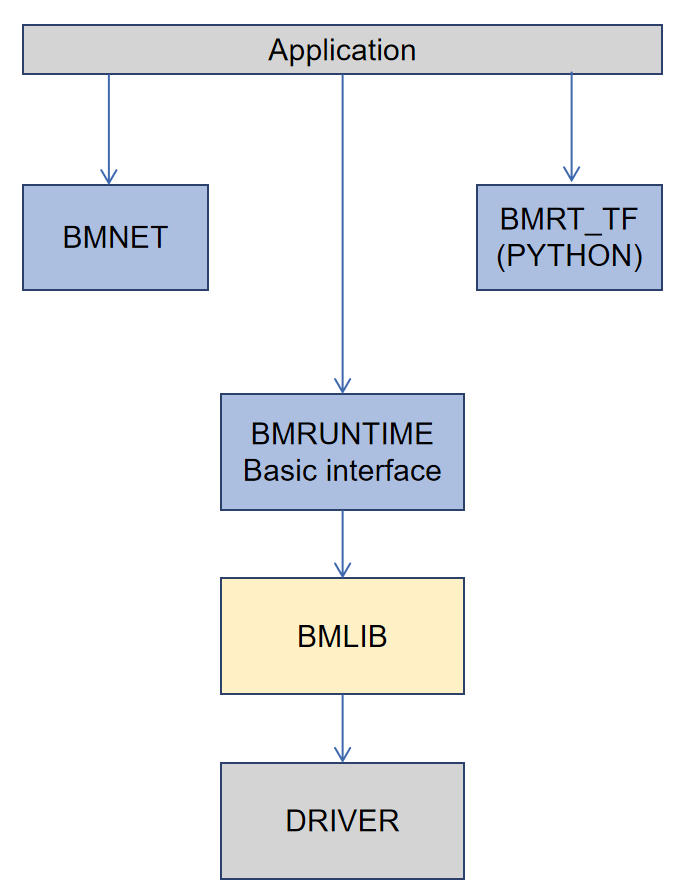

BMRuntime
================

BMRuntime is used to read the compiled output (.bmodel) of BMCompiler and drive it to be executed in the SOPHON TPU chip. BMRuntime provides users with diversified interfaces, which are convenient for users to transplant algorithms. Its software architecture is shown as follows:

BMRuntime has two interfaces available, C and C++. Some interfaces are reserved in order to be compatible with the previous generation of applications. However, it is not recommened to continue using new applications.

Interfaces in this chapter are all synchronous by default and some of them are asynchronous (functions are executed by the NPU and the CPU may continue to execute from up to bottom), which will be specially described.

This chapter consists of four parts:

* BMLIB interface: For device management but not classified into BMRuntime. The interface needs to be combined with others. So, it is introduced at the very beginning.
* C interface: C language interface of BMRuntime
* C++ interface: C++ language interface of BMRuntime
* Multi-thread programming: Introduce how to use the C or C++ interface for multi-thread programming

BMLIB Interface
_____________________
The BMLIB interface is a C interface, with the corresponding header file being bmlib_runtime.h and the corresponding lib library being libbmlib.so.

The BMLIB interface is used for device management, including device memory management.

There are many BMLIB interfaces. Interfaces that are usually needed by applications are introduced here.

Device
>>>>>>>>

bm_dev_request
:::::::::::::::

.. code-block:: cpp

  /* [out] handle
   * [in]  devid
   */
  bm_status_t bm_dev_request(bm_handle_t *handle, int devid);

Request a device and get the handle of the device. For other device interfaces (bm_xxxx class interfaces), this device handle needs to be specified.

Where, devid means the device No.. Under the PCIE mode, the corresponding device can be selected when there are multiple devices. Please specify 0 under the SoC mode.

In the case of successful request, return BM_SUCCESS; otherwise, return other error codes.

bm_dev_free
::::::::::::

.. code-block:: cpp

   /* [out] handle
   */
  void bm_dev_free(bm_handle_t handle);

Release a device. Normally, an application needs to request a device at the beginning and release such device before its exit.

The reference is shown as follows:

.. code-block:: cpp

    // start program
    bm_handle_t bm_handle;
    bm_dev_request(&bm_handle, 0);
    // do things here
    ......
    // end of program
    bm_dev_free(bm_handle);

Device Memory
>>>>>>>>>>>>>>>

bm_malloc_device_byte
::::::::::::::::::::::

.. code-block:: cpp

  /* [in]  handle
   * [out] pmem
   * [in]  size
   */
  bm_status_t bm_malloc_device_byte(bm_handle_t handle, bm_device_mem_t *pmem,
                                    unsigned int size);

Request a device mem of the specified size, where size is the size of the device mem, in byte.

In the case of a successful application, return BM_SUCCESS; otherwise, return other error codes.

bm_free_device
:::::::::::::::

.. code-block:: cpp

  /* [in]  handle
   * [out] mem
   */
  void bm_free_device(bm_handle_t handle, bm_device_mem_t mem);

Relase device mem. Any device mem requested will need to be released when it is not used any more.

The reference is shown as follows:

.. code-block:: cpp

    // alloc 4096 bytes device mem
    bm_device_mem_t mem;
    bm_status_t status = bm_malloc_device_byte(bm_handle, &mem, 4096);
    assert(status == BM_SUCCESS);
    // do things here
    ......
    // if mem will not use any more, free it
    bm_free_device(bm_handle, mem);

bm_mem_get_device_size
:::::::::::::::::::::::

.. code-block:: cpp

  // [in] mem
  unsigned int bm_mem_get_device_size(struct bm_mem_desc mem);

Get the size of device mem, in byte.

bm_memcpy_s2d
::::::::::::::

Copy data on system memory to device mem. System memory is specified by the void pointer and device men is specified the by bm_device_mem_t type.

In the case of successful copying, return BM_SUCCESS; otherwise, return other error codes.

There are three types depending on the size and offset of the copy:

.. code-block:: cpp

  // The size of the copy is the size of device mem, with the copying starting from src.
  /* [in]  handle
   * [out] dst
   * [in]  src
   */
  bm_status_t bm_memcpy_s2d(bm_handle_t handle, bm_device_mem_t dst, void *src);

.. code-block:: cpp

  // size specifies the size of the copy, in byte,and start copying from the offset of src.
  /* [in]  handle
   * [out] dst
   * [in]  src
   * [in]  size
   * [in]  offset
   */
  bm_status_t bm_memcpy_s2d_partial_offset(bm_handle_t handle, bm_device_mem_t dst,
                                           void *src, unsigned int size,
                                           unsigned int offset);

.. code-block:: cpp

  // size specifies the size of the copy, in byte, with the copying starting from src.
  /* [in]  handle
   * [out] dst
   * [in]  src
   * [in]  size
   */
  bm_status_t bm_memcpy_s2d_partial(bm_handle_t handle, bm_device_mem_t dst,
                                    void *src, unsigned int size);

bm_memcpy_d2s
::::::::::::::

Copy data in device mem to the system memory. In the case of successful copying, return BM_SUCCESS; otherwise, return other error codes.

System memory is specified by the void pointer and device mem is specified by the bm_device_mem_t type.

There are three types depending on the size and offset of the copy:

.. code-block:: cpp

  // The size of the copy is the size of device mem, with the copying starting from the 0 offset of
  // device mem.
  /* [in]  handle
   * [out] dst
   * [in]  src
   */
  bm_status_t bm_memcpy_d2s(bm_handle_t handle, void *dst, bm_device_mem_t src);

.. code-block:: cpp

  //size specifies the size of the copy, in byte, with the copying starting from the offset of device
  //mem.
  /* [in]  handle
   * [out] dst
   * [in]  src
   * [in]  size
   * [in]  offset
   */
  bm_status_t bm_memcpy_d2s_partial_offset(bm_handle_t handle, void *dst,
                                           bm_device_mem_t src, unsigned int size,
                                           unsigned int offset);

.. code-block:: cpp

  // size specifies the size of the copy, in byte, with the copying starting from the 0 offset of device
  // mem.
  /* [in]  handle
   * [out] dst
   * [in]  src
   * [in]  size
   */
  bm_status_t bm_memcpy_d2s_partial(bm_handle_t handle, void *dst,
                                    bm_device_mem_t src, unsigned int size);

bm_memcpy_d2d
::::::::::::::

.. code-block:: cpp

  /* [in]  handle
   * [out] dst
   * [in]  dst_offset
   * [in]  src
   * [in]  src_offset
   * [in]  len
   */
  bm_status_t bm_memcpy_d2d(bm_handle_t handle, bm_device_mem_t dst, int dst_offset,
                            bm_device_mem_t src, int src_offset, int len);

Copy data from a device mem to the other.

dst_offset specifies the offset of the target; src_offset specifies the offset of the source; and len specifies the size of the copy.

**Special notice**: len is in dword. For example, to copy 1024 bytes, len needs to be specified as 1024/4=256.

Device Memory Mmap
>>>>>>>>>>>>>>>>>>>

The interface described in this section is only valid on the SoC. On the SoC, although the system memory and Device Memory are separated from each other, they are actually memories on DDR.

Mmap may be used to get the virtual address of Device Memory so that it can be directly accessed by the application.

**Special note**: The NPU directly accesses DDR when accessing Device Memory without passing cache but cache is passed when an application accesses it. 

Thus, it is necessary to ensure the consistency of caches. This means:

* The application revises the data of Device Memory through the virtual address. It is necessary to flush before NPU inference so as to ensure the cache data has been synchronized with DDR.
* Device Memory data is modified upon the ending of NPU inference. The application needs to be invalidated before access through the virutal address so as to ensure DDR data has been synchronized with cache.

bm_mem_mmap_device_mem
:::::::::::::::::::::::

.. code-block:: cpp

  /* [in]  handle
   * [in]  dmem
   * [out] vmem
   */
  bm_status_t bm_mem_mmap_device_mem(bm_handle_t handle,
                                     bm_device_mem_t *dmem,
                                     unsigned long long *vmem);

Map device mem and get a virtual address.

Return BM_SUCCESS if it is successful; otherwise, return other error codes.

bm_mem_unmap_device_mem
::::::::::::::::::::::::

.. code-block:: cpp

  /* [in]  handle
   * [out] vmem
   * [in]  size
   */
  bm_status_t bm_mem_unmap_device_mem(bm_handle_t handle,
                                      void* vmem, int size);

Unmap is required when the mapped virtual address is not used any more. Size indicates the size of device mem, which can be obtained through bm_mem_get_device_size.

bm_mem_invalidate_device_mem
:::::::::::::::::::::::::::::

.. code-block:: cpp

  /* [in]  handle
   * [in]  dmem
   */
  bm_status_t bm_mem_invalidate_device_mem(bm_handle_t handle, bm_device_mem_t
  *dmem);

To invalidate cache is to ensure DDR data is sychronized with the cache.

.. code-block:: cpp

  /* [in]  handle
   * [out] dmem
   * [in]  offset
   * [in]  len
   */
  bm_status_t bm_mem_invalidate_partial_device_mem(bm_handle_t handle, bm_device_mem_t *dmem,unsigned int offset, unsigned int len);

Specify that cache is invalidated within the offset and size of device mem.

bm_mem_flush_device_mem
::::::::::::::::::::::::

.. code-block:: cpp

  /* [in]  handle
   * [out] dmem
   */
  bm_status_t bm_mem_flush_device_mem(bm_handle_t handle, bm_device_mem_t *dmem);

Refresh cache data or ensure cache data has been sychronized with DDR.

.. code-block:: cpp

  /* [in]  handle
   * [out] dmem
   * [in]  offset
   * [in]  len
   */
  bm_status_t bm_mem_flush_partial_device_mem(bm_handle_t handle, bm_device_mem_t 
  *dmem,unsigned int offset, unsigned int len);
  

Specify cache refreshing within the offset and size of device mem.

example
::::::::

Here is an example of mmap interface use:

.. code-block:: cpp

    bm_device_mem_t input_mem, output_mem;
    bm_status_t status = bm_malloc_device_byte(bm_handle, &input_mem, 4096);
    assert(status == BM_SUCCESS);
    status = bm_malloc_device_byte(bm_handle, &output_mem, 256);
    assert(status == BM_SUCCESS);
    void *input, * output;

    // mmap device mem to virtual addr
    status = bm_mem_mmap_device_mem(bm_handle, &input_mem, (uint64_t*)&input);
    assert(status == BM_SUCCESS);
    status = bm_mem_mmap_device_mem(bm_handle, &output_mem, (uint64_t*)&output);
    assert(status == BM_SUCCESS);

    // copy input data to input，and flush it
    memcpy(input, input_data, 4096);
    status = bm_mem_flush_device_mem(bm_handle, &input_mem);
    assert(status == BM_SUCCESS);

    // do inference here
    ......

    // invalidate output, and copy output data from output
    status = bm_mem_invalidate_device_mem(bm_handle, &output_mem);
    assert(status == BM_SUCCESS);
    memcpy(output_data, output, 256);

    // unmap
    status = bm_mem_unmap_device_mem(bm_handle, input, 4096);
    assert(status == BM_SUCCESS);
    status = bm_mem_unmap_device_mem(bm_handle, output, 256);
    assert(status == BM_SUCCESS);

Program synchronize
>>>>>>>>>>>>>>>>>>>>>>

.. code-block:: cpp

  // [in] handle
  bm_status_t bm_thread_sync(bm_handle_t handle);

Synchronous interface. Normally, npu inference is made asynchronously and the user’s cpu program can continue to be executed. This interface is used in the cpu process to ensure the npu inference is completed. Unless otherwise specially described, all interfaces introduced in this chapter are synchronous ones. There are only a few asynchronous interfaces that need to call bm_thread_sync for synchronization.

C Interface
_____________________

The C interface of BMRuntime, with the corresponding header file being bmruntime_interface.h and the corresponding lib library being libbmrt.so.

It is recommended to use this interface when the user's program uses the C interface, which supports static compilation networks in various shapes and dynamic compilation networks.

Tensor information
>>>>>>>>>>>>>>>>>>>>>>>

Tensor represents multi-dimensional data and the data operated in BMRuntime is Tensor.

Data type
::::::::::::::::::

.. code-block:: cpp

  typedef enum bm_data_type_e {
    BM_FLOAT32 = 0,
    BM_FLOAT16 = 1,
    BM_INT8 = 2,
    BM_UINT8 = 3,
    BM_INT16 = 4,
    BM_UINT16 = 5,
    BM_INT32 = 6,
    BM_UINT32 = 7
  } bm_data_type_t;

bm_data_type_t is used to indicate the data type.

Store mode
:::::::::::::::::::

.. code-block:: cpp

  /* store mode definitions */
  typedef enum bm_stroe_mode_e {
    BM_STORE_1N = 0, /* default, if not sure, use 0 */
    BM_STORE_2N = 1,
    BM_STORE_4N = 2,
  } bm_store_mode_t;

bm_store_mode_t specifies how data is stored. You only need to focus on BM_STORE_1N. If you want to focus on the bottom layer and optimize performance, you need to focus on BM_STORE_2N and BM_STORE_4N. 

BM_STORE_1N is the default storage method for data types. It indicates data is stored as normal.

BM_STORE_2N is only used for BM_FLOAT16/BM_INT16/BM_UINT16. It indicates the data with two different batches and the same other dimension positions are placed in a 32-bit data space. For example, for a four-dimensional (n, c, h, w) tensor, (0, ci, hi, wi) data is placed in the lower 16 bits of 32 bits and (1, ci, hi, wi) is placed in the upper 16 bits.

BM_STORE_4N is only used for BM_INT8/BM_UINT8. It indicates that the data with four different batches and the same other dimension positions are placed in a 32-bit data space. For example, for a four-dimensional (n, c, h, w) tensor, (0, ci, hi, wi) data is placed in the 0 to 7 bits of 32 bits, (1, ci, hi, wi) data is placed in the 8 to 15 bits, (2, ci, hi, wi) data is placed in the 16 to 23 bits and (3, ci, hi, wi) data is placed in the 24 to 31 bits.

Shape
:::::::::::::::::::

.. code-block:: cpp

  /* bm_shape_t holds the shape info */
  #define BM_MAX_DIMS_NUM 8
  typedef struct bm_shape_s {
    int num_dims;
    int dims[BM_MAX_DIMS_NUM];
  } bm_shape_t;

bm_shape_t represents the shape of tensor, with the tensor of up to eight dimensions supported. Where, num_dims represents the number of dimensions for the tensor; dims represents the value of each dimension, with each dimension value of dims starting from [0]. For example, the four dimensions (n, c, h, w) correspond to (dims [0], dims[1], dims[2], dims[3]) respectively.

In the case of constant shape, the initialization reference is shown as follows:

.. code-block:: cpp

  bm_shape_t shape = {4, {4,3,228,228}};
  bm_shape_t shape_array[2] = {
          {4, {4,3,28,28}}, // [0]
          {2, {2,4}}, // [1]
  };

The bmrt_shape interface is used to set bm_shape_t as follows:

.. code-block:: cpp

  /*
  dims array to bm_shape_t,
  shape and dims should not be NULL, num_dims should not be larger than BM_MAX_DIMS_NUM

  Prameters: [out] shape   - The bm_shape_t pointer.
             [in] dims     - The dimension value.
                             The sequence is the same with dims[BM_MAX_DIMS_NUM].
             [in] num_dims - The number of dimension.
  */
  void bmrt_shape(bm_shape_t* shape, const int* dims, int num_dims);

bmrt_shape_count can be used to get the number of shape elements. The interface is declared as follows:

.. code-block:: cpp

  /*
  number of shape elements, shape should not be NULL and num_dims should not large than
  BM_MAX_DIMS_NUM */
  uint64_t bmrt_shape_count(const bm_shape_t* shape);

For example, if num_dims is 4, the number of dims got is dims[0]*dims[1]*dims[2]*dims[3]. If num_dims is 0, return 1.

The bmrt_shape_is_same interface is used to judge if two shapes are the same. The interface is declared as follows:

.. code-block:: cpp

  /* compare whether two shape is same */
  bool bmrt_shape_is_same(const bm_shape_t* left, const bm_shape_t* right);

Return “true” if two shapes are the same and “false” if they are different.

The interface is considered to be of the same shape only if num_dims and the corresponding dims[0], dims[1], ...dims[num_dims-1] are the same.

Tensor
:::::::::::::::::

The bm_tensor_t structure is used to represent a tensor:

.. code-block:: cpp

  /*
  bm_tensor_t holds a multi-dimensional array of elements of a single data type
  and tensor are in device memory */
  typedef struct bm_tensor_s {
    bm_data_type_t dtype;
    bm_shape_t shape;
    bm_device_mem_t device_mem;
    bm_store_mode_t st_mode; /* user can set 0 as default store mode */
  } bm_tensor_t;

The bmrt_tensor can be configured with a tensor. The interface is declared as follows:

.. code-block:: cpp

  /*
  This API is to initialise the tensor. It will alloc device mem to tensor->device_mem,
  so user should bm_free_device(p_bmrt, tensor->device_mem) to free it.
  After initialization, tensor->dtype = dtype, tensor->shape = shape, and tensor->st_mode = 0.

  Parameters: [out] tensor - The pointer of bm_tensor_t. It should not be NULL.
              [in]  p_bmrt - The pointer of bmruntime. It should not be NULL
              [in]  dtype  - The data type.
              [in]  shape  - The shape.
  */
  void bmrt_tensor(bm_tensor_t* tensor, void* p_bmrt, bm_data_type_t dtype, bm_shape_t
  shape);

The bmrt_tensor_with_device interface is used to configure a tensor with the existing device mem. The interface is declared as follows:

.. code-block:: cpp

  /*
  The API is to initialise the tensor with a existed device_mem.
  The tensor byte size should not larger than device mem size.
  After initialization, tensor->dtype = dtype, tensor->shape = shape,
  tensor->device_mem = device_mem, and tensor->st_mode = 0.

  Parameters: [out] tensor     - The pointer of bm_tensor_t. It should not be NULL.
              [in]  device_mem - The device memory that had be allocated device memory.
              [in]  dtype      - The data type.
              [in]  shape      - The shape.
  */
  void bmrt_tensor_with_device(bm_tensor_t* tensor, bm_device_mem_t device_mem,
                               bm_data_type_t dtype, bm_shape_t shape);

Here, the bmrt_tensor and  bmrt_tensor_with_device interfaces are used to provide convenience for you to initialize a tensor.You can also initialize each member of  bm_tensor_t without the aid of any interface.

bmrt_tensor_bytesize is used to get the size of tensor and is measured in byte. It is obtained by multiplying the number of tensor elements by the number of bytes for the data type. The interface is declared as follows:

.. code-block:: cpp

  /*
  Parameters: [in] tensor - The pointer of bm_tensor_t. It should not be NULL.
  Returns:    size_t      - The byte size of the tensor.
  */
  size_t bmrt_tensor_bytesize(const bm_tensor_t* tensor);

bmrt_tensor_device_size is used to get the size of device mem, in byte. The interface is declared as follows:

.. code-block:: cpp

  /*
  Parameters: [in] tensor - The pointer of bm_tensor_t. It should not be NULL.
  Returns:    size_t      - The byte size of the tensor->dev_mem.
  */
  size_t bmrt_tensor_device_size(const bm_tensor_t* tensor);

bmrt_create
>>>>>>>>>>>>>>>>>>>>>>>

.. code-block:: cpp

  /*
  Parameters: [in] bm_handle - BM handle. It must be declared and initialized by using bmlib.
  Returns:    void*          - The pointer of a bmruntime helper.
  */
  void* bmrt_create(bm_handle_t bm_handle);

Create bmruntime and return the runtime pointer. For other interfaces (bmrt_xxxx class interfaces), the required handle is the runtime pointer.

bmrt_destroy
>>>>>>>>>>>>>>>>>>>>

.. code-block:: cpp

  /*
  Parameters: [in] p_bmrt - Bmruntime helper that had been created.
  */
  void bmrt_destroy(void* p_bmrt);

Destroy bmruntime and release resources.

Normally, the user starts to create runtime and destroy runtime before exit. The example is shown as follows:

.. code-block:: cpp

    // start program
    bm_handle_t bm_handle;
    bm_dev_request(&bm_handle, 0);
    void * p_bmrt = bmrt_create(bm_handle);
    // do things here
    ......
    // end of program
    bmrt_destroy(p_bmrt);
    bm_dev_free(bm_handle);

bmrt_get_bm_handle
>>>>>>>>>>>>>>>>>>>

.. code-block:: cpp

    /*
    Parameters: [in]  p_bmrt   - Bmruntime that had been created
    Returns:    void*          - The pointer of bm_handle_t
    */
    void * bmrt_get_bm_handle(void* p_bmrt);

Get bm_handle, the handle of the device, from the runtime pointers. The handle is required by bm_xxxx class interfaces.

bmrt_load_bmodel
>>>>>>>>>>>>>>>>>

.. code-block:: cpp

  /*
  Parameters: [in] p_bmrt      - Bmruntime that had been created.
              [in] bmodel_path - Bmodel file directory.
  Returns:    bool             - true: success; false: failed.
  */
  bool bmrt_load_bmodel(void* p_bmrt, const char *bmodel_path);

Load the bmodel file. Upon loading, there will be data of several networks in bmruntime. The networks may be subsequently inferred.

bmrt_load_bmodel_data
>>>>>>>>>>>>>>>>>>>>>>

.. code-block:: cpp

  /*
  Parameters: [in] p_bmrt      - Bmruntime that had been created.
              [in] bmodel_data - Bmodel data pointer to buffer.
              [in] size        - Bmodel data size.
  Returns:    bool             - true: success; false: failed.
  */
  bool bmrt_load_bmodel_data(void* p_bmrt, const void * bmodel_data, size_t size);

Load bmodel. Different from bmrt_load_bmodel, its bmodel data is stored in the memory.

bmrt_show_neuron_network
>>>>>>>>>>>>>>>>>>>>>>>>>

.. code-block:: cpp

  /*
  Parameters: [in] p_bmrt - Bmruntime that had been created.
  */
  void bmrt_show_neuron_network(void* p_bmrt);

Print the names of networks in bmruntime.

bmrt_get_network_number
>>>>>>>>>>>>>>>>>>>>>>>>

.. code-block:: cpp

  /*
  Parameters: [in] p_bmrt - Bmruntime that had been created
  Returns:    int         - The number of neuron networks.
  */
  int bmrt_get_network_number(void* p_bmrt);

Get the number of networks in bmruntime.

bmrt_get_network_names
>>>>>>>>>>>>>>>>>>>>>>>

.. code-block:: cpp

  /*
  Parameters:[in]  p_bmrt        - Bmruntime that had been created.
             [out] network_names - The names of all neuron networks.

  Note:
  network_names should be declared as (const char** networks = NULL), and use as &networks.
  After this API, user need to free(networks) if user do not need it.
  */
  void bmrt_get_network_names(void* p_bmrt, const char*** network_names);

Get the names of all networks in the runtime. This interface will request the memory for network_names. So, the interface needs to call free to release when it is not used any more.

The example of the use method is shown as follows:

.. code-block:: cpp

  const char **net_names = NULL;
  int net_num = bmrt_get_network_number(p_bmrt);
  bmrt_get_network_names(p_bmrt, &net_names);
  for (int i=0; i<net_num; i++) {
    puts(net_names[i]);
  }
  free(net_names);

bmrt_get_network_info
>>>>>>>>>>>>>>>>>>>>>>>>>>>>

Network information is expressed as follows:

.. code-block:: cpp

  /* bm_stage_info_t holds input shapes and output shapes;
  every network can contain one or more stages */
  typedef struct bm_stage_info_s {
    bm_shape_t* input_shapes;   /* input_shapes[0] / [1] / ... / [input_num-1] */
    bm_shape_t* output_shapes;  /* output_shapes[0] / [1] / ... / [output_num-1] */
  } bm_stage_info_t;

  /* bm_tensor_info_t holds all information of one net */
  typedef struct bm_net_info_s {
    const char* name;              /* net name */
    bool is_dynamic;               /* dynamic or static */
    int input_num;                 /* number of inputs */
    char const** input_names;      /* input_names[0] / [1] / .../ [input_num-1] */
    bm_data_type_t* input_dtypes;  /* input_dtypes[0] / [1] / .../ [input_num-1] */
    float* input_scales;           /* input_scales[0] / [1] / .../ [input_num-1] */
    int output_num;                /* number of outputs */
    char const** output_names;     /* output_names[0] / [1] / .../ [output_num-1] */
    bm_data_type_t* output_dtypes; /* output_dtypes[0] / [1] / .../ [output_num-1] */
    float* output_scales;          /* output_scales[0] / [1] / .../ [output_num-1] */
    int stage_num;                 /* number of stages */
    bm_stage_info_t* stages;       /* stages[0] / [1] / ... / [stage_num-1] */
    size_t * max_input_bytes;      /* max_input_bytes[0]/ [1] / ... / [input_num-1] */
    size_t * max_output_bytes;     /* max_output_bytes[0] / [1] / ... / [output_num-1] */
  } bm_net_info_t;

bm_net_info_t represents all information of a network and bm_stage_info_t represents the conditions of different shapes supported by the network.

input_num represents the number of inputs, input_names/input_dytpes/input_scales and  input_shapes in bm_stage_info_t indicates this number.

output_num represents the number of outputs,output_names/output_dytpes/output_scales and output_shapes  in  bm_stage_info_t indicates this number.

input_scales and output_scales are only useful when they are integers and are 1.0 by default when they are of float type.

max_input_bytes represents the maximum number of bytes for each input and max_output_bytes represents the maximum number of bytes for each output.
Each network may have multiple stages. The user may request the maximum number of bytes for each input/output and store the data of various stages.

bmrt_get_network_info gets the information of a given network according to the network name. The interface is declared as follows:

.. code-block:: cpp

  /*
  Parameters: [in] p_bmrt   - Bmruntime that had been created.
              [in] net_name - Network name.
  Returns:    bm_net_info_t - The pointer of bm_net_info_t. If net not found, will return NULL.
  */
  const bm_net_info_t* bmrt_get_network_info(void* p_bmrt, const char* net_name);

bmrt_print_network_info
>>>>>>>>>>>>>>>>>>>>>>>>>

Print network information. It is required in debugging. The interface is declared as follows:

.. code-block:: cpp

  void bmrt_print_network_info(const bm_net_info_t* net_info);

bmrt_launch_tensor
>>>>>>>>>>>>>>>>>>>>>>

Infer npu for the designated network. The interface is declared as follows:

.. code-block:: cpp

  /*
  To launch the inference of the neuron network with setting input tensors.
  This API supports the neuron nework, that is static-compiled or dynamic-compiled.
  After calling this API, inference on TPU is launched. The CPU program will not be blocked
  if the neuron network is static-compiled and has no cpu layer. Otherwize, the CPU
  program will be blocked. This API support multiple inputs, and multi thread safety.

  Parameters: [in] p_bmrt - Bmruntime that had been created.
              [in] net_name - The name of the neuron network.
              [in] input_tensors - Array of input tensor.
                                   Defined like bm_tensor_t input_tensors[input_num].
                                   User should initialize each input tensor.
              [in] input_num - Input number.
              [out] output_tensors - Array of output tensor.
                                     Defined like bm_tensor_t output_tensors[output_num].
                                     Data in output_tensors device memory use BM_STORE_1N.
              [in] output_num - Output number.
  Returns:     bool - true: Launch success. false: Launch failed.

  Note:
  This interface will alloc devcie mem for output_tensors. User should free each device mem by
  bm_free_device after the result data is useless.
  */
  bool bmrt_launch_tensor(void* p_bmrt, const char * net_name,
                          const bm_tensor_t input_tensors[], int input_num,
                          bm_tensor_t output_tensors[], int output_num);

The user needs to initialize the input_tensors required by the network before inference, including data in input_tensors. Output_tensors is used to return the inference result.

**Special note:**

* This interface will request device mem for output_tensors to store result data. You should actively release device mem when you do not need any result data.
* Upon the completion of inference, output data is stored in the form of BM_STROE_1N and the output shape is stored in the shape of each output_tensor .
* This interface is asynchronous. You need to call bm_thread_sync to ensure the inference is completed.

The example of the use method is shown as follows:

.. code-block:: cpp

  bm_status_t status = BM_SUCCESS;
  bm_tensor_t input_tensors[1];
  bm_tensor_t output_tensors[2];
  bmrt_tensor(&input_tensors[0], p_bmrt, BM_FLOAT32, {4, {1, 3, 28, 28}});
  bm_memcpy_s2d_partial(bm_handle, input_tensors[0].device_mem, (void *)input0,
                        bmrt_tensor_bytesize(&input_tensors[0]));
  bool ret = bmrt_launch_tensor(p_bmrt, "PNet", input_tensors, 1, output_tensors, 2);
  assert(true == ret);
  status = bm_thread_sync(bm_handle);
  assert(status == BM_SUCCESS);
  bm_memcpy_d2s_partial(bm_handle, output0, output_tensors[0].device_mem,
                          bmrt_tensor_bytesize(&output_tensors[0]));
  bm_memcpy_d2s_partial(bm_handle, output1, output_tensors[1].device_mem,
                          bmrt_tensor_bytesize(&output_tensors[1]));
  bm_free_device(bm_handle, output_tensors[0].device_mem);
  bm_free_device(bm_handle, output_tensors[1].device_mem);
  bm_free_device(bm_handle, intput_tensors[0].device_mem);

bmrt_launch_tensor_ex
>>>>>>>>>>>>>>>>>>>>>>

Infer npu for a given network. The interface is declared as follows:

.. code-block:: cpp

  /*
  To launch the inference of the neuron network with setting input tensors.
  This API supports the neuron nework, that is static-compiled or dynamic-compiled.
  After calling this API, inference on TPU is launched. The CPU program will not be blocked
  if the neuron network is static-compiled and has no cpu layer. Otherwize, the CPU
  program will be blocked. This API supports multiple inputs, and multi thread safety.

  Parameters: [in] p_bmrt - Bmruntime that had been created.
              [in] net_name - The name of the neuron network.
              [in] input_tensors - Array of input tensor.
                                   Defined like bm_tensor_t input_tensors[input_num].
                                   User should initialize each input tensor.
              [in] input_num - Input number.
              [out] output_tensors - Array of output tensor.
                                     Defined like bm_tensor_t output_tensors[output_num].
                                     User can set device_mem or stmode of output tensors.
                                     If user_mem is true, this interface will use device mem of
                                     output_tensors, and will not alloc device mem; Or this
                                     interface will alloc devcie mem to store output.
                                     User should free each device mem by bm_free_device after
                                     the result data is useless.
              [in] output_num - Output number.
              [in] user_mem - true: device_mem in output_tensors have been allocated.
                              false: have not been allocated.
              [in] user_stmode - true: output will use store mode that set in output_tensors.
                                 false: output will use BM_STORE_1N.
  Returns:    bool - true: Launch success. false: Launch failed.
  */
  bool bmrt_launch_tensor_ex(void* p_bmrt, const char * net_name,
                             const bm_tensor_t input_tensors[], int input_num,
                             bm_tensor_t output_tensors[], int output_num,
                             bool user_mem, bool user_stmode);

You may specify the output device mem and store mode in output_tensors, which is different from bmrt_launch_tensor.

bmrt_luanch_tensor == bmrt_launch_tensor_ex(user_mem = false, user_stmode = false)

The specific description is as follows:

* When user_mem is false, the interface will request device mem for each output_tensor and save output data.
* When user_mem is true, the interface will not request device mem for output_tensor. You need to make a request from the outside. The size requested can be specified by  max_output_bytes in bm_net_info_t.
* When user_stmode is false, the output data is arranged in the form of BM_STROE_1N.
* When user_stmode is true, the output data will be specified according to  st_mode in each output_tensor.

**Special note:** This interface is asynchronous. You need to call bm_thread_sync to ensure the inference is completed.

The example of the use method is shown as follows:

.. code-block:: cpp

  bm_status_t status = BM_SUCCESS;
  bm_tensor_t input_tensors[1];
  bm_tensor_t output_tensors[2];
  auto net_info = bmrt_get_network_info(p_bmrt, "PNet");
  status = bm_malloc_device_byte(bm_handle, &input_tensors[0].device_mem,
                                 net_info->max_input_bytes[0]);
  assert(status == BM_SUCCESS);
  input_tensors[0].dtype = BM_FLOAT32;
  input_tensors[0].st_mode = BM_STORE_1N;
  status = bm_malloc_device_byte(bm_handle, &output_tensors[0].device_mem,
                                 net_info->max_output_bytes[0]);
  assert(status == BM_SUCCESS);
  status = bm_malloc_device_byte(bm_handle, &output_tensors[1].device_mem,
                                 net_info->max_output_bytes[1]);
  assert(status == BM_SUCCESS);

  input_tensors[0].shape = {4, {1, 3, 28, 28}};
  bm_memcpy_s2d_partial(bm_handle, input_tensors[0].device_mem, (void *)input0,
                        bmrt_tensor_bytesize(&input_tensors[0]));
  bool ret = bmrt_launch_tensor_ex(p_bmrt, "PNet", input_tensors, 1,
                                  output_tensors, 2, true, false);
  assert(true == ret);
  status = bm_thread_sync(bm_handle);
  assert(status == BM_SUCCESS);
  bm_memcpy_d2s_partial(bm_handle, output0, output_tensors[0].device_mem,
                          bmrt_tensor_bytesize(&output_tensors[0]));
  bm_memcpy_d2s_partial(bm_handle, output1, output_tensors[1].device_mem,
                          bmrt_tensor_bytesize(&output_tensors[1]));
  bm_free_device(bm_handle, output_tensors[0].device_mem);
  bm_free_device(bm_handle, output_tensors[1].device_mem);
  bm_free_device(bm_handle, intput_tensors[0].device_mem);

bmrt_launch_data
>>>>>>>>>>>>>>>>>

Infer npu for a given network. The interface is declared as follows:

.. code-block:: cpp

  /*
  To launch the inference of the neuron network with setting input datas in system memory.
  This API supports the neuron nework, that is static-compiled or dynamic-compiled.
  After calling this API, inference on TPU is launched. And the CPU program will be blocked.
  This API supports multiple inputs, and multi thread safety.

  Parameters: [in] p_bmrt       - Bmruntime that had been created.
              [in] net_name     - The name of the neuron network.
              [in] input_datas  - Array of input data.
                                  Defined like void * input_datas[input_num].
                                  User should initialize each data pointer as input.
              [in] input_shapes - Array of input shape.
                                  Defined like bm_shape_t input_shapes[input_num].
                                  User should set each input shape.
              [in] input_num    - Input number.
              [out]output_datas - Array of output data.
                                  Defined like void * output_datas[output_num].
                                  If user doesn't alloc each output data, set user_mem to false,
                                  and this api will alloc output mem, user should free each
                                  output mem when output data not used. Also user can alloc
                                  system memory for each output data by self and set user_mem
                                  true. Data in memory use BM_STORE_1N.
              [out]output_shapes- Array of output shape.
                                  Defined like bm_shape_t output_shapes[output_num].
                                  It will store each output shape.
              [in] output_num   - Output number.
              [in] user_mem     - true: output_datas[i] has been allocated memory.
                                  false: output_datas[i] has not been allocated memory.
  Returns:    bool - true: Launch success; false: Launch failed.
  */
  bool bmrt_launch_data(void* p_bmrt, const char* net_name, void* const input_datas[],
                        const bm_shape_t input_shapes[], int input_num, void * output_datas[],
                        bm_shape_t output_shapes[], int output_num, bool user_mem);

The difference with bmrt_launch_tensor is as follows:

* Both input and output are stored in the system memory.
* It is a synchronous interface. The inference has been completed when the interface returns.

bmrt_trace
>>>>>>>>>>>>>>>>>>>>

.. code-block:: cpp

  /*
  To check runtime environment, and collect info for DEBUG.

  Parameters: [in] p_bmrt - Bmruntime helper that had been created.
  */
  void bmrt_trace(void* p_bmrt);

This interface is used for debugging. It can check runtime data and print some information about runtime to faciliate debugging.

C++ Interface
_____________________

C++ interface of BMRuntime, with the corresponding header file being bmruntime_cpp.h and the corresponding lib library being libbmrt.so.
You are suggested to use this interface when using the C++ interface, which supports static compilation networks of multiple shapes and dynamic compilation networks.

The C++ interface naming space is called bmruntime, which consists of three classes and global APIs:

* class Context : Used for network management, it includes loading network models and obtaining network information.
* class Network: It is used to infer a specific network in class Context.
* class Tensor: Automatically generated by class Network, it is used to manage input tensors and output sensors.
* Global APIs: It is used for obtaining the byte size of tensors and the number of elements and comparing whether shapes are identical.

The declaration is as follows:

.. code-block:: cpp

    namespace bmruntime {
        class Context;
        class Network;
        class Tensor;
        ......
    }

class Context
>>>>>>>>>>>>>>>>>>>>>>>

Context is used for network management, such as loading models, which can be loaded from one to multiple models; obtaining network information to get the names of all networks loaded and the information of a given network through network names.

Constructor and destructor
::::::::::::::::::::::::::::::::::

.. code-block:: cpp

    explicit Context(int devid = 0);
    explicit Context(bm_handle_t bm_handle);
    virtual ~Context();

Constructor and destructor of Context

When calling the C++ interface, create a Context instance first to specify devid to create an example. The device number 0 is used by default.

The use reference is shown as follows:

.. code-block:: cpp

  int main() {
    // start program
    Context ctx;
    // do things here
    ......
    // end of program
  }

You can also load  bm_handle to create an example. Where, bm_handle is generated by bm_dev_request. It should be noted that when the program is exited in this way, Context is first destructed and then bm_dev_free is called to release the bm_handle.

The use reference is as follows:

.. code-block:: cpp

  int main() {
    // start program
    bm_handle_t bm_handle;
    bm_dev_request(&bm_handle, 0);
    Context * p_ctx = new Context(bm_handle);
    // do things here
    ......
    // end of program, destroy context first,then free bm_handle
    delete p_ctx;
    bm_dev_free(bm_handle);
  }

load_bmodel
::::::::::::

.. code-block:: cpp

    bm_status_t load_bmodel(const void *bmodel_data, size_t size);
    bm_status_t load_bmodel(const char *bmodel_file);

Load bmodel.

Bmodel can take the form of memory or files. It can be called by multiple threads. Return BM_SUCCESS in the case of successful loading; otherwise, return other error codes.

Multiple models can be continuously loaded but there cannot be repeated network names; otherwise, the loading will fail.

The use reference is shown as follows:

.. code-block:: cpp

    bm_status_t status;
    status = p_ctx->load_bmodel(p_net1, net1_size); // p_net1 points to the bmodel memory buffer
    assert(status == BM_SUCCESS);
    status = p_ctx->load_bmodel("net2.bmodel"); // Specify the file route for the loaded bmodel
    assert(status == BM_SUCCESS);

get_network_number
:::::::::::::::::::

.. code-block:: cpp

    int get_network_number() const;

Get the number of networks loaded.

Each bmodel contains one to multiple networks. Loading bmodel each time will increase the number of networks.

get_network_names
::::::::::::::::::

.. code-block:: cpp

    void get_network_names(std::vector<const char *> *names) const;

Get the name of network loaded and save it to names. Note: This input vector will be clear firstly, then push_back all names of all networks.

The use reference is shown as follows:

.. code-block:: cpp

    std::vector<const char *> net_names;
    p_ctx->get_network_names(&net_names);
    for(auto name : net_names) {
        std::cout << name << std::endl;
    }

get_network_info
::::::::::::::::::

.. code-block:: cpp

    const bm_net_info_t *get_network_info(const char *net_name) const;

Get the information of a specific network through the network name.

If net_name is available, return the network information structure pointer of bm_net_info_t, including the number, names and types of its inputs and outputs. For details, refer to the  bm_net_infot_t structure. If net_name is not available, return Null.

The use reference is shown as follows:

.. code-block:: cpp

    auto net1_info = p_ctx->get_network_info("net1");
    if (net1_info == NULL) {
        std::cout << "net1 is not exist";
    } else {
        std::cout << "net1 input num: " << net1_info->input_num;
    }

handle
::::::::::::::::::

.. code-block:: cpp

    bm_handle_t handle() const;

Get the device handle of context, which is the same with the bm_handle loaded by the constructor. Handle is used when bm_xxxx class interfaces are called.

trace
:::::::::::::::::

.. code-block:: cpp

    void trace() const;

This interface is used for debugging. It can check context data and print some information about context to faciliate debugging.

class Network
>>>>>>>>>>>>>>>>>>>>>>>

Class Network is used to infer a specific network, which is selected among the loaded Context networks. This class can automatically request the device memory of inputs and outputs for the network. You may set the tensor of input and output if you need your device memory.

Constructor and destructor
::::::::::::::::::::::::::::::

.. code-block:: cpp

    Network(const Context &ctx, const char *net_name, int stage_id = -1);
    virtual ~Network();

Constructor and destructure of network.

ctx is the Context instance mentioned above. Net_name means the name of the network installed in ctx and is used to create a network instance.

Stage_id refers to the sub-serial No. of the stage for a network. If stage_id is equal to -1, it indicates the user intends to reshape the shapes of all input tensors.
For the sub-serial No. of a specific stage, the input tensors of network is fixed as the shape of this stage and cannot be reshaped later.

The use reference is shown as follows:

.. code-block:: cpp

    //net1, the shapes of input tensors can be reshaped 
    Network net1(*p_ctx, "net1");
    //net2, the shape of stage [1] in bm_net_info_ is adopted and will not be reshaped later.
    Network net2(*p_ctx, "net2", 1);

Inputs
::::::::

.. code-block:: cpp

    const std::vector<Tensor *> &Inputs();

Get all input tensors.

Before inferring this network, get its input tensors first and then set all input sensors. For example, set theirs shape and data or device mem.

The use reference is shown as follows:

.. code-block:: cpp

    // Initialize the inputs of net1, supposing it has two inputs
    auto &inputs = net1.Inputs();
    inputs[0]->Reshape(shape0);
    inputs[1]->Reshape(shape1);
    // device_mem0 and device_mem1 have the data to be input
    inputs[0]->set_device_mem(device_mem0);
    inputs[1]->set_device_mem(device_mem1);

    // Initialize the inputs of net2, supposing it has one input
    auto &inputs = net2.Inputs();
    // inputs[0]->Reshape(shape0); //  error, cannot be modified
    // Suppose the data to be input is in the system memory and data0 is the data pointer.
    inputs[0]->CopyFrom(data0);

Input
::::::::

.. code-block:: cpp

    Tensor *Input(const char *tensor_name);

Get input tensor through input name.

Forward
::::::::

.. code-block:: cpp

    bm_status_t Forward(bool sync = true) const;

Network inference.

Call Forward for inference upon the data of inputs are ready.

When sync is true, the interface will wait for the completion of inference. The interface is asynchronous and it is under the way and does not necessarily end when the interface exits. In this case, it is necessary to call the bm_thread_sync interface to ensure the completion of its inference.

**Special note**: The entire inference process occurs on device memory. So, the input data must have stored in the device mem of input tensors before inference. Upon the ending of inference, the result data is also saved to the device mem of output tensors.

The use reference is shown as follows:

.. code-block:: cpp

    // net1 inference
    net1.Forward();
    // et2 inference
    net2.Forward(false);
    bm_thread_sync(p_ctx->hand());

Outputs
::::::::

.. code-block:: cpp

    const std::vector<Tensor *> &Outputs();

Get output tensors.

Before forward inference, you can change the device_mem in output tensors so that the inference result is saved to the device mem you specify or change the store mode of output sensors so that the inference result is saved to the store mode specified.

Only upon the completion of Forward inference, the shape of output tensors and data in device_mem are valid.

Output
::::::::

.. code-block:: cpp

    Tensor *Output(const char *tensor_name);

Get output sensors through output names.

info
::::::

.. code-block:: cpp

    const bm_net_info_t *info() const;

Get the information of the network.

class Tensor
>>>>>>>>>>>>>>>>>>>>>>>

It is used for managing input sensors and output sensors of the network. You can not create Tensor on your own as Tensors are automatically created when the Network class is generated. So, both the constructor and the destructor are not public.

CopyTo
:::::::

.. code-block:: cpp

    bm_status_t CopyTo(void *data) const;
    bm_status_t CopyTo(void *data, size_t size, uint64_t offset = 0) const;

Copy the data of device mem for tensor to the system memory.

Data is a pointer that points at system memory data; size is used to specify the size of the copy and offset is used to specify the offset.
When size and offset are not specified, copy the data of the entire tensor or the size of ByteSize ().

If the user needs to copy the output result to the system memory, after the inference ends, it is necessary to call CopyTo to copy the data to the system memory.

CopyFrom
:::::::::

.. code-block:: cpp

    bm_status_t CopyFrom(const void *data);
    bm_status_t CopyFrom(const void *data, size_t size, uint64_t offset = 0);

Copy the system memory data to the device mem of tensor.

Data is a pointer that points at system memory data; size is used to specify the size of the copy and offset is used to specify the offset.
When size and offset are not specified, copy the data of the entire tensor, that is the size of ByteSize ().

You should call CopyFrom and copy the data to the system memory before inference if you need to copy the data to the corresponding input tensor.

Reshape
::::::::

.. code-block:: cpp

    bm_status_t Reshape(const bm_shape_t &shape);

Set the shape of tensor.

It is mainly used to change the shape of the input sensor and is meaningless for the output tensor as its shape is obtained through inference.

ByteSize
:::::::::

.. code-block:: cpp

    size_t ByteSize() const;

Get the size of tensor data, in byte, which is calculated by multiplying the numbe of elements and the number of bytes for element types.

num_elements
:::::::::::::

.. code-block:: cpp

    uint64_t num_elements() const;

Get the number of tensor elements. It is calculated by using the formula dims[0] * dims[1] * ⋯* dims[num_dims-1]. Return 1 when num_dims is 0.

tensor
:::::::

.. code-block:: cpp

    const bm_tensor_t *tensor() const;

Get the bm_tensor_t structure of tensor, which includes the shape, data type, device mem and store mode of tensor.

set_store_mode
:::::::::::::::

.. code-block:: cpp

    void set_store_mode(bm_store_mode_t mode) const;

Set the store mode of tensor.

Before inference, you may configure the store mode of the input to specify the store mode of the input data or configure the store mode of output to indicate the data storage mode upon inference. In the absence of configuration, it is BM_STORE_1N by default.

set_device_mem
:::::::::::::::

.. code-block:: cpp

    bm_status_t set_device_mem(const bm_device_mem_t &device_mem);

Set the device mem of the tensor.

Before inference, you can configure the device mem of the input to specify the store position of the input data or configure the device mem of output to indicate the store position of output.

Both input and output will be stored in the device mem automatically requested by network if you set nothing. 

Additionally, you can configure the size of device mem, which cannot be smaller than ByteSize (); otherwise, errors will be returned due to the failure in storing the data of the entire tensor.

Global APIs
>>>>>>>>>>>>>>

ByteSize
::::::::::

.. code-block:: cpp

    size_t ByteSize(bm_data_type_t type);                // byte size of data type

Get the byte size of the data type, for example, the byte size of BM_FLOAT32 is 4 and that of BM_INT8 is 1.

.. code-block:: cpp

    size_t ByteSize(const bm_device_mem_t &device_mem);  // byte size of device memory

Get the byte size of device mem, that is the size of its storage space.

.. code-block:: cpp

    size_t ByteSize(const bm_tensor_t &tensor);          // byte size of origin tensor

Get the byte size of bm_tensor_t, which is equal to (number of tensor elements)*(byte size of the data type of tensor).

.. code-block:: cpp

    size_t ByteSize(const Tensor &tensor);               // byte size of tensor

Get the byte size of Tensor, which is equal to (number of tensor elements)* (byte size of the data type of tensor), which is identical with tensor.ByteSize()

Count
::::::::

.. code-block:: cpp

    /*
    dims[0] * dims[1] * dims[...] * dims[num_dims-1]
    */
    uint64_t Count(const bm_shape_t &shape);
    uint64_t Count(const bm_tensor_t &tensor);
    uint64_t Count(const Tensor &tensor);

Get the number of elements or the product of the number of individual dimensions. Return 1 if num_dims is 0.

IsSameShape
:::::::::::::

.. code-block:: cpp

    /*
    compare whether shape dims is the same
    */
    bool IsSameShape(const bm_shape_t &left, const bm_shape_t &right);

Compare if both shapes are the same. Return true if yes, otherwise return false.

The interface is considered to be of the same shape only if num_dims and the corresponding dims[0], dims[1], ...dims[num_dims-1] are the same.

Multi-thread Program
______________________

Both C and C++ interfaces for the runtime aforementioned are thread safe, but other interfaces reserved for compatibility with the old version are not necessarily thread safe, so they are not recommended.

There are two types of common use methods:

* Create a bmruntime and carry out multi-thread inference of networks after loading all models.
* One bmruntime is created for each thread. Load the model required by the thread for network inference.

single runtime
>>>>>>>>>>>>>>>>

Single runtime can be used to load several different models. It should be noted that there can not be the same network between multiple models; otherwise, they will be considered to be in conflict. Similarly, the same model can only be loaded once.

Multi-thread inference is made on the loaded network through this runtime. The networks in multiple threads may be the same or different.

The programming model is shown as follows:

The figure uses the C interface as an example.

For the C++ interface, create a single Context instance and then load the network model via load_bmodel. 

Next, create network instances in multiple threads for inference. The networks for the same instance may be the same or different. 

multi runtime
>>>>>>>>>>>>>>>>

You can create multiple threads, each creating a bumruntime. The loading model of each bmruntime is independent, with the same model loaded among them. 

The programming model is shown as follows:

The figure shows an example of the C interface.

For the C++ interface, create a single Context instance and then load the network model via load_bmodel.

how to choose
>>>>>>>>>>>>>>>

The difference between the two types of multi-thread programming methods is as follows:

**A single runtime, with each network has only one neuron memory**

So, using a single runtime means small neuron memory consumption. However, you need to wait for the neuron space of the network to be free if you perform multi-thread inference on the same network.

When there are multiple runtimes, each loads the same network. There is no need to wait for the neuron space to be free when loading the same network, but a lot of neuron memory will be consumed.

The option can be selected based on the following criteria and according to the user's business conditions.

**Please use multiple runtimes if it is necessary to perform multiple-thread inference on the same network; otherwise, use a single runtime.**
