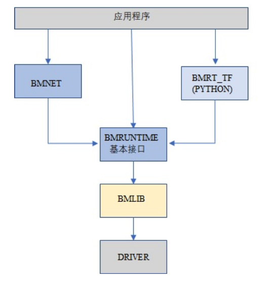
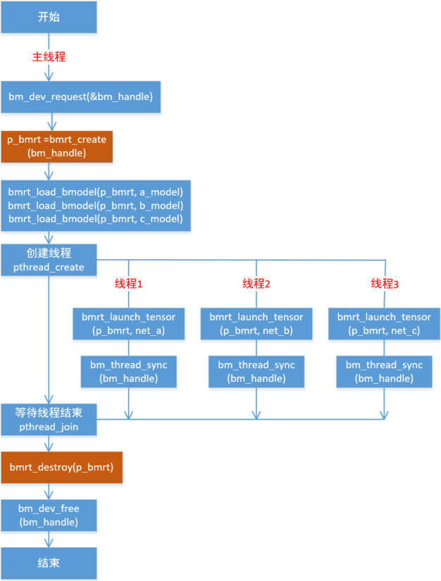
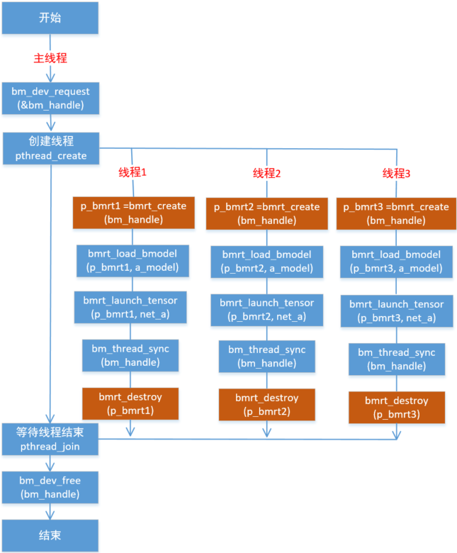

BMRuntime
================

BMRuntime用于读取BMCompiler的编译输出(.bmodel)，驱动其在SOPHON TPU芯片中执行。BMRuntime向用户提供了丰富的接口，便于用户移植算法，其软件架构如下:

BMRuntime有C和C++两种接口；另外为了兼容上一代应用程序，保留一些接口，但不推荐新的应用程序继续使用。

本章节中的接口默认都是同步接口，有个别是异步接口(由NPU执行功能，CPU可以继续往下执行)，会特别说明。

本章节分4个部分:

* BMLIB接口：用于设备管理，不属于BMRuntime，但需要配合使用，所以先介绍
* C接口：BMRuntime的C语言接口
* C++接口：BMRuntime的C++语言接口
* 多线程编程：介绍如何用C接口或者C++接口进行多线程编程

BMLIB Interface
_____________________
BMLIB接口是C语言接口，对应的头文件是bmlib_runtime.h，对应的lib库为libbmlib.so

BMLIB接口用于设备管理，包括设备内存的管理。

BMLIB的接口很多，这里介绍应用程序通常需要用到的接口。

Device
>>>>>>>>

bm_dev_request
:::::::::::::::

.. code-block:: cpp

  /* [out] handle
   * [in]  devid
   */
  bm_status_t bm_dev_request(bm_handle_t *handle, int devid);

用于请求一个设备，得到设备句柄handle。其他设备接口(bm_xxxx类接口)，都需要指定这个设备句柄。

其中devid表示设备号，在PCIE模式下，存在多个设备时可以用于选择对应的设备；在SoC模式下，请指定为0。

当请求成功时，返回BM_SUCCESS；否则返回其他错误码。

bm_dev_free
::::::::::::

.. code-block:: cpp

   /* [out] handle
   */
  void bm_dev_free(bm_handle_t handle);

用于释放一个设备。通常应用程序开始需要请求一个设备，退出前释放这个设备。

使用参考如下:

.. code-block:: cpp

    // start program
    bm_handle_t bm_handle;
    bm_dev_request(&bm_handle, 0);
    // do things here
    ......
    // end of program
    bm_dev_free(bm_handle);

Device Memory
>>>>>>>>>>>>>>>

bm_malloc_device_byte
::::::::::::::::::::::

.. code-block:: cpp

  /* [in]  handle
   * [out] pmem
   * [in]  size
   */
  bm_status_t bm_malloc_device_byte(bm_handle_t handle, bm_device_mem_t *pmem,
                                    unsigned int size);

申请指定大小的device mem，size为device mem的字节大小。

当申请成功时，返回BM_SUCCESS；否则返回其他错误码。

bm_free_device
:::::::::::::::

.. code-block:: cpp

  /* [in]  handle
   * [out] mem
   */
  void bm_free_device(bm_handle_t handle, bm_device_mem_t mem);

释放device mem。任何申请的device mem，不再使用的时候都需要释放。

使用参考如下：

.. code-block:: cpp

    // alloc 4096 bytes device mem
    bm_device_mem_t mem;
    bm_status_t status = bm_malloc_device_byte(bm_handle, &mem, 4096);
    assert(status == BM_SUCCESS);
    // do things here
    ......
    // if mem will not use any more, free it
    bm_free_device(bm_handle, mem);

bm_mem_get_device_size
:::::::::::::::::::::::

.. code-block:: cpp

  // [in] mem
  unsigned int bm_mem_get_device_size(struct bm_mem_desc mem);

得到device mem的大小，以字节为单位。

bm_memcpy_s2d
::::::::::::::

将在系统内存上的数据拷贝到device mem。系统内存由void指针指定，device mem由bm_device_mem_t类型指定。

拷贝成功，返回BM_SUCCESS；否则返回其他错误码。

根据拷贝的大小和偏移，有以下三种：

.. code-block:: cpp

  // 拷贝的大小是device mem的大小，从src开始拷贝
  /* [in]  handle
   * [out] dst
   * [in]  src
   */
  bm_status_t bm_memcpy_s2d(bm_handle_t handle, bm_device_mem_t dst, void *src);

.. code-block:: cpp

  // size指定拷贝的字节大小，从src的offset偏移开始拷贝
  /* [in]  handle
   * [out] dst
   * [in]  src
   * [in]  size
   * [in]  offset
   */
  bm_status_t bm_memcpy_s2d_partial_offset(bm_handle_t handle, bm_device_mem_t dst,
                                           void *src, unsigned int size,
                                           unsigned int offset);

.. code-block:: cpp

  // size指定拷贝的字节大小，从src开始拷贝
  /* [in]  handle
   * [out] dst
   * [in]  src
   * [in]  size
   */
  bm_status_t bm_memcpy_s2d_partial(bm_handle_t handle, bm_device_mem_t dst,
                                    void *src, unsigned int size);

bm_memcpy_d2s
::::::::::::::

将device mem中的数据拷贝到系统内存；拷贝成功，返回BM_SUCCESS；否则返回其他错误码。

系统内存由void指针指定，device mem由bm_device_mem_t类型指定。

根据拷贝的大小和偏移，有以下三种：

.. code-block:: cpp

  // 拷贝的大小是device mem的大小，从device mem的0偏移开始拷贝
  /* [in]  handle
   * [out] dst
   * [in]  src
   */
  bm_status_t bm_memcpy_d2s(bm_handle_t handle, void *dst, bm_device_mem_t src);

.. code-block:: cpp

  // size指定拷贝的字节大小，从device mem的offset偏移开始拷贝
  /* [in]  handle
   * [out] dst
   * [in]  src
   * [in]  size
   * [in]  offset
   */
  bm_status_t bm_memcpy_d2s_partial_offset(bm_handle_t handle, void *dst,
                                           bm_device_mem_t src, unsigned int size,
                                           unsigned int offset);

.. code-block:: cpp

  // size指定拷贝的字节大小，从device mem的0偏移位置开始拷贝
  /* [in]  handle
   * [out] dst
   * [in]  src
   * [in]  size
   */
  bm_status_t bm_memcpy_d2s_partial(bm_handle_t handle, void *dst,
                                    bm_device_mem_t src, unsigned int size);

bm_memcpy_d2d
::::::::::::::

.. code-block:: cpp

  /* [in]  handle
   * [out] dst
   * [in]  dst_offset
   * [in]  src
   * [in]  src_offset
   * [in]  len
   */
  bm_status_t bm_memcpy_d2d(bm_handle_t handle, bm_device_mem_t dst, int dst_offset,
                            bm_device_mem_t src, int src_offset, int len);

将数据从一个device mem拷贝到另一个device mem。

dst_offset指定目标的偏移，src_offset指定源的偏移，len指定拷贝的大小。

**特别注意**: len是以dword为单位，比如要拷贝1024个字节，则len需要指定为1024/4=256。

Device Memory Mmap
>>>>>>>>>>>>>>>>>>>

此小节介绍的接口，只有在SoC上有效。在SoC上，系统内存和Device Memory虽然是隔开的，但其实都是DDR上的内存。

可以通过mmap，得到Device Memory的虚拟地址，从而可以被应用程序直接访问。

**特别注意**: NPU访问Device Memory，是直接访问DDR，没有经过cache；而应用程序访问的时候是经过cache的。

因此需要处理cache的一致性，也就是说：

* 应用程序通过虚拟地址修改了Device Memory的数据，在进行NPU推理前需要flush，确保cache数据已经同步到了DDR
* NPU推理结束后修改了Device Memory的数据，应用程序通过虚拟地址访问前需要先invalidate，确保DDR数据已经同步到了cache

bm_mem_mmap_device_mem
:::::::::::::::::::::::

.. code-block:: cpp

  /* [in]  handle
   * [in]  dmem
   * [out] vmem
   */
  bm_status_t bm_mem_mmap_device_mem(bm_handle_t handle,
                                     bm_device_mem_t *dmem,
                                     unsigned long long *vmem);

将device mem映射出来，得到虚拟地址。

成功返回BM_SUCCESS；否则返回其他错误码。

bm_mem_unmap_device_mem
::::::::::::::::::::::::

.. code-block:: cpp

  /* [in]  handle
   * [out] vmem
   * [in]  size
   */
  bm_status_t bm_mem_unmap_device_mem(bm_handle_t handle,
                                      void* vmem, int size);

映射的虚拟地址不再使用的时候需要unmap，size为device mem的大小，这个大小可以通过bm_mem_get_device_size得到。

bm_mem_invalidate_device_mem
:::::::::::::::::::::::::::::

.. code-block:: cpp

  /* [in]  handle
   * [in]  dmem
   */
  bm_status_t bm_mem_invalidate_device_mem(bm_handle_t handle, bm_device_mem_t *dmem);

使cache失效，也就是确保DDR数据同步到了cache

.. code-block:: cpp

  /* [in]  handle
   * [out] dmem
   * [in]  offset
   * [in]  len
   */
  bm_status_t bm_mem_invalidate_partial_device_mem(bm_handle_t handle, bm_device_mem_t *dmem,
                                                   unsigned int offset, unsigned int len);

指定device mem的偏移和大小的范围内cache失效

bm_mem_flush_device_mem
::::::::::::::::::::::::

.. code-block:: cpp

  /* [in]  handle
   * [out] dmem
   */
  bm_status_t bm_mem_flush_device_mem(bm_handle_t handle, bm_device_mem_t *dmem);

刷新cache数据，也就是确保cache数据同步到了DDR

.. code-block:: cpp

  /* [in]  handle
   * [out] dmem
   * [in]  offset
   * [in]  len
   */
  bm_status_t bm_mem_flush_partial_device_mem(bm_handle_t handle, bm_device_mem_t *dmem,
                                              unsigned int offset, unsigned int len);

指定device mem的偏移和大小的范围内cache刷新

example
::::::::

这里举例说明mmap接口的用法:

.. code-block:: cpp

    bm_device_mem_t input_mem, output_mem;
    bm_status_t status = bm_malloc_device_byte(bm_handle, &input_mem, 4096);
    assert(status == BM_SUCCESS);
    status = bm_malloc_device_byte(bm_handle, &output_mem, 256);
    assert(status == BM_SUCCESS);
    void *input, * output;

    // mmap device mem to virtual addr
    status = bm_mem_mmap_device_mem(bm_handle, &input_mem, (uint64_t*)&input);
    assert(status == BM_SUCCESS);
    status = bm_mem_mmap_device_mem(bm_handle, &output_mem, (uint64_t*)&output);
    assert(status == BM_SUCCESS);

    // copy input data to input，and flush it
    memcpy(input, input_data, 4096);
    status = bm_mem_flush_device_mem(bm_handle, &input_mem);
    assert(status == BM_SUCCESS);

    // do inference here
    ......

    // invalidate output, and copy output data from output
    status = bm_mem_invalidate_device_mem(bm_handle, &output_mem);
    assert(status == BM_SUCCESS);
    memcpy(output_data, output, 256);

    // unmap
    status = bm_mem_unmap_device_mem(bm_handle, input, 4096);
    assert(status == BM_SUCCESS);
    status = bm_mem_unmap_device_mem(bm_handle, output, 256);
    assert(status == BM_SUCCESS);

Program synchronize
>>>>>>>>>>>>>>>>>>>>>>

.. code-block:: cpp

  // [in] handle
  bm_status_t bm_thread_sync(bm_handle_t handle);

同步接口。通常npu推理是异步进行的，用户的cpu程序可以继续执行。本接口用于cpu程序中确保npu推理完成。本章介绍的接口没有特别说明，都是同步接口。只有个别异步接口，需要调用bm_thread_sync进行同步。

C Interface
_____________________

BMRuntime的C语言接口，对应的头文件为bmruntime_interface.h，对应的lib库为libbmrt.so。

用户程序使用C接口时建议使用该接口，该接口支持多种shape的静态编译网络，支持动态编译网络。

Tensor information
>>>>>>>>>>>>>>>>>>>>>>>

Tensor（张量）表示多维的数据，BMRuntime中操作的数据为Tensor。

Data type
::::::::::::::::::

.. code-block:: cpp

  typedef enum bm_data_type_e {
    BM_FLOAT32 = 0,
    BM_FLOAT16 = 1,
    BM_INT8 = 2,
    BM_UINT8 = 3,
    BM_INT16 = 4,
    BM_UINT16 = 5,
    BM_INT32 = 6,
    BM_UINT32 = 7
  } bm_data_type_t;

bm_data_type_t用于表示数据类型。

Store mode
:::::::::::::::::::

.. code-block:: cpp

  /* store mode definitions */
  typedef enum bm_stroe_mode_e {
    BM_STORE_1N = 0, /* default, if not sure, use 0 */
    BM_STORE_2N = 1,
    BM_STORE_4N = 2,
  } bm_store_mode_t;

bm_store_mode_t表示数据的存储方式。用户可以只关注BM_STORE_1N即可，若要关注底层并优化性能，此时才需要去关心BM_STORE_2N和BM_STORE_4N。

BM_STORE_1N是默认存储方式，用于数据类型，表示数据按正常方式存储。

BM_STORE_2N只用于BM_FLOAT16/BM_INT16/BM_UINT16，表示一个32bit的数据空间将放置2个不同batch，但是其它维度位置相同的数据。例如(n, c, h, w)的四维tensor，32bit的低16bit放置(0, ci, hi, wi)的数据，高16bit放置(1, ci, hi, wi)的数据。

BM_STORE_4N只用于BM_INT8/BM_UINT8，表示一个32bit的数据空间将放置4个不同batch，但是其它维度位置相同的数据，例如(n, c, h, w)的四维tensor，32bit的0~7bit放置(0, ci, hi, wi)的数据，8~15bit放置(1, ci, hi, wi)的数据，16~23bit放置(2, ci, hi, wi)的数据，24~31bit放置(3, ci, hi, wi)的数据。

Shape
:::::::::::::::::::

.. code-block:: cpp

  /* bm_shape_t holds the shape info */
  #define BM_MAX_DIMS_NUM 8
  typedef struct bm_shape_s {
    int num_dims;
    int dims[BM_MAX_DIMS_NUM];
  } bm_shape_t;

bm_shape_t表示tensor的shape，目前最大支持8维的tensor。其中num_dims为tensor的实际维度数，dims为各维度值，dims的各维度值从[0]开始，比如(n, c, h, w)四维分别对应(dims[0], dims[1], dims[2], dims[3])。

如果是常量shape，初始化参考如下：

.. code-block:: cpp

  bm_shape_t shape = {4, {4,3,228,228}};
  bm_shape_t shape_array[2] = {
          {4, {4,3,28,28}}, // [0]
          {2, {2,4}}, // [1]
  };

bmrt_shape接口可以设置bm_shape_t，如下：

.. code-block:: cpp

  /*
  dims array to bm_shape_t,
  shape and dims should not be NULL, num_dims should not be larger than BM_MAX_DIMS_NUM

  Prameters: [out] shape   - The bm_shape_t pointer.
             [in] dims     - The dimension value.
                             The sequence is the same with dims[BM_MAX_DIMS_NUM].
             [in] num_dims - The number of dimension.
  */
  void bmrt_shape(bm_shape_t* shape, const int* dims, int num_dims);

bmrt_shape_count可以得到shape的元素个数。接口声明如下：

.. code-block:: cpp

  /*
  number of shape elements, shape should not be NULL and num_dims should not large than
  BM_MAX_DIMS_NUM */
  uint64_t bmrt_shape_count(const bm_shape_t* shape);

比如num_dims为4，则得到的个数为dims[0]*dims[1]*dims[2]*dims[3]；如果num_dims为0，则返回1。

bmrt_shape_is_same接口判断2个shape是否一样。接口声明如下：

.. code-block:: cpp

  /* compare whether two shape is same */
  bool bmrt_shape_is_same(const bm_shape_t* left, const bm_shape_t* right);

一样返回true；不一样返回false。

只有num_dims以及对应的dims[0]、dims[1]、...、dims[num_dims-1]都一样，接口才认为是一样的shape。

Tensor
:::::::::::::::::

bm_tensor_t结构体用来表示一个tensor：

.. code-block:: cpp

  /*
  bm_tensor_t holds a multi-dimensional array of elements of a single data type
  and tensor are in device memory */
  typedef struct bm_tensor_s {
    bm_data_type_t dtype;
    bm_shape_t shape;
    bm_device_mem_t device_mem;
    bm_store_mode_t st_mode; /* user can set 0 as default store mode */
  } bm_tensor_t;

bmrt_tensor接口可以配置一个tensor。接口声明如下：

.. code-block:: cpp

  /*
  This API is to initialise the tensor. It will alloc device mem to tensor->device_mem,
  so user should bm_free_device(p_bmrt, tensor->device_mem) to free it.
  After initialization, tensor->dtype = dtype, tensor->shape = shape, and tensor->st_mode = 0.

  Parameters: [out] tensor - The pointer of bm_tensor_t. It should not be NULL.
              [in]  p_bmrt - The pointer of bmruntime. It should not be NULL
              [in]  dtype  - The data type.
              [in]  shape  - The shape.
  */
  void bmrt_tensor(bm_tensor_t* tensor, void* p_bmrt, bm_data_type_t dtype, bm_shape_t shape);

bmrt_tensor_with_device接口用已有的device mem配置一个tensor。接口声明如下：

.. code-block:: cpp

  /*
  The API is to initialise the tensor with a existed device_mem.
  The tensor byte size should not large than device mem size.
  After initialization, tensor->dtype = dtype, tensor->shape = shape,
  tensor->device_mem = device_mem, and tensor->st_mode = 0.

  Parameters: [out] tensor     - The pointer of bm_tensor_t. It should not be NULL.
              [in]  device_mem - The device memory that had be allocated device memory.
              [in]  dtype      - The data type.
              [in]  shape      - The shape.
  */
  void bmrt_tensor_with_device(bm_tensor_t* tensor, bm_device_mem_t device_mem,
                               bm_data_type_t dtype, bm_shape_t shape);

这里bmrt_tensor和bmrt_tensor_with_device接口是为了方便用户初始化一个tensor，用户也可以自己对bm_tensor_t每个成员进行初始化，不借助任何接口。

bmrt_tensor_bytesize用于得到tensor的大小，单位是字节，它用通过tensor的元素个数乘以数据类型的字节数得到。接口声明如下：

.. code-block:: cpp

  /*
  Parameters: [in] tensor - The pointer of bm_tensor_t. It should not be NULL.
  Returns:    size_t      - The byte size of the tensor.
  */
  size_t bmrt_tensor_bytesize(const bm_tensor_t* tensor);

bmrt_tensor_device_size用于得到device mem的大小，单位是字节。接口声明如下：

.. code-block:: cpp

  /*
  Parameters: [in] tensor - The pointer of bm_tensor_t. It should not be NULL.
  Returns:    size_t      - The byte size of the tensor->dev_mem.
  */
  size_t bmrt_tensor_device_size(const bm_tensor_t* tensor);

bmrt_create
>>>>>>>>>>>>>>>>>>>>>>>

.. code-block:: cpp

  /*
  Parameters: [in] bm_handle - BM handle. It must be declared and initialized by using bmlib.
  Returns:    void*          - The pointer of a bmruntime helper.
  */
  void* bmrt_create(bm_handle_t bm_handle);

创建bmruntime，返回runtime指针。其他接口(bmrt_xxxx类接口)，需要的句柄都是该runtime指针。

bmrt_destroy
>>>>>>>>>>>>>>>>>>>>

.. code-block:: cpp

  /*
  Parameters: [in] p_bmrt - Bmruntime helper that had been created.
  */
  void bmrt_destroy(void* p_bmrt);

销毁bmruntime，释放资源。

用户通常开始创建runtime，退出前销毁runtime，举例如下：

.. code-block:: cpp

    // start program
    bm_handle_t bm_handle;
    bm_dev_request(&bm_handle, 0);
    void * p_bmrt = bmrt_create(bm_handle);
    // do things here
    ......
    // end of program
    bmrt_destroy(p_bmrt);
    bm_dev_free(bm_handle);

bmrt_get_bm_handle
>>>>>>>>>>>>>>>>>>>

.. code-block:: cpp

    /*
    Parameters: [in]  p_bmrt   - Bmruntime that had been created
    Returns:    void*          - The pointer of bm_handle_t
    */
    void * bmrt_get_bm_handle(void* p_bmrt);

从runtime指针中得到设备句柄bm_handle，在bm_xxxx一类接口中需要用到。

bmrt_load_bmodel
>>>>>>>>>>>>>>>>>

.. code-block:: cpp

  /*
  Parameters: [in] p_bmrt      - Bmruntime that had been created.
              [in] bmodel_path - Bmodel file directory.
  Returns:    bool             - true: success; false: failed.
  */
  bool bmrt_load_bmodel(void* p_bmrt, const char *bmodel_path);

加载bmodel文件，加载后bmruntime中就会存在若干网络的数据，后续可以对网络进行推理。

bmrt_load_bmodel_data
>>>>>>>>>>>>>>>>>>>>>>

.. code-block:: cpp

  /*
  Parameters: [in] p_bmrt      - Bmruntime that had been created.
              [in] bmodel_data - Bmodel data pointer to buffer.
              [in] size        - Bmodel data size.
  Returns:    bool             - true: success; false: failed.
  */
  bool bmrt_load_bmodel_data(void* p_bmrt, const void * bmodel_data, size_t size);

加载bmodel，不同于bmrt_load_bmodel，它的bmodel数据存在内存中。

bmrt_show_neuron_network
>>>>>>>>>>>>>>>>>>>>>>>>>

.. code-block:: cpp

  /*
  Parameters: [in] p_bmrt - Bmruntime that had been created.
  */
  void bmrt_show_neuron_network(void* p_bmrt);

打印bmruntime中存在的网络的名称。

bmrt_get_network_number
>>>>>>>>>>>>>>>>>>>>>>>>

.. code-block:: cpp

  /*
  Parameters: [in] p_bmrt - Bmruntime that had been created
  Returns:    int         - The number of neuron networks.
  */
  int bmrt_get_network_number(void* p_bmrt);

获得bmruntime中存在的网络的数量。

bmrt_get_network_names
>>>>>>>>>>>>>>>>>>>>>>>

.. code-block:: cpp

  /*
  Parameters:[in]  p_bmrt        - Bmruntime that had been created.
             [out] network_names - The names of all neuron networks.

  Note:
  network_names should be declare as (const char** networks = NULL), and use as &networks.
  After this API, user need to free(networks) if user do not need it.
  */
  void bmrt_get_network_names(void* p_bmrt, const char*** network_names);

得到runtime中存在的所有网络的名称。该接口会为network_names申请内存，所以不再使用的时候需要调用free释放它。

使用方法举例如下：

.. code-block:: cpp

  const char **net_names = NULL;
  int net_num = bmrt_get_network_number(p_bmrt);
  bmrt_get_network_names(p_bmrt, &net_names);
  for (int i=0; i<net_num; i++) {
    puts(net_names[i]);
  }
  free(net_names);

bmrt_get_network_info
>>>>>>>>>>>>>>>>>>>>>>>>>>>>

网络的信息表示如下：

.. code-block:: cpp

  /* bm_stage_info_t holds input shapes and output shapes;
  every network can contain one or more stages */
  typedef struct bm_stage_info_s {
    bm_shape_t* input_shapes;   /* input_shapes[0] / [1] / ... / [input_num-1] */
    bm_shape_t* output_shapes;  /* output_shapes[0] / [1] / ... / [output_num-1] */
  } bm_stage_info_t;

  /* bm_tensor_info_t holds all information of one net */
  typedef struct bm_net_info_s {
    const char* name;              /* net name */
    bool is_dynamic;               /* dynamic or static */
    int input_num;                 /* number of inputs */
    char const** input_names;      /* input_names[0] / [1] / .../ [input_num-1] */
    bm_data_type_t* input_dtypes;  /* input_dtypes[0] / [1] / .../ [input_num-1] */
    float* input_scales;           /* input_scales[0] / [1] / .../ [input_num-1] */
    int output_num;                /* number of outputs */
    char const** output_names;     /* output_names[0] / [1] / .../ [output_num-1] */
    bm_data_type_t* output_dtypes; /* output_dtypes[0] / [1] / .../ [output_num-1] */
    float* output_scales;          /* output_scales[0] / [1] / .../ [output_num-1] */
    int stage_num;                 /* number of stages */
    bm_stage_info_t* stages;       /* stages[0] / [1] / ... / [stage_num-1] */
    size_t * max_input_bytes;      /* max_input_bytes[0]/ [1] / ... / [input_num-1] */
    size_t * max_output_bytes;     /* max_output_bytes[0] / [1] / ... / [output_num-1] */
  } bm_net_info_t;

bm_net_info_t表示一个网络的全部信息，bm_stage_info_t表示该网络支持的不同的shape情况。

input_num表示输入的数量，input_names/input_dytpes/input_scales以及bm_stage_info_t中的input_shapes都是这个数量。

output_num表示输出的数量，output_names/output_dytpes/output_scales以及bm_stage_info_t中的output_shapes都是这个数量。

input_scales和output_scales只有整型时有用；浮点型时为默认值1.0。

max_input_bytes表示每个input最大的字节数，max_output_bytes表示每个output最大的字节数。
每个网络可能有多个stage，用户可能需要申请每个input/output的最大字节数，存放各种stage的数据。

bmrt_get_network_info根据网络名，得到某个网络的信息，接口声明如下：

.. code-block:: cpp

  /*
  Parameters: [in] p_bmrt   - Bmruntime that had been created.
              [in] net_name - Network name.
  Returns:    bm_net_info_t - The pointer of bm_net_info_t. If net not found, will return NULL.
  */
  const bm_net_info_t* bmrt_get_network_info(void* p_bmrt, const char* net_name);

bmrt_print_network_info
>>>>>>>>>>>>>>>>>>>>>>>>>

打印网络的信息，主要在调试中需要用到，接口声明如下：

.. code-block:: cpp

  void bmrt_print_network_info(const bm_net_info_t* net_info);

bmrt_launch_tensor
>>>>>>>>>>>>>>>>>>>>>>

对指定的网络，进行npu推理。接口声明如下：

.. code-block:: cpp

  /*
  To launch the inference of the neuron network with setting input tensors.
  This API supports the neuron nework that is static-compiled or dynamic-compiled.
  After calling this API, inference on TPU is launched. The CPU program will not be blocked
  if the neuron network is static-compiled and has no cpu layer. Otherwize, the CPU
  program will be blocked. This API support multiple inputs, and multi thread safety.

  Parameters: [in] p_bmrt - Bmruntime that had been created.
              [in] net_name - The name of the neuron network.
              [in] input_tensors - Array of input tensor.
                                   Defined like bm_tensor_t input_tensors[input_num].
                                   User should initialize each input tensor.
              [in] input_num - Input number.
              [out] output_tensors - Array of output tensor.
                                     Defined like bm_tensor_t output_tensors[output_num].
                                     Data in output_tensors device memory use BM_STORE_1N.
              [in] output_num - Output number.
  Returns:     bool - true: Launch success. false: Launch failed.

  Note:
  This interface will alloc devcie mem for output_tensors. User should free each device mem by
  bm_free_device after the result data is useless.
  */
  bool bmrt_launch_tensor(void* p_bmrt, const char * net_name,
                          const bm_tensor_t input_tensors[], int input_num,
                          bm_tensor_t output_tensors[], int output_num);

用户在推理前需要初始化网路需要的input_tensors，包括input_tensors中的数据。output_tensors用于返回推理的结果。

**需要注意:**

* 该接口会为output_tensors申请device mem，用于存储结果数据。当用户不再需要结果数据的时候，需要主动释放device mem。
* 推理结束后，输出数据是以BM_STROE_1N存储；输出的shape存储在每个output_tensor的shape中。
* 该接口为异步接口，用户需要调用bm_thread_sync确保推理完成。

使用方法举例如下：

.. code-block:: cpp

  bm_status_t status = BM_SUCCESS;
  bm_tensor_t input_tensors[1];
  bm_tensor_t output_tensors[2];
  bmrt_tensor(&input_tensors[0], p_bmrt, BM_FLOAT32, {4, {1, 3, 28, 28}});
  bm_memcpy_s2d_partial(bm_handle, input_tensors[0].device_mem, (void *)input0,
                        bmrt_tensor_bytesize(&input_tensors[0]));
  bool ret = bmrt_launch_tensor(p_bmrt, "PNet", input_tensors, 1, output_tensors, 2);
  assert(true == ret);
  status = bm_thread_sync(bm_handle);
  assert(status == BM_SUCCESS);
  bm_memcpy_d2s_partial(bm_handle, output0, output_tensors[0].device_mem,
                          bmrt_tensor_bytesize(&output_tensors[0]));
  bm_memcpy_d2s_partial(bm_handle, output1, output_tensors[1].device_mem,
                          bmrt_tensor_bytesize(&output_tensors[1]));
  bm_free_device(bm_handle, output_tensors[0].device_mem);
  bm_free_device(bm_handle, output_tensors[1].device_mem);
  bm_free_device(bm_handle, intput_tensors[0].device_mem);

bmrt_launch_tensor_ex
>>>>>>>>>>>>>>>>>>>>>>

对指定的网络，进行npu推理。接口声明如下：

.. code-block:: cpp

  /*
  To launch the inference of the neuron network with setting input tensors.
  This API supports the neuron nework that is static-compiled or dynamic-compiled.
  After calling this API, inference on TPU is launched. The CPU program will not be blocked
  if the neuron network is static-compiled and has no cpu layer. Otherwize, the CPU
  program will be blocked. This API support multiple inputs, and multi thread safety.

  Parameters: [in] p_bmrt - Bmruntime that had been created.
              [in] net_name - The name of the neuron network.
              [in] input_tensors - Array of input tensor.
                                   Defined like bm_tensor_t input_tensors[input_num].
                                   User should initialize each input tensor.
              [in] input_num - Input number.
              [out] output_tensors - Array of output tensor.
                                     Defined like bm_tensor_t output_tensors[output_num].
                                     User can set device_mem or stmode of output tensors.
                                     If user_mem is true, this interface will use device mem of
                                     output_tensors, and will not alloc device mem; Or this
                                     interface will alloc devcie mem to store output.
                                     User should free each device mem by bm_free_device after
                                     the result data is useless.
              [in] output_num - Output number.
              [in] user_mem - true: device_mem in output_tensors have been allocated.
                              false: have not been allocated.
              [in] user_stmode - true: output will use store mode that set in output_tensors.
                                 false: output will use BM_STORE_1N.
  Returns:    bool - true: Launch success. false: Launch failed.
  */
  bool bmrt_launch_tensor_ex(void* p_bmrt, const char * net_name,
                             const bm_tensor_t input_tensors[], int input_num,
                             bm_tensor_t output_tensors[], int output_num,
                             bool user_mem, bool user_stmode);

与bmrt_launch_tensor不同的地方在于，用户可以在output_tensors中指定输出的device mem，以及输出的store mode。

bmrt_luanch_tensor == bmrt_launch_tensor_ex(user_mem = false, user_stmode = false)

具体说明如下：

* 当user_mem为false时，接口会为每个output_tensor申请device mem，并保存输出数据。
* 当user_mem为true时，接口不会为output_tensor申请device mem，用户需要在外部申请，申请的大小可以通过bm_net_info_t中的max_output_bytes指定。
* 当user_stmode为false时，输出数据以BM_STROE_1N排列。
* 当user_stmode为true时，输出数据根据各个output_tensor中的st_mode指定。

**需要注意:** 该接口为异步接口，用户需要调用bm_thread_sync确保推理完成。

使用方法举例如下：

.. code-block:: cpp

  bm_status_t status = BM_SUCCESS;
  bm_tensor_t input_tensors[1];
  bm_tensor_t output_tensors[2];
  auto net_info = bmrt_get_network_info(p_bmrt, "PNet");
  status = bm_malloc_device_byte(bm_handle, &input_tensors[0].device_mem,
                                 net_info->max_input_bytes[0]);
  assert(status == BM_SUCCESS);
  input_tensors[0].dtype = BM_FLOAT32;
  input_tensors[0].st_mode = BM_STORE_1N;
  status = bm_malloc_device_byte(bm_handle, &output_tensors[0].device_mem,
                                 net_info->max_output_bytes[0]);
  assert(status == BM_SUCCESS);
  status = bm_malloc_device_byte(bm_handle, &output_tensors[1].device_mem,
                                 net_info->max_output_bytes[1]);
  assert(status == BM_SUCCESS);

  input_tensors[0].shape = {4, {1, 3, 28, 28}};
  bm_memcpy_s2d_partial(bm_handle, input_tensors[0].device_mem, (void *)input0,
                        bmrt_tensor_bytesize(&input_tensors[0]));
  bool ret = bmrt_launch_tensor_ex(p_bmrt, "PNet", input_tensors, 1,
                                  output_tensors, 2, true, false);
  assert(true == ret);
  status = bm_thread_sync(bm_handle);
  assert(status == BM_SUCCESS);
  bm_memcpy_d2s_partial(bm_handle, output0, output_tensors[0].device_mem,
                          bmrt_tensor_bytesize(&output_tensors[0]));
  bm_memcpy_d2s_partial(bm_handle, output1, output_tensors[1].device_mem,
                          bmrt_tensor_bytesize(&output_tensors[1]));
  bm_free_device(bm_handle, output_tensors[0].device_mem);
  bm_free_device(bm_handle, output_tensors[1].device_mem);
  bm_free_device(bm_handle, intput_tensors[0].device_mem);

bmrt_launch_data
>>>>>>>>>>>>>>>>>

对指定的网络，进行npu推理。接口声明如下：

.. code-block:: cpp

  /*
  To launch the inference of the neuron network with setting input datas in system memory.
  This API supports the neuron nework that is static-compiled or dynamic-compiled.
  After calling this API, inference on TPU is launched. And the CPU program will be blocked.
  This API support multiple inputs, and multi thread safety.

  Parameters: [in] p_bmrt       - Bmruntime that had been created.
              [in] net_name     - The name of the neuron network.
              [in] input_datas  - Array of input data.
                                  Defined like void * input_datas[input_num].
                                  User should initialize each data pointer as input.
              [in] input_shapes - Array of input shape.
                                  Defined like bm_shape_t input_shapes[input_num].
                                  User should set each input shape.
              [in] input_num    - Input number.
              [out]output_datas - Array of output data.
                                  Defined like void * output_datas[output_num].
                                  If user don't alloc each output data, set user_mem to false,
                                  and this api will alloc output mem, user should free each
                                  output mem when output data not used. Also user can alloc
                                  system memory for each output data by self and set user_mem
                                  true. Data in memory use BM_STORE_1N.
              [out]output_shapes- Array of output shape.
                                  Defined like bm_shape_t output_shapes[output_num].
                                  It will store each output shape.
              [in] output_num   - Output number.
              [in] user_mem     - true: output_datas[i] have been allocated memory.
                                  false: output_datas[i] have not been allocated memory.
  Returns:    bool - true: Launch success; false: Launch failed.
  */
  bool bmrt_launch_data(void* p_bmrt, const char* net_name, void* const input_datas[],
                        const bm_shape_t input_shapes[], int input_num, void * output_datas[],
                        bm_shape_t output_shapes[], int output_num, bool user_mem);

与bmrt_launch_tensor不同的地方在于:

* 输入和输出都存储在系统内存。
* 为同步接口。接口返回的时候推理已经完成。

bmrt_trace
>>>>>>>>>>>>>>>>>>>>

.. code-block:: cpp

  /*
  To check runtime environment, and collect info for DEBUG.

  Parameters: [in] p_bmrt - Bmruntime helper that had been created.
  */
  void bmrt_trace(void* p_bmrt);

该接口用于DEBUG。它会校验runtime的数据，打印runtime的一些信息，方便调试。

C++ Interface
_____________________

BMRuntime的C++语言接口，对应的头文件为bmruntime_cpp.h，对应的lib库为libbmrt.so。
用户程序使用C++接口时建议使用该接口，该接口支持多种shape的静态编译网络，支持动态编译网络。

C++接口命名空间为bmruntime，由3个类和全局API组成：

* class Context : 用于网络管理，包括加载网络模型，获取网络信息
* class Network : 用于对class Context中某个具体网络进行推理
* class Tensor : 由class Network自动生成，用于对input tensors和output tensors进行管理
* Global APIs  : 全局API，用于获得tensor的字节大小、元素个数、比较shape是否一致等功能

声明如下：

.. code-block:: cpp

    namespace bmruntime {
        class Context;
        class Network;
        class Tensor;
        ......
    }

class Context
>>>>>>>>>>>>>>>>>>>>>>>

Context用于网络管理，比如加载模型，可以加载1个到多个模型；获取网络信息，可以得到已经加载了的所有网络的名称，以及通过网络名获得某个具体网络的信息。

构造函数与析构函数
:::::::::::::::::::

.. code-block:: cpp

    explicit Context(int devid = 0);
    explicit Context(bm_handle_t bm_handle);
    virtual ~Context();

Context的构造函数和析构函数。

用户调用c++接口时，首先需要创建一个Context实例，可以指定devid创建实例，默认使用设备号0。

使用参考如下：

.. code-block:: cpp

  int main() {
    // start program
    Context ctx;
    // do things here
    ......
    // end of program
  }

也可以传入bm_handle创建实例，其中bm_handle由bm_dev_request生成。这种方式下需要注意，在退出程序的时候先析构Context，再调用bm_dev_free释放bm_handle。

使用参考如下：

.. code-block:: cpp

  int main() {
    // start program
    bm_handle_t bm_handle;
    bm_dev_request(&bm_handle, 0);
    Context * p_ctx = new Context(bm_handle);
    // do things here
    ......
    // end of program, destroy context first,then free bm_handle
    delete p_ctx;
    bm_dev_free(bm_handle);
  }

load_bmodel
::::::::::::

.. code-block:: cpp

    bm_status_t load_bmodel(const void *bmodel_data, size_t size);
    bm_status_t load_bmodel(const char *bmodel_file);

加载bmodel。

bmodel可以用内存形式，也可以是文件形式。可以被多线程调用。加载成功，返回BM_SUCCESS; 否则返回其他错误码。

可以连续加载多个模型，但是多个模型之间不能有重复的网络名，不然会加载失败。

使用参考如下：

.. code-block:: cpp

    bm_status_t status;
    status = p_ctx->load_bmodel(p_net1, net1_size); // p_net1指向bmodel的内存buffer
    assert(status == BM_SUCCESS);
    status = p_ctx->load_bmodel("net2.bmodel"); // 指定加载bmodel的文件路径
    assert(status == BM_SUCCESS);

get_network_number
:::::::::::::::::::

.. code-block:: cpp

    int get_network_number() const;

获得已加载的网络的数量。

每个bmodel都含有1到多个网络，每次加载bmodel，就会增加网络的数量。

get_network_names
::::::::::::::::::

.. code-block:: cpp

    void get_network_names(std::vector<const char *> *names) const;

获得已加载的网络的名称，保存到names中。注意vector会先被clear，再依次push_back网络名。

使用参考如下：

.. code-block:: cpp

    std::vector<const char *> net_names;
    p_ctx->get_network_names(&net_names);
    for(auto name : net_names) {
        std::cout << name << std::endl;
    }

get_network_info
::::::::::::::::::

.. code-block:: cpp

    const bm_net_info_t *get_network_info(const char *net_name) const;

通过网络名，获得某个具体网络的信息。

如果net_name存在，则返回bm_net_info_t的网络信息结构指针，内容包括它的输入输出的数量、名称、类型等等，具体参见bm_net_infot_t结构体；如果net_name不存在，则返回NULL。

使用参考如下：

.. code-block:: cpp

    auto net1_info = p_ctx->get_network_info("net1");
    if (net1_info == NULL) {
        std::cout << "net1 is not exist";
    } else {
        std::cout << "net1 input num: " << net1_info->input_num;
    }

handle
::::::::::::::::::

.. code-block:: cpp

    bm_handle_t handle() const;

得到context的设备句柄，与构造函数传入的bm_handle是同一个，在调用bm_xxxx类接口时需要用到。

trace
:::::::::::::::::

.. code-block:: cpp

    void trace() const;

该接口用于DEBUG。它会校验context的数据，打印context的一些信息，方便调试。

class Network
>>>>>>>>>>>>>>>>>>>>>>>

Network类用于对某个具体网络进行推理，该网络是从Context类已加载的网络中选取。该类会自动为该网络申请输入输出的device memory。如果用户需要自己的device memory，也可以在输入输出的tensor中设置。

构造函数与析构函数
:::::::::::::::::::

.. code-block:: cpp

    Network(const Context &ctx, const char *net_name, int stage_id = -1);
    virtual ~Network();

Network的构造函数与析构函数。

ctx为前文所述的Context实例，net_name是ctx中已经加装的网络的名称，通过net_name创建一个Network实例。

stage_id是指使用该网络的stage的次序号，如果为-1，则表明用户打算自己Reshape各个输入tensor的shape；
如果是具体stage的次序号，则Network的input tensors固定为这个stage的shape，后续不能被Reshape。

使用参考如下：

.. code-block:: cpp

    //net1, input tensors的shape后续可以被Reshape
    Network net1(*p_ctx, "net1");
    //net2, 采用bm_net_info_t中stage[1]的shape，后续不会被Reshape
    Network net2(*p_ctx, "net2", 1);

Inputs
::::::::

.. code-block:: cpp

    const std::vector<Tensor *> &Inputs();

得到所有input tensors。

用户在对该网络进行推理前，需要先得到input tensors，然后对所有的input tensor进行设定，比如设置它的shape，以及它的data，也可以指定它的device mem。

使用参考如下：

.. code-block:: cpp

    // 对net1的inputs初始化，假定它有2个input
    auto &inputs = net1.Inputs();
    inputs[0]->Reshape(shape0);
    inputs[1]->Reshape(shape1);
    // device_mem0和device_mem1已经存有需要的输入数据
    inputs[0]->set_device_mem(device_mem0);
    inputs[1]->set_device_mem(device_mem1);

    // 对net2的inputs初始化，假定它有1个input
    auto &inputs = net2.Inputs();
    // inputs[0]->Reshape(shape0); // error，不能修改
    // 假定需要的输入数据在系统内存，data0为数据指针
    inputs[0]->CopyFrom(data0);

Input
::::::::

.. code-block:: cpp

    Tensor *Input(const char *tensor_name);

通过input name得到input tensor。

Forward
::::::::

.. code-block:: cpp

    bm_status_t Forward(bool sync = true) const;

网络推理。

当inputs的数据都准备好后，就可以调用Forward进行推理。

sync为true时，该接口会等待推理结束；sync为false时，该接口为异步接口，接口退出的时候，推理正在进行中，不一定结束，需要调用bm_thread_sync接口确保它推理结束。

**特别注意**: 整个推理过程都在device memory上进行的，所以推理前输入数据必须已经存储在input tensors的device mem里面，推理结束后的结果数据也是保存在output tensors的device mem里面。

使用参考如下：

.. code-block:: cpp

    // net1进行推理
    net1.Forward();
    // net2进行推理
    net2.Forward(false);
    bm_thread_sync(p_ctx->hand());

Outputs
::::::::

.. code-block:: cpp

    const std::vector<Tensor *> &Outputs();

得到output tensors。

在Forward推理前，用户可以改变output tensors的device_mem，以使推理结果保存在用户指定的device mem中；也可以改变output tensors的store mode，以使推理结果以指定的store mode存放。

在Forward推理结束后，output tensors里面的shape和device_mem中的数据才是有效的。

Output
::::::::

.. code-block:: cpp

    Tensor *Output(const char *tensor_name);

通过output name得到output tensor。

info
::::::

.. code-block:: cpp

    const bm_net_info_t *info() const;

得到该网络的信息。

class Tensor
>>>>>>>>>>>>>>>>>>>>>>>

用于对网络的input tensors和output tensors进行管理。用户不能自己创建Tensor，Tensor在Network类生成时自动创建，所以构造函数和析构函数均不是public。

CopyTo
:::::::

.. code-block:: cpp

    bm_status_t CopyTo(void *data) const;
    bm_status_t CopyTo(void *data, size_t size, uint64_t offset = 0) const;

将tensor的device mem上的数据拷贝到系统内存。

data是指向系统内存数据的指针，size用于指定拷贝的大小，offset用于指定偏移。
当size与offset不指定的时候，拷贝整个tensor的数据，也就是ByteSize()大小。

如果用户需要将输出结果拷贝到系统内存，则在推理结束后需要调用CopyTo，把数据拷贝到系统内存。

CopyFrom
:::::::::

.. code-block:: cpp

    bm_status_t CopyFrom(const void *data);
    bm_status_t CopyFrom(const void *data, size_t size, uint64_t offset = 0);

将系统内存的数据拷贝到tensor中的device mem。

data是指向系统内存数据的指针，size用于指定拷贝的大小，offset用于指定偏移。
当size与offset不指定的时候，拷贝整个tensor的数据，也就是ByteSize()大小。

如果用户的输入在系统内存，则进行推理前需要调用CopyForm，把数据拷贝到对应的input tensor。

Reshape
::::::::

.. code-block:: cpp

    bm_status_t Reshape(const bm_shape_t &shape);

设置tensor的shape。

主要是用来改变input tensor的shape；对于output tensor，该接口没有意义，因为它的shape是推理后得到的。

ByteSize
:::::::::

.. code-block:: cpp

    size_t ByteSize() const;

获得tensor的数据的大小，以字节为单位。通过(元素数量)*(元素类型的字节数)计算得到。

num_elements
:::::::::::::

.. code-block:: cpp

    uint64_t num_elements() const;

获得tensor的元素数量。通过dims[0] * dims[1] * ... * dims[num_dims-1]计算得到；如果num_dims为0，则返回1。

tensor
:::::::

.. code-block:: cpp

    const bm_tensor_t *tensor() const;

获得tensor的bm_tensor_t结构，该结构中包含了tensor的shape、data type、device mem、store mode。

set_store_mode
:::::::::::::::

.. code-block:: cpp

    void set_store_mode(bm_store_mode_t mode) const;

设置tensor的store mode。

在进行推理前，用户可以配置input的store mode，用来表明输入数据的存储模式；也可以配置output的store mode，用于表示推理后的数据存储模式。不配置情况下，默认为BM_STORE_1N。

set_device_mem
:::::::::::::::

.. code-block:: cpp

    bm_status_t set_device_mem(const bm_device_mem_t &device_mem);

设置tensor的device mem。

在进行推理前，用户可以设置input的device mem，表明输入数据的存储位置；也可以设置output的device mem，用于指定输出的存储位置。

用户不设置的情况下，输入输出都存储在Network自动申请的device mem中。

另外用户配置的device mem的大小，不能小于ByteSize()，不然因无法存储下整个tensor的数据而返回错误。

Global APIs
>>>>>>>>>>>>>>

ByteSize
::::::::::

.. code-block:: cpp

    size_t ByteSize(bm_data_type_t type);                // byte size of data type

获取数据类型的字节大小，比如BM_FLOAT32字节大小为4，BM_INT8字节大小是1。

.. code-block:: cpp

    size_t ByteSize(const bm_device_mem_t &device_mem);  // byte size of device memory

获得device mem的字节大小，也就是它的存储空间大小。

.. code-block:: cpp

    size_t ByteSize(const bm_tensor_t &tensor);          // byte size of origin tensor

获得bm_tensor_t的字节大小，它等于(tensor的元素个数)*(tensor的数据类型字节大小)。

.. code-block:: cpp

    size_t ByteSize(const Tensor &tensor);               // byte size of tensor

获得Tensor的字节大小，它等于(tensor的元素个数)*(tensor的数据类型字节大小)；等同于tensor.ByteSize()

Count
::::::::

.. code-block:: cpp

    /*
    dims[0] * dims[1] * dims[...] * dims[num_dims-1]
    */
    uint64_t Count(const bm_shape_t &shape);
    uint64_t Count(const bm_tensor_t &tensor);
    uint64_t Count(const Tensor &tensor);

获得元素个数，也就是各个维度数量的乘积；如果num_dims为0，则返回1。

IsSameShape
:::::::::::::

.. code-block:: cpp

    /*
    compare whether shape dims is the same
    */
    bool IsSameShape(const bm_shape_t &left, const bm_shape_t &right);

比较两个shape是否一样，一样返回true；不一样返回false。

只有num_dims以及对应的dims[0]、dims[1]、...、dims[num_dims-1]都一样，接口才认为是一样的shape。

Multi-thread Program
______________________

上文描述的runtime的C接口和C++接口，都是线程安全的。但是兼容老版本而保留的其他接口(Other Interface)不一定是线程安全的，不推荐使用。

常用的使用方法有两种：

* 创建一个bmruntime，加载所有的模型后，对各种网络进行多线程推理
* 每个线程创建一个bmruntime，加载该线程需要的模型，进行网络推理

single runtime
>>>>>>>>>>>>>>>>

单个runtime，可以加载多个不同的模型，注意多个模型之间不能存在相同的网络，不然会认为冲突。同理，同样的模型只能加载一次。

可以通过这个runtime，对已经加载的网络进行多线程推理，多个线程中的网络可以相同，也可以不同。

编程模型如下：

该图以C接口举例。

对于C++接口，就是创建单个Context实例，然后通过load_bmodel加载网络模型。

然后在多个线程内分别创建Network实例进行推理，同样的Network实例的网络可以相同，也可以不同。

multi runtime
>>>>>>>>>>>>>>>>

用户可以创建多个线程，每个线程创建一个bmruntime，各个bmruntime加载模型都是独立的，它们之间加载相同的模型。

编程模型如下：

该图以C接口举例。

对于C++接口，就是各个线程分别创建一个Context实例，各自通过load_bmodel加载网络模型。

how to choose
>>>>>>>>>>>>>>>

这两种多线程编程方式之间区别在于：

**单个runtime，每个网络的neuron内存是只有一份**

所以使用单个runtime的时候，消耗的neuron内存少，但是如果对同一个网络进行多线程推理，就需要等待这个网络的neuron空间空闲；

而多个runtime的时候，每个runtime都加载相同的网络，跑同一个网络时不需要等待neuron空间空闲，但是消耗的neuron内存多。

根据用户的业务情况，可以用以下标准来选择使用哪一个方式：

**如果需要对同一个网络进行多线程推理，请使用多个runtime；其他情况都使用单个runtime**
